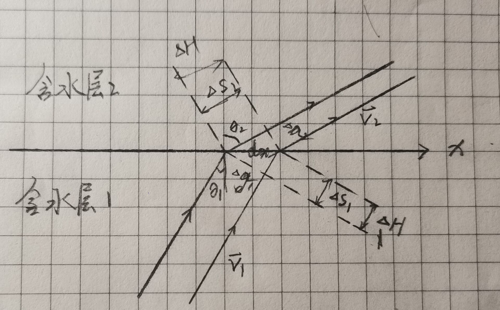
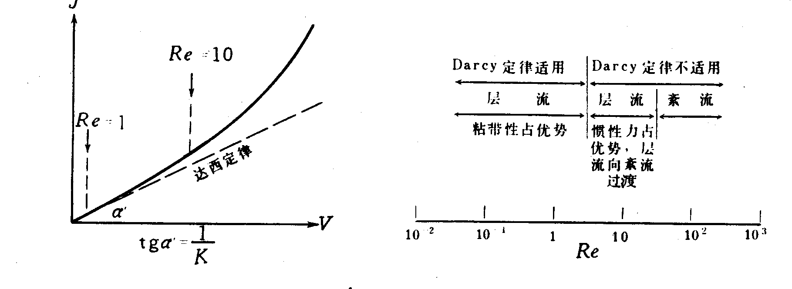
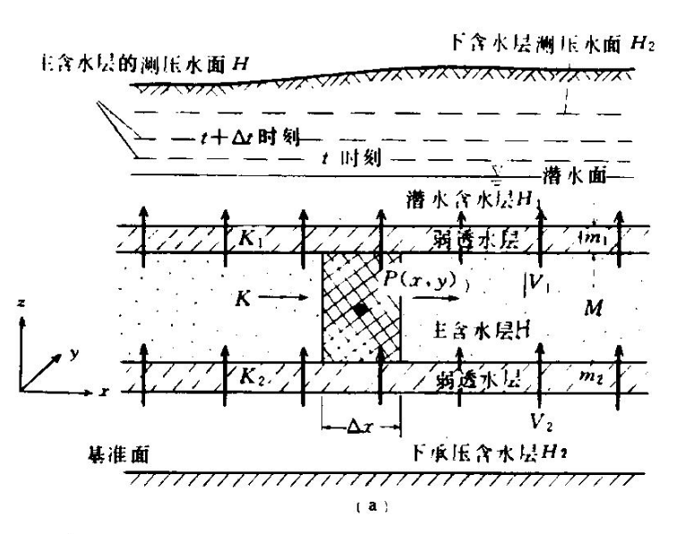
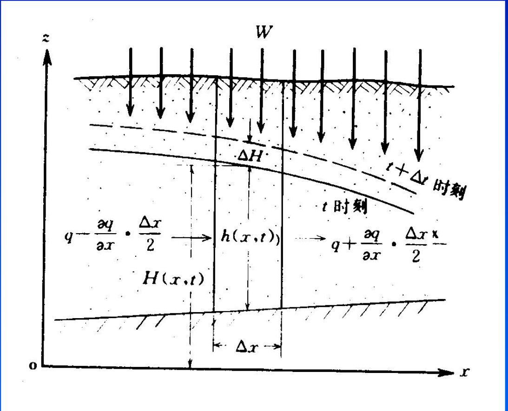

地下水运动基础概论和一般数学模型
*******************************************

.. contents:: 目录

这章介绍地下水动力学的一般数学模型。

欧拉法
===================================

欧拉法采用场论的观点描述空间中的物理量。

物理量：考察物质点的物理量 :math:`\psi`

控制体：研究的空间区域

1. 物理量 :math:`\psi` 在空间中的描述：

.. math:: \psi(x,y,z,t)
    :label: 欧拉物理量

2. 控制体中物理量时间导数：

.. math:: 系统导数 = 瞬变项 + 流项 = 源项
    :label: 欧拉输运公式

* 系统导数 

.. math:: \frac{D}{Dt}\iiint\psi\mathrm{d}\tau
    :label: 系统导数

.. _瞬变项:

* 瞬变项   

.. math:: \iiint\frac{\partial\psi}{\partial t}\mathrm{d}\tau
    :label: 瞬变项

.. _流项:

* 流项 

.. math:: \iint \psi \mathbf{V n}\mathrm{d}A
    :label: 流项

.. _源项:

* 源项   任意可以增加 :math:`\psi` 的项，一般表示为 W 

表示为数学式如下:

.. math:: 
    :label: 欧拉输运公式_eq

    \frac{D}{Dt}\iiint\psi\mathrm{d}\tau 
    = \iiint\frac{\partial\psi}{\partial t}\mathrm{d}\tau 
    + \iint \psi \mathbf{V n}\mathrm{d}A 
    + = \iiint W \mathrm{d}\tau

微分：

.. math:: 
    :label: 欧拉输运公式2_eq

    \frac{\partial\psi}{\partial t} + \nabla(\psi\mathbf{V}) = W

典型单元体和渗流模型
==========================================

典型单元体和渗流模型是地下水运动的基础模型

多孔介质和地下水在多孔介质的实际运动
----------------------------------------

1. 地下水运动的介质——多孔介质

多孔介质：在地下水动力学中，把具有空隙的岩体称为多孔介质。根据岩体中空隙的类型，多孔介质可分为 *孔隙介质* 、 *裂隙介质* 和 *溶穴介质* 。

多孔介质中的地下水可能以吸着水、薄膜水、毛管水和重力水等多种形式存在。本书主要研究重力水的运动。

2. 地下水运动的流态类型

层流：液体质点作有规律的线状运动。

紊流：液体质点作杂乱无章的运动。

3. 流态判别系数

层流和紊流是用Reynolds数来判别的：

.. math:: Re = \frac{\upsilon d}{\nu}
   :label: Re_eq

* :math:`\upsilon`        为液体流速
* :math:`\nu`             为液体运动粘滞系数
* :math:`d`                       为含水层颗粒平均粒径 

地下水由层流转变为紊流时的Reynolds数称为临界Reynolds数。一般情况下，临界Reynolds数为150～300。
天然情况下，含水层中地下水的Reynolds数远小于临界Reynolds数，因此天然状态下地下水流多处于层流状态。

4. 地下水在多孔介质的运动——渗透

地下水沿着形状不一、大小各异、弯弯曲曲的多孔介质空隙通道流动的现象称为渗透。渗透描述的是真实地下水的运动特征。

典型单元体
------------------------------

典型单元体（Representative Elementary Volume，简称REV），亦称表征单元体。对于均质多孔介质，各物理量（如空隙度、水头、压力等）在一定体积范围内不随体积的变化而变化，此时，称这一范围的体积为典型单元体。记为      。

定义p点的各物理量时，用以p为中心的典型单元体内该物理量的平均值来定义 。

REV 只是保证了参数在空间上的连续性，其他各项性质与真实的多孔介质无差异。下面列出与多孔介质的物理性质和力学性质

1. 弹性释水现象 (见 `体积压缩系数`_ 和 `贮水系数`_ )

2. 重力排水现象 (见 `给水度`_)

渗流模型
------------------------------

渗流：一种假想的水流，这种假想的水流满足下列条件：

1. 它充满了整个含水层空间（包括空隙空间和岩石颗粒所占据的空间）；
2. 水流的性质（如密度、粘滞性等）和真实地下水相同 
3. 通过任一断面的流量和实际水流相同；
4. 任一点的压力或水头均和实际水流相同；
5. 水流运动时，在任意岩石体积内所受的阻力等于真实水流所受的阻力。

满足上述条件的假想水流，称为渗流。

.. _水流折射定律:

突变界面的水流折射
^^^^^^^^^^^^^^^^^^^^^^^^^^^^
.. math:: 
    :label: 水流折射定律

    tan\theta_1 : tan\theta_2 = K1 : K2

根据流量守恒可以证明：

* 分界面微元 :math:`\mathrm{d}x` 
* 等水头面差 :math:`\Delta H`
* 等水头面距离 :math:`\Delta s_1 ; \Delta s_2`
* 流线距离 :math:`\Delta t_1 ; \Delta t_2`
* :math:`J_1 ; J_2 ; v_1 ; v_2 ; Q_1 ; Q_2`

根据流量守恒证明如下：

.. math:: 

    &\ Q_1 = \Delta t_1 v_1 = \Delta t_2 v_2 = Q_2 \\
    &\ J_1 : J_2 = \Delta s_2 : \Delta s_1 = sin\theta_2 : sin\theta_1 \\
    &\ v_1 : v_2 = K_1J_1 : K_2J_2 = K_1sin\theta_2 : K_2sin\theta_1 \\
    &\ t1 : t2 = cos\theta_1 : cos\theta_2 \\
    &\ v_1t_1 = v_2t_2 \Rightarrow tan\theta_1 : tan\theta_2 = K1 : K2 \\

渗流基本定律——达西定律
--------------------------------

1. Darcy定律的适用范围

只有当 水流流速 和 水力梯度呈线性关系时才能适用Darcy定律，具体情况如下：

2. Darcy定律含义 :eq:`Darcy_law`

.. math:: \upsilon = KJ = =K\nabla H

* J 为水力梯度

.. math:: J = = \nabla H 
    :label: J_eq

* H 为水头

.. math:: H = h + \frac{v^2}{2g} + \frac{p}{\gamma_w}
    :label: H_eq

.. _渗透系数:

* K 为渗透系数

.. math:: K = \frac{gk}{\nu}
    :label: K_eq

k 为渗透率，只与介质有关。

渗流定律下的数学模型
====================================

数学模型的选取应当灵活取用，不能硬套公式。

饱和地下水水体的数学模型
----------------------------------

1. 模型条件：

指向饱和地下水水体，满足：

- 水体质量 :math:`m_w =\iiint\rho n\mathrm{d}\tau`

2. 模型公式

在多孔介质中，考虑水体质量守恒，即考察物理量 :math:`\rho` 的欧拉输运公式 :math:numref:`欧拉输运公式` :math:numref:`欧拉输运公式_eq`

* 源项：W
* 瞬变项： :math:`\frac{\partial \rho n}{\partial t}`
* 流项: 

.. math:: 

    \nabla(\rho v) = = \nabla(\rho \nabla (KH))

3. 微分方程:

.. math:: 
    :label: model_eq_饱和水体

    \frac{\partial \rho n}{\partial t} + \nabla(\rho \nabla (KH)) = W

该模型的未知量为 :math:`H(x,y,z,t)`。类型为：`待续`

4. 模型简化

   1. 简化条件：

   * 密度恒定流 :math:`\rho = \rho_0`
   * 空隙度n不随着时间变化 :math:`n = n_0`
   * K不随着时间改变: :math: 

   2. 简化后公式

   .. math:: \nabla^2 H = W / (\rho K)

   类型为 `泊松方程` 。

   当 :math:`W = 0` 时 ，类型为 `拉普拉斯方程` 。

承压水体的数学模型
----------------------------------

1. 模型条件

* 满足饱和水体模型条件 :eq:`model_eq_饱和水体`
* 源汇项为弹性释水 :math:`W = \rho_w\mu_s\frac{\partial H}{\partial t}`

2. 得到方程:

.. math:: 
    :label: model_eq_承压水体

    \frac{\partial \rho n}{\partial t} + \nabla(\rho \nabla (KH)) = \rho_w\mu_s\frac{\partial H}{\partial t}

3. 模型简化

* 恒密度流
* n恒定
* 各向同性

简化后方程:

.. math:: 

    \nabla^2 H = \frac{\mu_s}{ K}\frac{\partial H}{\partial t}

当模型为稳态模型时 为拉普拉斯方程

半承压含水层的二维数学模型
------------------------------------

半承压含水层为可接受来自 `弱透水层`_ 越流补给的承压含水层。

1. 模型条件

* 弱透水层的补给
* 主含水层水平流动，上下层面水平
* 恒密度流
* 垂直方向同性

在这样的条件下，由于垂直方向上H没有变化，问题简化为xoy平面上的二维问题。

2. 得到公式

.. math:: 

    &\ 瞬变项 = \frac{\partial\rho n}{\partial t}M = 0 \\
    &\ 流项 = \rho\nabla (v M) = - \rho\nabla (KM\nabla H) = -\rho \nabla(T\nabla H)\\
    &\ 源项 = 弹性释水 + 越流补给 = - \rho\mu_s\frac{\partial H}{\partial t}M + 
    \rho K_1(H - H_1)/m_1 + \rho K_2(H_2 - H)/m_2 \\

3. 模型公式

.. math:: 
    :label: model_eq_二维半承压水体

    \nabla(T\nabla H) + K_1(H - H_1)/m_1 + K_2(H_2 - H)/m_2 = \mu^*\frac{\partial H}{\partial t}

4. 模型简化
   
添加条件：

* 各向同性

.. math:: \nabla^2 H + \frac{H - H_1}{B_1^2} + \frac{H_2 - H}{B_2^2} = \frac{\mu^*}{T}\frac{\partial H}{\partial t}
    :label: model_eq_各向同性半承压含水层水体

* B 为 `越流因素`_

潜水面的二维模型
-------------------------

1. 模型条件

* `Dupuit假设`_ 
* 恒密度流
* 以潜水面高度 :math:`h` 为未知量

2. 得到公式

由于是恒密度流，这次直接用流量守恒

.. math:: 
    
    &\ 瞬变项 = 0 \\
    &\ 流项 = \nabla (v h) = - \nabla(Kh\nabla H) \\
    &\ 源项 = 降雨补给量 + 给水量 = W_{降雨} -  \mu\frac{\partial h}{\partial t}

* Dupuit假设使 :math:`\nabla(vh) = -\nabla(Kh\nabla H)` 在潜水面也成立
* h 这里是潜水面到底面的高度，dh 不一定等于 dH

3. 模型公式

.. math:: 
    :label: model_eq_潜水面

    \nabla(Kh\nabla H) + W_{降雨} = \mu\frac{\partial h}{\partial t}

4. 简化公式

简化条件：

* 当潜水层底面水平时 dh = dH

.. math:: 
    :label: model_eq_底面水平潜水面

    \nabla(Kh\nabla h) + W_{降雨} = \mu\frac{\partial h}{\partial t}

* 当各向同性

.. math:: 
    :label: model_eq_各向同性底面水平潜水面

    \nabla(h\nabla h) + W_{降雨}/K = \frac{\mu}{K}\frac{\partial h}{\partial t}

* 稳态模型

.. math:: \nabla(h\nabla h) + W_{降雨}/K = 0

概念参考
=========================================

包括了多孔介质、地下水物理性质和概念。

微分方程相关概念
-----------------------

.. _系统导数:

1. `系统导数`_:控制体内物质的物理量随时间的变化

2. `瞬变项`_

3. `流项`_

4. `源项`_

由于恒密度流时的公式一般使用流量守恒来直接替代质量守恒，所以源项W的量纲也可以是 :math:`[s^{-1}]`,当使用质量
守恒表达时 量纲为 :math:`[ML^{-3}s^{-1}]`

.. _液体运动粘滞系数:

液体运动粘滞系数(:math:`\nu`)
--------------------------------------------

粘滞性：液体对于外加切应力或剪切变形会表现出抵抗的性质，称为粘滞性。

流体的粘滞性规律可以用Newton内摩擦定律表示

.. math:: F = \mu A \frac{\mathrm{d}u}{\mathrm{d}y}

式中：F为内摩阻力，A为接触面积；u为相对速度； :math:`\mu` 为动力粘滞系数,也叫动力黏度。

:math:`\mu` 与液体的种类有关，:math:`\mu` 越大，流体越难流动。液体粘滞性大小还可以用运动粘滞系数 :math:`\nu` 来表示。

.. math:: \mu = \frac{\nu}{\rho}

.. _孔隙度:

孔隙度(:math:`n`)
-------------------

孔隙度：

.. math:: n = \frac{V_v}{V}

孔隙率:

.. math:: e = \frac{V_v}{V_s}

渗透系数(:math:`K`)
-----------------------------------------
见 `Darcy定律`_

.. math:: 
    K = \frac{gk}{\nu}

.. _渗透率:

渗透率(k):与渗流相关的只与介质相关的参数

.. _Darcy定律:

Darcy定律
-------------------------

.. math:: 
    :label: Darcy_law

    \upsilon = KJ = -K\nabla H \\
    Q = KA\frac{\Delta H}{L} = - \iint K\nabla H \mathrm{d}A

    

.. _水头:

水头(H)
----------------------

由水头的计算公式 :eq:`H_eq` ，加上地下水流速很慢，动力水头和其他水体相差太大可得

.. math:: 

    \begin{flalign}
    &\   H \approx h + p/\gamma  \\
    &\   p \approx (H - h)\gamma 
    \Rightarrow (h_{潜水面} - h)\gamma \\
    &\ \Delta p = \Delta H \gamma & 空间位置上不变重力水头不变。
    \end{flalign}

.. _水力梯度:

水力梯度 (J or j)
---------------------

.. math:: J = -\nabla H

.. _给水度:

给水度(:math:`\mu`) 
--------------------------------------

单位水头下降（潜水面高度下降）单位面积重力排水量

.. math:: 
    Q_{wout} = \iint\mu(\Delta H)\mathrm{d}A

贮水系数与给水度的区别：

- （1）物理意义不同

贮水系数表示弹性释放出来的水，释水过程是瞬时完成的，而给水度表示重力排水，水的释放需要一个较长的时间，存在迟后疏干现象。

- （2）数值大小不同

贮水系数在10-3～10-5之间，而给水度值一般在0.05～0.25之间；一般情况贮水系数不随时间变化，而给水度是时间的函数，排水时间越长，给水度值越大，最后趋于定值。

- （3）影响区域不同

贮水系数值与整个含水层和水的弹性性质有关；而给水度只与水位变动带及其上部包气带排水部分的岩性有关。

.. _贮水系数:

贮水系数(:math:`\mu_s`)
---------------------------

.. math:: 

    Q_{wout} = \iiint\mu_s(\Delta H)\mathrm{d}\tau

1. 根据体积压缩系数的定义
2. 体积压缩系数很小的事实
3. `有效应力原理`_
4. 考虑承压水水头变化的情况(减压释水)

状态方程：

.. math:: 

    &\ \beta p = - lnV_w + C

    &\ V_w = V_{w0}e^{- \beta p} & (V_0 为p = 0 时的体积)

    &\ V_w \approx V_{w0}(1 - \beta p)

同理可得：

.. math:: 
    :label: 状态方程

    & V_w = V_{w0}(1 - \beta p) \\
    & V_b = V_b(1 - \alpha \delta) \\
    & (1-n) = (1-n_0)(1-\alpha p) \\
    & V_v = nV_{b0}(1 - \alpha \delta / n) \\
    & V_s 基本不变 \\

单位体积 *孔隙排水* 和 *水体积增大排水* ：

.. math:: 

    &\ - \mathrm{d}n = - (1-n)\alpha\mathrm{d}p \\
    &\ \mathrm{d}V_w/V_b = - n\beta\mathrm{d}p \\

H变化引起的V_v变化和水体积变化:

.. math:: 
    :label: 贮水系数_eq

    &\ 根据贮水系数定义： \mu_s = 单位体积排出的水量/dH \\
    \\
    &\ 单位体积排出的水量： \mu_s(-dH) = - (1-n)\alpha\mathrm{d}p - n\beta\mathrm{d}p \\
    \\
    &\ 贮水系数： \mu_s = (1-n)\alpha\gamma_w + n\beta\gamma_w \approx (1-n)\alpha\gamma_w

贮水率(:math:`\mu^*`)
------------------------------------

厚度为M含水层，单位层面积下降单位水头释放的水量: :math:`\mu^{*} = \mu_s M`

.. _体积压缩系数:

体积压缩系数(:math:`\beta ;\alpha ;\alpha_p ;\alpha_s`)
------------------------------------------------------------------

在地下水动力学中共有四个压缩系数: 

* :math:`\delta` 为有效应力 :math:`p` 为水压力。
* :math:`n_0 为 p = 0 时的取值`

.. math:: 

    水压缩系数: \beta  = - \frac{1}{V_w}\frac{\mathrm{d}V_w}{\mathrm{d}p} \\
    多孔介质压缩系数: \alpha = - \frac{1}{V_b}\frac{\mathrm{d}V_b}{\mathrm{d}{\delta}} \\
    介质固体颗粒压缩系数: \alpha_s = - \frac{1}{V_s}\frac{\mathrm{d}V_s}{\mathrm{d}{\delta}} \\
    孔隙压缩系数: \alpha_p = - \frac{1}{V_v}\frac{\mathrm{d}V_v}{\mathrm{d}{\delta}}

    \\

    & \alpha = (1 - n)\alpha_s + n\alpha_p \approx n\alpha_p \\
    \\
    & \frac{\mathrm{d}V_b}{V_b} = \frac{n\mathrm{d}(nV_b)}{nV_b} = \frac{n\mathrm{d}V_b}{V_b} + \mathrm{d}n \\
    & \frac{\mathrm{d}V_b}{V_b} = \frac{\mathrm{d}n}{1-n} \\
    \\
    & \alpha = -\frac{\mathrm{d}n}{1-n}/\mathrm{d}\delta \\
    & (1-n) = (1-n_0)e^{-\alpha p}  \approx (1-n_0)(1-\alpha p) \\
    \\
    & \mathrm{d}n = -(1-n)\alpha\mathrm{d}\delta = (1-n)\alpha\mathrm{d}p \\
    

孔隙压缩系数反映了骨架的可形变程度。

.. _有效应力原理:

有效应力原理
----------------------

.. math:: 
    
    \sigma = \sigma^{'} + u \\
    u = \gamma_w h_w \\

总负荷一般不变:

.. math:: \mathrm{d}u = -\mathrm{d}\sigma^{'}

* :math:`\sigma 为总应力，\sigma^{'} 为有效应力 ， u 为水应力。h_w 为测压水头`

渗透率(T) 
-----------------------------------
.. math:: T = KM

排水量 :math:`Q_{wout}`
---------------------------

排出水的体积，因为水的密度变化不大，所以可以使用排水量来直接说明水的物质量变化情况

.. _弱透水层:

弱透水层
------------------

相对于主含水层渗透系数极小的含水层，一般小3个数量级且本身厚度相对于含水层来说很薄。

弱透水层的弹性释水 :eq:`贮水系数_eq`

.. math:: \mu_s = (1 - n)\alpha\gamma_w

弱透水层主要为黏土层，黏土层渗透系数小但是贮水系数却很大，直观上黏土层更能隔水，但也更能贮水，
用同样大的压强压缩黏土层和非黏土层会发现黏土层更容易变形，即:

.. math:: 

    \alpha 大\\
    \mu_s 大\\
    K 小 \\

黏土层的地下水动力学理想模型
^^^^^^^^^^^^^^^^^^^^^^^^^^^^^^^^^^^^

对于研究对象非黏土层，且黏土层的厚度较薄，一般作如下简化处理:

1. 忽略弱透水层的弹性释水
2. 由 `水流折射定律`_ 可知黏土层的入射角或出射角

.. math:: 
    &\ tan\theta_{弱透水层} = tan\theta_{主含水层}(K_1/K_2) > 10^3 tan\theta_{主含水层} \\
    &\ \theta \approx 90^{\circ} \\

3. 忽略在弱透水层的水头损耗

故将弱透水层抽象为：

* 使水流流向平行于边界且还有越流补给的边界。

等价于：

* 不透水边界 but 有补给W。

.. _越流因素:

越流因素(B)
-------------------------------------------

反映一个越流系统中越流能力的大小，于岩层相关

.. math:: 

    Q_{越流补给水量} = T\iint\frac{\Delta H}{ B^2}\mathrm{d}A 

计算公式:

.. math:: B = \sqrt{\frac{Tm}{K}}
    :label: B_eq

越流系数(:math:`\sigma^{'}`)
-----------------------------------------

单位面积单位水体下的越流量 

量纲 :math:`[L^3T^{-1}]`

.. math:: Q_{越流量} = \iint\sigma^{'}\Delta H\mathrm{d}A 

计算公式：

量纲 :math:`[T^{-1}]`

.. math:: \sigma^{'} = \frac{K}{m}

.. _Dupuit假设:

Dupuit假设
----------------------

在计算潜水面时，由于潜水面存在垂向水流，因而水力梯度的公式为

.. math:: J = \nabla H = (\frac{\partial H}{\partial x},\frac{\partial H}{\partial y},\frac{\partial H}{\partial z})

而不是 

.. math:: J = (\frac{\partial H}{\partial x},\frac{\partial H}{\partial y})

假设潜水面的水流没有垂向流动，就是Dupuit假设。
