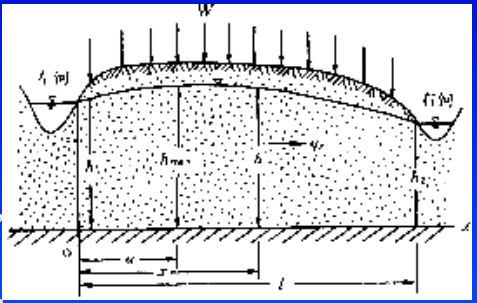
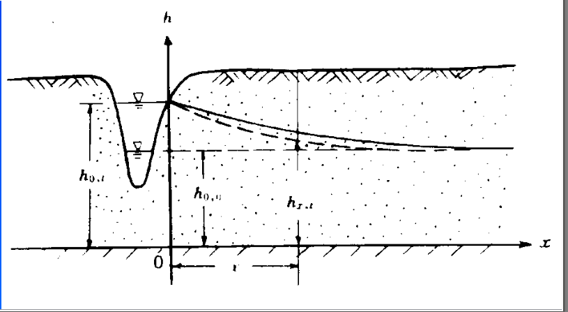

河渠附近的地下水运动
=============================

由第一章可知，河渠中的地下水问题一般被视为二维问题，由公式

.. math:: \nabla (Kh\nabla H) + W_{降雨} = \mu \frac{\partial h}{\partial t}

确定浅水面水头和潜水面高度。

一维稳态潜水面模型
----------------------

**模型条件**

* 稳态模型：: 降水入渗和河渠水头保持稳定
* Dupuit假设 : 河渠基本平行，潜水面水头直接使用2维的水头公式计算
* 含水层均质各向同性，密度和K为常数

**数学模型**

.. math:: 

    \left\{\begin{matrix}
    \frac{\mathrm{d}(h\frac{\mathrm{d} h}{\mathrm{d} x})}{\mathrm{d} x} + \frac{W}{K} = 0 \\
    h(0) = h_1 \\
    h(l) = h_2 
    \end{matrix}\right.

**h解**

解得 

.. math:: h^2 = \frac{W}{K}x(l - x) + \frac{h_2^2 - h_1^2}{l} x + h_1^2
    :label: 2_1

**q解**

由 :math:`\mathrm{d}q = Kh\mathrm{d}h`

解得 

.. math:: q = W(x - a)
    :label: 2_2

* a  为分水岭位置

.. math:: a = l/2 + \frac{K}{W}\frac{h_2^2 - h_1^2}{2l}
    :label: 2_3

**含义**

.. math:: 

    &\ \mathrm{d}\frac{h^2}{2} = h\mathrm{d}h = -hv\mathrm{d}x/K = -q\mathrm{d}x/K \\

上式解释了为什么 :math:`h^2 为二次函数` 而 :math:`dq = W` 满足流量守恒

**应用**

* 反映了稳态地下水潜水面的形态为二次椭球面或二次抛物线
* 提供了河渠间稳态潜水面高度解法
* 提供了河渠间分水岭计算公式

河渠水位迅速变化为定值的河渠间地下水非稳定模型
------------------------------------------------

**模型条件**

与稳态河渠潜水面模型基本相同，但发生顺时回水

**数学模型**

.. math:: 

    \left\{\begin{matrix}
    \frac{\partial }{\partial x}(Kh\frac{\partial h}{\partial x}) = \mu\frac{\partial h}{\partial t} \\
    h^2_{x,0} = h_{0,0}^2 + \frac{h^2_{l,0} - h^2_{0,0}}{l}x \\
    h_{0,t} = h_1 \\
    h_{l,t} = h_2
    \end{matrix}\right.

**求解**

.. math:: 

    (1)
    &\ 令 u = \frac{h^2}{2} \\
    &\ 微分方程变为： \\
    &\ \frac{\partial }{\partial x}(K\frac{\partial u}{\partial x}) = \mu\frac{1}{\sqrt{2u}}\frac{\partial u}{\partial t} \\
    &\ 假设潜水面厚度变化不大，用潜水面厚度的平均值h_m 代替 \sqrt{2u} \\
    &\ \frac{\partial^2 u}{\partial x^2}  = a\frac{\partial u}{\partial t} 方程化为泊松方程\\
    (2)
    &\ 变化后的数学模型为 \\
    &\ \left\{\begin{matrix}
    \frac{\partial^2 u}{\partial x^2}  = a\frac{\partial u}{\partial t} \\
    u_{x,0} = u_{0,0} + \frac{u_{l,0} - u_{0,0}}{l}x \\
    u_{0,t} = u_1 \\
    u_{l,t} = u_2
    \end{matrix}\right.