古植物
*****************

植物界与动物界最根本的区别是自养光合作用。

具维管系统的植物界始现于4亿多年前的志留纪，它使
得生物的生态领域真正从水域扩展到陆地，开始了陆地
生物的演化阶段，使大地披上绿装。

.. contents:: 目录

**植物界（门等级）分类谱系简表**

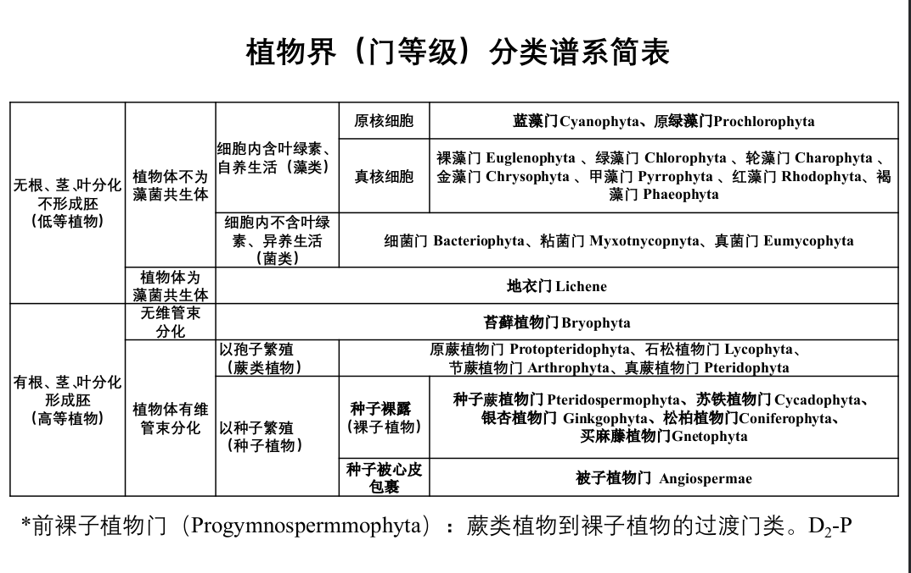
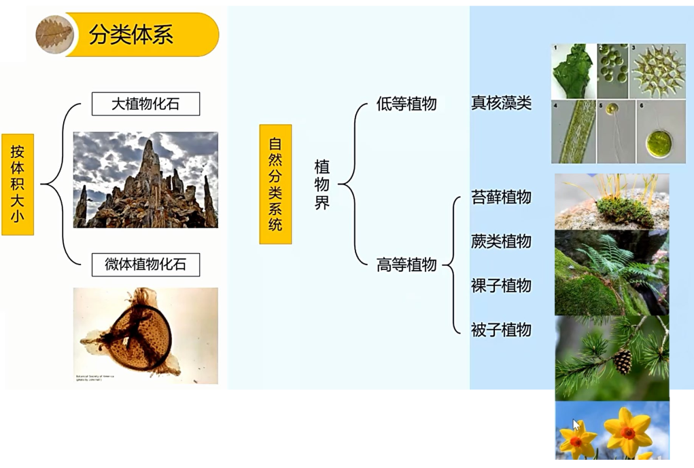

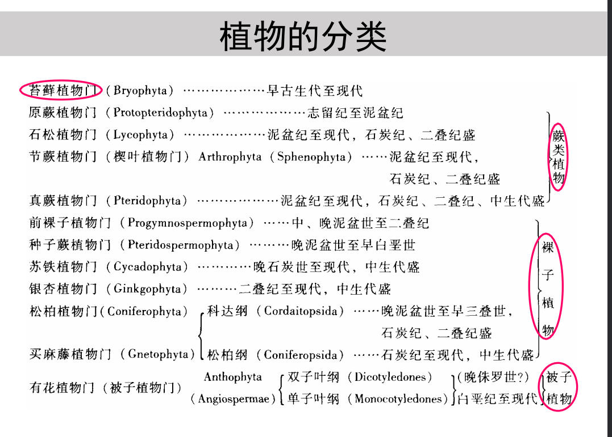

苔藓植物门（Bryophyta）
=========================

* 植物界中形体小而结构原始的类群
* 多数植物体有茎、叶之分，少数
  为匍匐于地面的叶状体，无真正
  的根，也无真正的维管系统
* 生活史中配子体占优势，孢子体
  不发育，并寄生在配子体上
* 分类：苔纲（叶状体）、藓纲(茎叶分化)
  
蕨类植物（Ceterach）
=======================

亦称“羊齿植物”（Ceterach）

植物界中较低等者，仅生活于潮湿地带
以孢子繁殖，是进化水平最高的孢子植物
有根、茎、叶的分化，有维管组织分化

主要有4个（亚）门：

1. 原蕨植物门（Protopteridophyta）
2. 石松植物门（Lycophyta）
3. 节蕨植物门（Arthrophyta）
4. 真蕨植物门（Pteridophyta）

原蕨植物门（Protopteridophyta）
-----------------------------------

最早的陆生维管植物

矮小，分化不明显；茎分直
立的地上茎及横卧的地下茎，
二歧式分枝；无叶或叶状附
属物，又称无叶植物或裸蕨
植物；具假根（拟根状茎）。

原生中柱，体积小，无次生
组织

孢子囊常位于枝顶或侧生穗
状，同孢

S—D3，D1-2繁盛

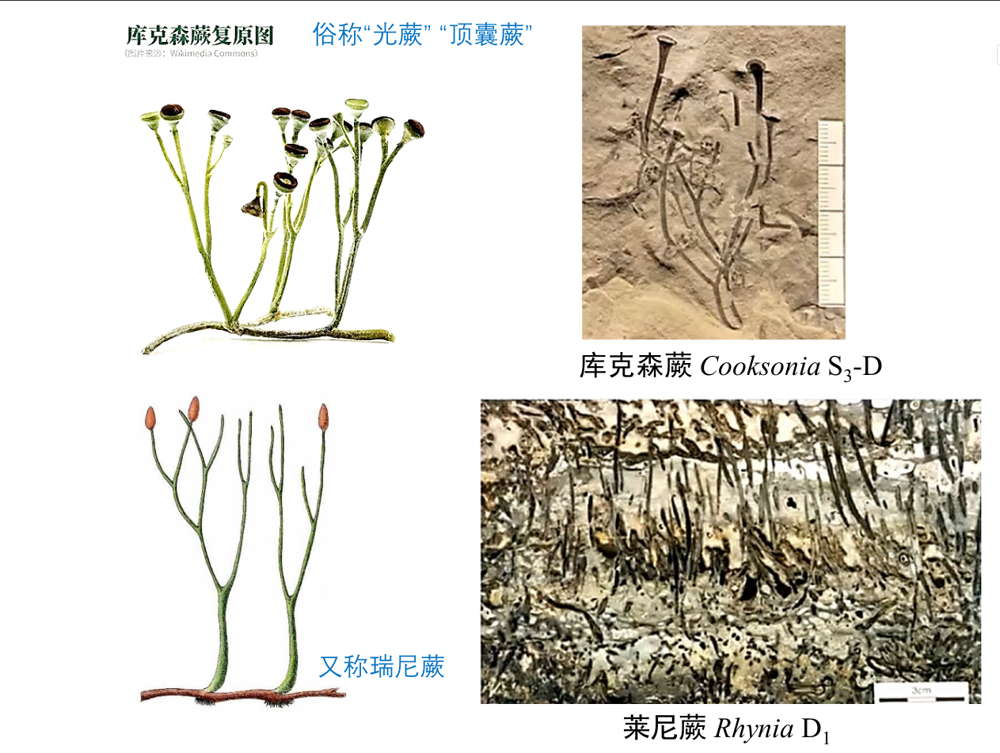

石松植物门（Lycophyta）
-----------------------------

有根茎叶的分化

茎二歧式分枝

星状原生中柱或管状中柱

单叶、小而密布于枝，呈
螺旋生，单脉

D1-Rec，C极盛、造 煤，P
后开始衰退，Rec.仅剩少
量草本

常见化石是叶座

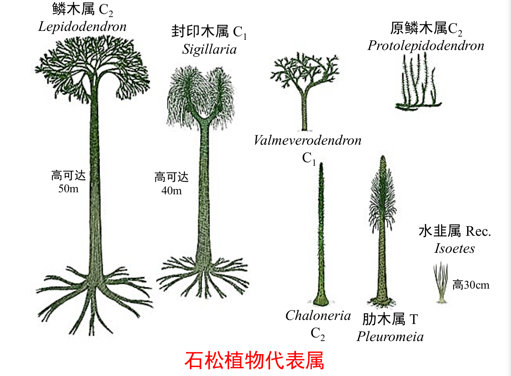

节蕨植物门（Arthrophyta）
---------------------------

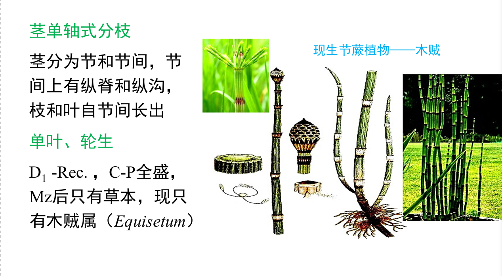

真蕨植物门（Pteridophyta）
-----------------------------

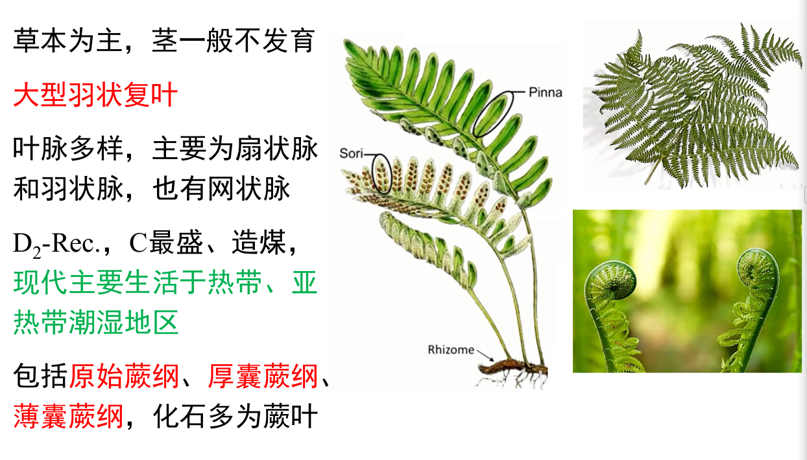

裸子植物（Gymnospermae）
==============================

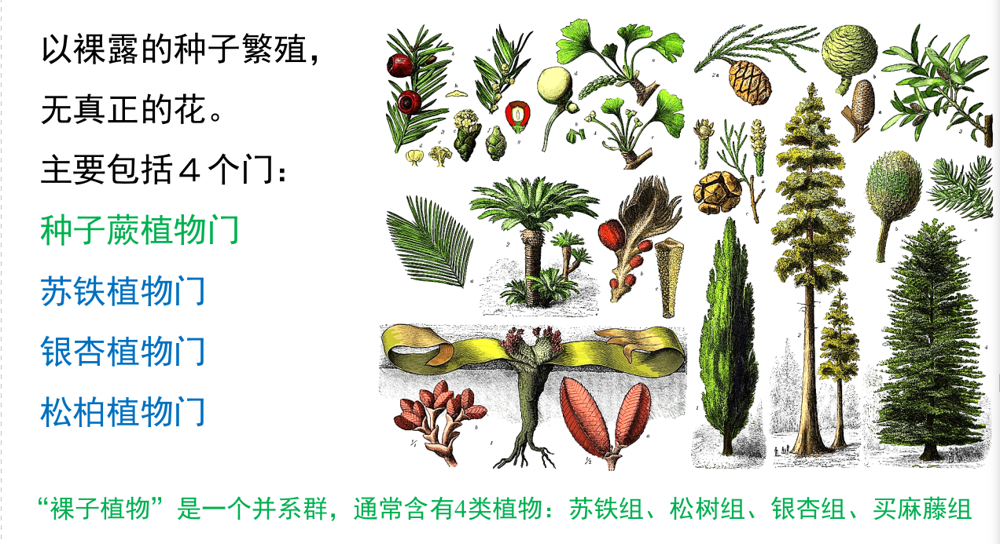

种子蕨植物门（Pteridospermophyta）
----------------------------------

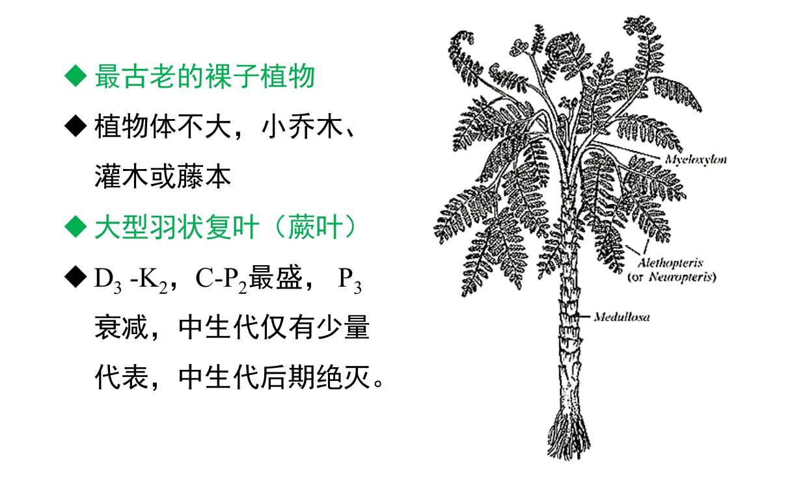

* 种子蕨植物常见的是叶化石，但其与真蕨植物的叶化石
  不易区分，故常采用形态分类。
* 形态属（种）：根据化石的
  外部形态特征所建立的属（
  种）名，而不考虑化石本身
  的亲缘关系。

苏铁植物门（Cycadophyta）
--------------------------

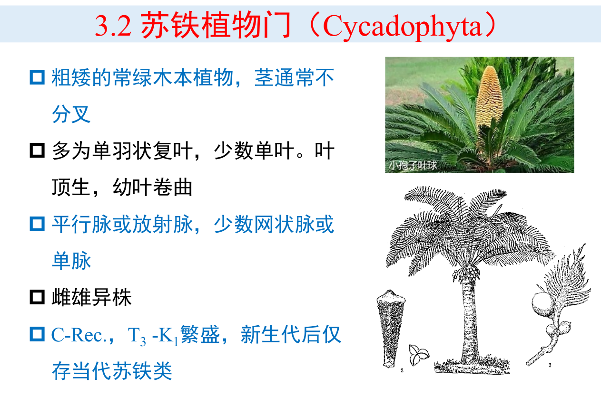

银杏植物门（Ginkgophyta）
--------------------------

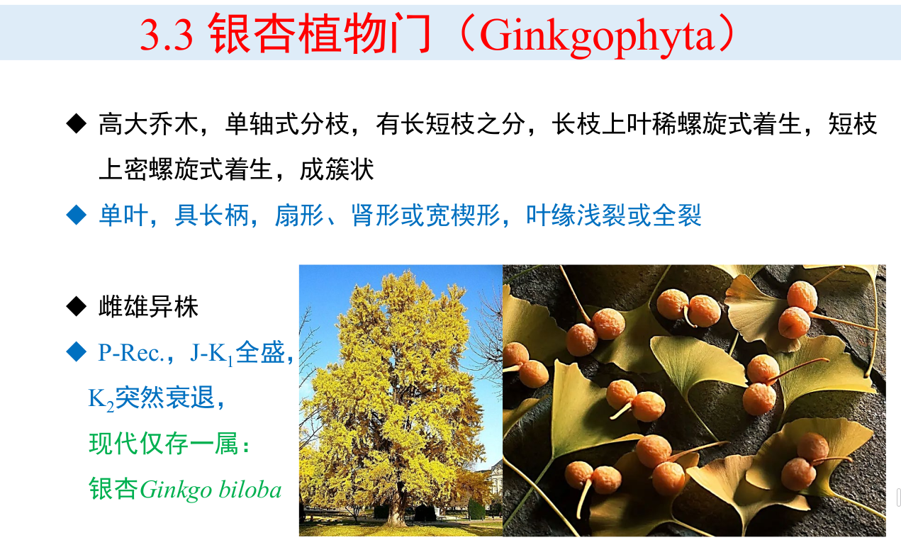

松柏植物门（Coniferophyta）
---------------------------

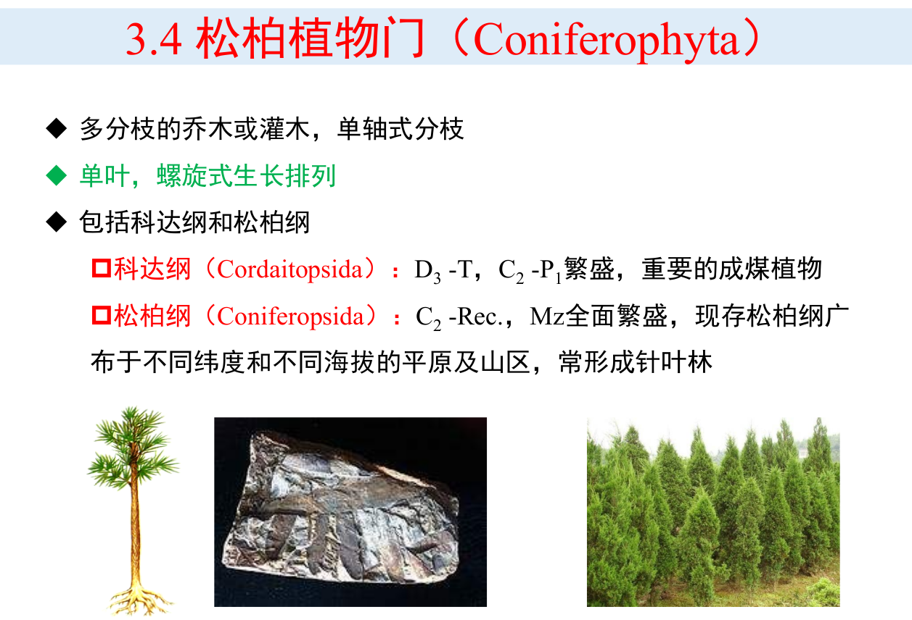

被子植物门（Angiospermae）
===============================

* 胚珠包在由心皮（封闭的大孢子叶）形成的子房内，成熟的种子不裸露
* 生殖器官就是花，故亦称有花植物
* 乔木、灌木、藤本、草本
* 陆生、水生、寄生
* 单叶、复叶
* 叶脉之主脉羽状或弧形，细脉结网
* K1 -Rec，新生代后在植物界中占统治地位

根据胚内子叶数目分为两个纲：

* 双子叶纲（Dicotyledonea）
* 单子叶纲（Monocotyledonea）

植物界演化的主要阶段
=========================

植物界演化的主要阶段及三次聚煤期
   
   1. 菌藻植物阶段：Ar-S，全部水生，无器官分化。丝状藻→叶状藻
   2. 早期维管植物阶段：D1-2，植物开始登陆；以原蕨植物为主，并有原始石松等前裸子植物。仅在
      滨海暖湿低地生长。
   3. 蕨类植物阶段：D3- P2。以蕨类植物（石松、节蕨、真蕨）为主，一些裸子植物的早期类型（种
      子蕨、科达）也十分常见。D3 -C1 就形成了晚古生代植物群面貌。C-P 植物极度繁盛，是全球第
      一次重要的聚煤期。
   4. 裸子植物阶段：P3-K1，以裸子植物（苏铁、银杏、松柏）最为繁盛，部分真蕨也十分发育。P3 -T2
      气候干旱，中生代植物开始发育。T3 -K1 植物极盛，第二次重要的聚煤期。
   5. 被子植物阶段：K2 -Rec.，被子植物植物界中占绝对统治地位。E 是全球第三次重要的聚煤期。
      第四纪冰期后形成当代的植物群面貌。