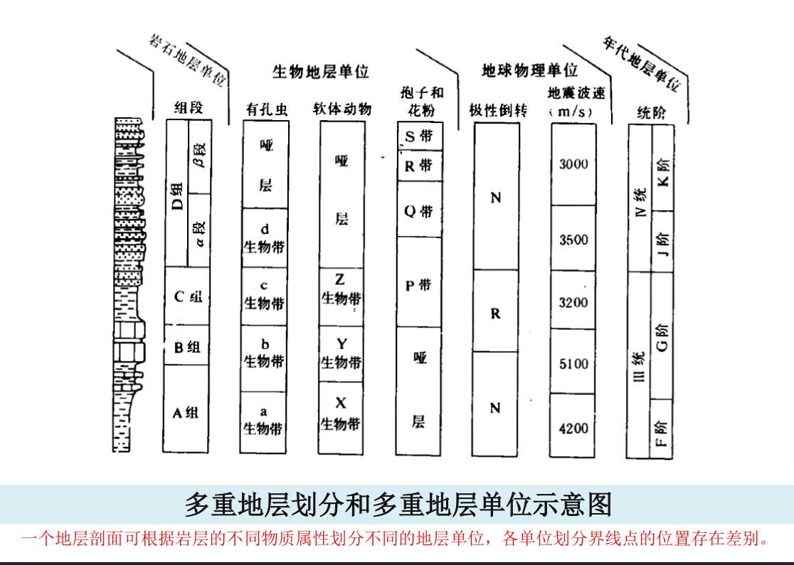
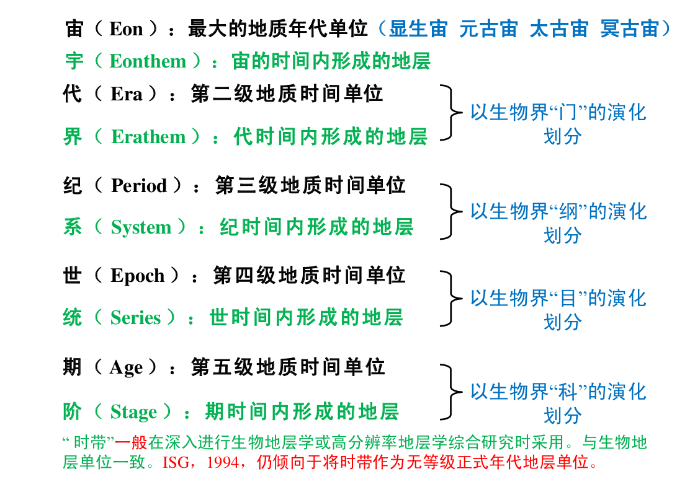

地层的划分和对比
*****************

.. contents:: 目录

.. image:: ./image/guojiniandaidiceng.png
  :alt: 年代地层表1

基本概念
==================

地层学：研究层状岩石形成的先后顺序、
地质年代、时空分布规律（狭义）、形
成环境条件及其物理、化学性质的地质
学分支学科。其核心目标是建立地球科
学时间坐标。

地层（ Stratum ）——赋予了时间属性的层状岩石

野外所见所有成层状的岩石称为岩层，包括沉积岩 、部分火成岩和变质岩。
当探讨其形成年代、形成先后顺序和地质填图单元时，称其为地层。

地层学的研究对象是地质历史中形成的岩层。岩层是地
层的基本组成单元。

地层划分：是指根据岩层具有的不同物质属性把岩层组
织成不同的单位

地层对比：是指根据不同地区或不同剖面地层的各种属
性进行比较，确定地层单位的地层时代或地层层位的对
应关系。地层的时间属性对比是最重要和最基本的对比。

地层律
====================

1. 地层叠覆率（ Law of superposition ）

原始沉积形成的地层，在未经构造变
动改造的情况下，总是上新下老。

2. 原始水平率（ Principle of original horizontality ）
3. 侧向连续率（ Principle of lateral continuity ）

4. 地质体切割率（ Principle of cross-cutting relationships ）

切割律的基本内容为：较新的地质体切割较老的地质体。

5. 化石层序率（ Principle of faunal succession ）

地层越老，所含
的生物越简单，
反之亦然；不同
时代地层，有不
同的化石组合。
新生代地史

地层单位和地层系统
=====================

多重地层单位,两套地层系统
--------------------------

岩层的物质属性是划分地层单位系统和建立地层单位的依据。

**岩层的物质属性** 包括物理属性（如岩性、磁性、电性、地震特征等）、
生物属性（生物类别、丰度、分异性、生态特征、分子化石特征等）、
化学属性（地球化学特征、同位素年龄等）、宏观属性（接触关系、
旋回特征、事件特征、变形和变质特征、岩层结构特征等）。

岩层有多重物质属性可以用来划分地层，对应多重地层单位

只有岩石地层和年代地层才形成全球和区域一致的、完整连续的地层系统。

故有 “多重地层单位、两套地层系统” 的说法。

地层划分的结果是建立地层单位。由于地层划分的依据不同或划分地
层所依据的物质属性不同，所建立的地层单位也不样。

* 依据地层的岩石学特征及地层结构、厚度和体态、接触关系等建立的地层单位是 **岩石地层单位**
* 依据地层的时间属性（如生物地层所反映的时间、地层的同位素年龄等）所划分的地层单位是 **年代地层单位**
* 依据地层的生物或生态特征建立的地层单位是 **生物地层单位或生态地层单位**
* 依据地层的磁性特征建立的地层单位是 **磁性地层单位**
* 依据地层的地球化学特征建立的地层单位是 **化学地层单位** 等。

多重物质属性
-----------------

**岩石学特征**

岩石学特征包括组成地层的岩石的颜色、
矿物组分或结构组分、结构、组构和沉积构造等。

在岩石地层划分中，首要考虑的是组成地层的岩石特征。

岩性相同或大致相同的连续岩层可以划分为一个岩石地层单位。

**生物学特征**

地层的生物学特征主
要包括地层中所含的生物化石组分（类别），以及生物化石的含量、
生物化石的保存状态、生物化石之间及生物化石和围岩之间的相互
关系等。

地层中所含的生物化石在认识地层和地层划分中至少具有两方面的
意义：一是年代学的意义，地层中所含的生物化石类别不同，可以
反映地层形成的时代不同。二是环境学的意义，地层中所含的生物
化石类别、含量、保存状态及相互关系可以反映它们形成环境的差
别。

**地层结构特征**

地层结构是指组成地层的岩层在时空上的组构方式。

根据岩层的组构方式所划分的地层结构类型可作为地层划分的依据。

对于层状延伸的地层来说，可以分为简单的均质型结构和非均质结
构两大类和若干小类。

对于非层状延伸的地层，由于地层的侧向变化大，应该从三维的角
度去认识地层的结构。

1. 层状延伸的地层
   
   * **均一式结构** 是指地层由一种单一的岩层类型组成，岩层的组分相
     同，结构、组构和沉积构造相同或相似，颜色和层厚相近等。
   * **互层式结构** 是指地层由两种岩层类型规则或不规则交互而组成，
     如砂岩和页岩的交互、灰岩和白云岩的交互等。
   * **夹层式组构** 是指组成地层的岩层以一种岩层类型为主，间夹另一
     种岩层类 型，如地层总体为泥岩岩层，内夹少量砂岩岩层等。
   * **有序多层式结构** 是指地层由二种或三种以上的岩层类型组成，这
     些岩层以规律的组合方式组构在一起。最具代表性的如各种旋回
     沉积序列，也就是现代地层学中强调的地层的基本层序。基本层
     序是指由一定的岩层类型以一定的规律组合而成的地层序列，其
     实质就是旋回沉积序列。
   * **无序多层式结构** 是指地层由多种岩层类型组成，但并没有一定的
     组合规律。它们是由非旋回沉积作用形成的。

2. 非层状延伸的地层
   
  * **斜列式结构** 是指组成地层的岩层以斜列的方式排列，如生物
    礁前缘斜坡倒石堆形成的地层。
  * **叠积式结构** 是指一些丘状或块状的岩层在垂向上叠加而成的
    地层结构，典型的如连续垂向加积的生物礁形成的地层结构。
  * **嵌入式结构** 是指地层总体以某一种岩层为主，内夹一些非层
    状或丘状、透镜状岩层，典型的如台地碳酸盐组成的地层中
    夹有小型生物礁岩层。

上述地层结构可以单独出现，也可以以不同的方式组合形成复
合式结构，如均一式结构中夹有序多层式结构、互层式结构中
夹均一式结构、无序多层式结构中夹有序多层式结构等。

**地层的厚度和体态特征**

* **地层的体态** 是指岩层或地层体空间形态和分布状态。地层的空间形态
  一般是层状的，但也不乏非层状的，如楔状、透镜状、丘状等。地层
  的分布状态一般认为是水平或近于水平的，但也有许多地层是斜列的。
  地层的分布状态可以通过特殊的沉积构造（如示顶底构造）去识别。
* **地层的厚度要求** 是一个地层单位应有一定的厚度，厚度过小也就不足
  以建立一个地层单位。地层单位的厚度要求一般根据地质填图的比例
  尺确定，即可以在地质图上以最小的表达尺度（lmm）去表达。

**地层的接触关系特征**

层序地层学将间断归为不整合接触类型

* **连续接触关系** 是指不间断的沉积作用形成的岩层之间的接触关系。它
  是地层中最常见的，在地层结构和基本层序识别中，基本层序内部应
  该是连续的接触关系。
* **小间断接触关系** 为地层中由于沉积作用中断或沉积环境变迁造成的沉
  积间断面，这也是沉积地层中最常见的界面。小间断面一般可以作为
  地层的基本层序之间的分隔面。
* **假整合（平行不整合）接触关系** 是指上下地层产状平行或近于平行、具有不规则的侵
  蚀和暴露标志的分隔面。其代表了早期地层的整体上升，遭受风化、剥蚀，而后又接
  受沉积的演化历史。假整合面上一般都具有古风化壳或具底砾岩、粗碎屑岩等。假整
  合是地层单位的重要界面。组一级的地层单位之间常见假整合的接触关系。组内一般
  不允许假整合存在。
* **角度不整合接触关系** 为下部被褶曲或掀斜地层和上部水平地层间的接触关系。这种不
  整合包含一系列曾经发生过的地质事件：下伏的原始水平或近于水平的地层在构造作
  用下发生褶皱或掀斜，然后经历隆升、风化、剥蚀削去了其上翘的顶端，而后新的地
  层沉积其上。角度不整合面是分隔地层单位（如群、组）的重要界面。在地层单位内
  部（如组、段）一般不允许存在角度不整合。
* **非整合接触关系** 是指沉积盖层、岩浆岩体或深变质岩体之间的分隔界面。非整合代表
  古老基底经受了长期的暴露、风化、剥蚀，之后接受再沉积的演化历史。非整合面之
  下的岩体或深变质岩被截切，之上的地层不发生接触变质作用，接触面之上常见含下
  伏地层或岩体砾石的底砾岩。无疑，非整合面是划分地层单位的重要界面。

**其他属性特征**

地层的磁性特征、电阻率和自然电位、矿物特征、地球化学特征、生
态特征、同位素年龄等，它们均可以作为地层划分的依据，用于建立
不同的地层单位。

地层划分、对比
--------------

地层划分、对比的目的 —— 建立起区域或全球的地层系统。

* 地层划分是依据不同的地层物质属性将相似和接近的地层组构成不同的地层单位
* 地层对比的意义在于建立起不同地区的地层特征和地层位置之间的关系。

**地层划分、对比的原则**

1. 地层的物质属性相当的原则
2. 不同地层单位的地层对比不一致的原则

**地层对比的方法**

1. 野外直接追溯对比
2. 地质事件对比（构造运动面等）
3. 岩石相似性对比（岩性组合法、标志层法、地层结构对比法等）
4. 古地磁极对比
5. 古生物对比（标准化石法、化石组合法等）
6. 同位素年龄对比

三套地层单位和两套地层单位系统
======================================

掌握三套地层单位（岩石地层单位、年代地层单位和生物地层单位）和 两套地层单位系统（岩石地层单位系统和年代地层单位系统）

地层系统包括：

1. 组成地层序列的各个地层单位
2. 级别和相互的从属关系

.. image:: ./image/santaodicengdanwei.png

岩石地层单位和地层系统(Lithostratigraphic Unit and Stratigraphic System)
-------------------------------------------------------------------------------

群(group)、组(formation)、段(member)、层(bed)

**群 （Group）**
   
群是比组高一级的岩石地层单位。

群可以由两个或两个以上相邻或相关的具有共同岩性（或岩性组
合）特征的组组合而成；有时也可能是一套尚未经深入研究，暂
未分组，待详细研究后有可能被划分成若干组的岩石系列。

必要时，群可以再分成几个亚群，或将两个或两个以上相邻并具
有共同岩性（岩性组合）特征的群组建成一个超群。群的单位层
型，就是它所包容的各个组的单位层型。

组不一定要合并为群，只有为了更有效地在大范围内进行对比研究，或为编制小比例尺
图件的需要才并组为群。地层厚度大小和沉积时间间隔的长短不是建群的有效理由

**组（ Formation ）**

*组是岩石地层划分的基本单位* ，空间上有一定的延展性，用于地
质填图、描述和阐明区域地质特征。组的含义在于“岩性、岩相
和 变质程度的均一性” 。

组或者由一种岩石（沉积岩、火山岩或变质岩）构成，或者以一种
岩石为主间有重复出现的其他岩石的夹层；或者由多种岩石有规律
交替出现的互层所构成；还可能以很复杂的岩石组分或独特的结构
所构成并与其他组相区域区别。

对于一个独立的组所要求的岩石变化程度没有严格的规定。主要视
一个地区的地质复杂程度，并能较为准确地描述其岩石组合特征和
阐明地质历史为原则。

关于组级单位的厚度，无标准限制。其厚度大小主要取决于能最好
阐述该地区岩石发育所需要的地层单位规模的大小。

**段（ Member ）**

段是组内较其低一级的正式岩石地层单位，必须具有“
与组内相邻岩层不同的岩性特征”，且分布广泛。

段总是组的一个组成部分，不能脱离组而独立存在。

组不一定要整分成段。需要时可以仅把组的某个或某次
间隔划分成段。

段可以从一个组侧向进入另一个组。

**层（ Bed ）**

层是最小的正式岩石地层单位。由岩性、成分和生物组合等 特征显著而又明
显区别于相邻岩层的地层构成。

一般只限于对那些能识别出来而且特别有用的
一个层，或许多单层组成的单位才给予命名，并指定一个正式岩石地层单位。

* 标志层是一个分布广而岩性特殊的薄层，可以命名作为正式岩石地层单位。
* 岩流层（ Flow ）是火山熔岩中最小的岩石地层单位，等级上与沉积岩中的“层” 相
  当。它可用其结构、成分、叠加序列等加以辨别。一般岩流层都是非正式岩石地层单位。
* 层的厚度通常为一厘米到几米厚。厚度更小的层称作“纹层”（ Laminae ）。只有
  由层面限制的层才是岩石地层单位的层。
* 层可以在段中存在，也可以不分段的组中存在。一个特殊层可以从一个段或组穿
  入另一个段或组而保持原来名称。

年代地层单位和地层系统(Chronostratigraphic Unit and Stratigraphic System)
------------------------------------------------------------------------------------

地质学表示地质年代的方法有两种：

* 相对地质年代 （事件发生的先后顺序）
* 绝对地质年代 （事件发生的距今年代）: 同位素测年

相对地质年代确定的依据：

a. 岩层沉积的先后顺序
b. 生物演化特点
c. 地质体之间的相互关系

**地质年代单位及划分依据**

**阶 （Stage）与 期（ Age ）**

阶 （Stage）是年代地层学的基本工作单位，它也是可在全球范围内识
别的标准年代地层等级系列中最小的地层单位。显生宙102个阶。

* 阶是统内部据生物演化阶段或特征 （属/ 种/ 亚种 ）的进一步划分，
  代表相对较短的时间间隔；
* 由于生态因素和生物分区的限制，据底栖生物建立的阶往往只有大
  区性的等时意义；而据浮游生物建立的阶才可能具有全球等时的意义；
* 阶的界线层型应该在一个基本连续的沉积序列内，最好是海相沉积。
* 顶、底界线应是易于识别、可在大范围内追索、具有时间意义的明
  显标志面；
* 阶的上、下界线代表了地质时期两个特定的瞬间，两者之间的时间
  间隔就是该阶的时间跨度。多在 2-10Ma 内。

*亚阶（Substage）* 是阶的再分；相邻的阶可归并为超阶（Superstage） 。
但对这些单位的创建要慎重。最好是将原来的阶分成多个新阶；或是
将原来的阶提升为包含这些新阶的统。

**时带（Chronozone** 

时带（Chronozone）是指在某个指定的地层单位或地质特征的时间跨度内
在世界任何地区所形成的岩石体，与之对应的地质年代单位是时 （chron）
（ISG, 1994）。

时带是没有特定等级的正式年代地层单位，而不是年代地层单位等级系列
（宇、界、系、统、阶）中的一部分 ；

时带的时间跨度也就是原指定的地层单位，如岩石地层单位、生物地层单
位或是磁性地层单位的时间跨度。例如，据生物带的时限建立的时带，包
括了在年代上相当于这个生物带的最大总时间跨度内的所有地层，不管有
无该带的特有化石。

时带的时间跨度可差别很大。如说“菊石时带”，指菊石生存的漫长时期
内形成的所有岩石，而不管地层中是否含有菊石；也可说“峨嵋山玄武岩
时带”，指在该玄武岩形成时隔内任何地方形成的任何岩层，而不论是否
有玄武岩。

理论上时带的地理范围是世界性的，但它的可应用性只限于那些其时间跨
度能够在地层中识别的地区；
时带的名称取自它所依据的地层单位。如“ Triticites 时带”（取自
Triticites 延限带） ，“张夏时带”（取自张夏组 ） 。

生物地层单位(Biostratigraphic Unit)
--------------------------------------------

生物地层单位是以所含化石内容或生物特征的一致性作为依据划分的地
层单位。以含有相同化石内容和特征所划分，并与邻层化石有别的
三度空间岩层体。

生物地层单位之间不存在从属关系，也不相互排斥， 更不是代表生物地层单位的不同等级。

* **延限带（ Taxon range zone ）**:某一特定生物类别（科、属、种等）化石从出现到消失所占用的地层
* **共存延限带（ Concurrent range zone ）** :由两个特定生物类别（科、属、种等）化石在延展区内重叠部分所占用的地层
* **间隔带（ interval range zone ）** :位于两个特定生物面之间含化石的地层体。
* **组合带**  ：特定的化石组合所占用的地层。
* **顶峰带**  ：特定化石最为繁盛的地层，亦称富集带。
* **谱系带**  ：进化种系中特定片断化石标本的地层，亦称种系带。

GSSP(全球界线层型剖面和点（金钉子）)
---------------------------------------------

**层型（ stratotype）** ：一个已命名的地层单位或地层界线的原始或后来被
指定作为对比标准的地层剖面或界线。

* 单位层型（ unit stratotype ）：代表一段特定时间间隔内的地层。
* 界线层型（ boundary stratotype ）：代表一个特定时间点的地层界线。
* 复合层型（composite stratotype ）：由几个选定的组分层型联合形成一个单位层型。

层型是能够恰当表达地层单位概念的具体模式。

GSSP : 确定已建立的各地层系、统、阶之间的界线剖面和点，把
它作为全球标准，俗称“金钉子”（ Golden Spike ）。

**建立 GSSP 的条件**

* GSSP 必须定义一个阶的底部界线。
* GSSP定义的阶的底部界线通常以种一级的某种化石首现定义，
  同时还必须有丰富的其他可以用来定义底界的指标，如其他化石
  、地球化学、 古地磁等。
* GSSP 定义的阶的底部界线必须可以用放射性年代定年。
* 标定 GSSP 的指标必须可以在区域甚至全球进行对比。
* GSSP 的沉积必须连续，沉积相变化不能太大，且必须具有一定
  沉积厚度。同时不能受到后期构造、变质作用等式响。
* GSSP 点通行条件必须很好。

地层单位之间的相互关系
----------------------------

岩石地层单位和年代地层单位的界线不一致，或岩石地层单位的界线与
年代地层单位的界线斜交。 这种现象称为岩石地层单位的穿时或时侵。

年代地层单位（Chronostratigraphic Unit ，简记CU） 是依据时间建立
的，包括地球某个时间跨度内所形成的所有岩石，而不考虑这些岩石
的成分或特性。因此，它在各处都只包括某一时代的岩石，其界线在
各个地方都是等时的。

岩石地层单位（Lithostratigraphic Unit ，简记LU） 大不相同， LU在任何
有岩石的地方都可以被客观地识别。 CU与生物地层单位、磁性地层单
位和不整合界定的地层单位相比较，后者只有在岩石中实际出现某些
特征或属性时，这些地层单位才是相对客观的物质单位。

生物地层单位（Biostratigraphic Unit ，简记BU） 通常接近于年代地层
单位（CU） 。虽然生物对比接近于时间对比，但BU在根本上不同于
年代地层单位。

LU 、BU具穿时性，而 CU 不穿时。