古生物和地史学概论
####################

.. contents:: 

第一章——化石与古生物学
***************************

化石（fossil）是指保存在岩层中的地质历史时期 *生物的遗体* 、 *生命活动的遗迹* 和 *生物成因的残留物指*

假化石（pseudofossil）是指类似化石但与生命活动无关的一类物体

疑化石（dubiofossil）是指无法辨别的化石类似物

古生物学以化石为研究对象。

古今生物之间的时间界线被定在更新世与全新世之交（约11700年）。

化石的形成
=====================

化石的石化作用：生活于地质历史时期的古生物，其死亡后的生物遗体以及生活时产生的遗迹，
被沉积物埋藏，并在漫长的地质年代过程中，随着沉积物的成岩作用，与沉积物
一起经受各种物理化学改造，最终称为沉积物的一部分的这个过程。

化石的形成条件
------------------

1. 生物本身条件

一般说来硬体比软体更易形成化石。

方解石、硅质化合物和磷酸钙等矿物组成的生物硬体比霰石和含镁方解石等不稳定矿物更易保存

有机质硬体如角质层、木质、几丁质薄膜等可碳化保存为化石。

2. 生物死后的环境条件

高能水动力条件下生物尸体容易被破坏;PH小于7.8时，碳酸钙组成的硬体容易被溶解；烟花环境下有机质容易腐烂。在还原条件下容易保存。

3. 埋藏条件

不同的埋藏条件对化石的形成有不同的影响，例如冻土中保存的猛犸象化石十分完整

4. 时间条件

化石经过上时期的石化作用才可形成化石

5. 成岩条件

沉积物在固结成岩过程中压实和结晶作用会影响化石形成。只有在压实作用较小且为经过严重重结晶作用的情况下，才能保存为完好的化石。

石化作用的形式
^^^^^^^^^^^^^^^^^^

* 矿质填充作用 矿物质沉淀填充硬体组织的空隙
* 置换作用 外来物质填充生物体内被溶解的组成物质，两者速度相当则保存效果较好。
* 碳化作用 不稳定成分被分解和因升镏作用挥发，径流下稳定的碳质薄膜

化石埋藏学
=================

研究古生物从死亡后到化石形成之前所经历的 *埋藏环境* 、 *埋藏条件* 和 *埋藏过程* 的学科称为化石埋藏学

化石的埋藏类型
----------------

化石的埋藏类型：
* 原地埋藏
* 异地埋藏

化石群的埋藏类型：
* 原地化石群： 化石成员几乎没有搬运
* 残留化石群： 大部分化石没有搬运，少部分搬运而走
* 混合化石群： 大部分化石没有搬运，少部分为搬运而来
* 搬运化石群 ： 大部分为搬运而来的化石群

辨别化石埋藏类型的主要标志：

1. 化石保存的完整程度
2. 个体大小的分选性，一般未经搬运的化石大小各异
3. 两壳保存的分散性，原地埋藏的 *双瓣壳化石* 一般两壳闭合，即使分离数量也大致1:1。
4. 观察判断生物的生长位置。 
5. 化石的生态类型与其埋藏环境是否一致。
6. 不同时代的化石保存在伊耆氏，老的化石应该属于异地埋藏
7. 生命活动留下的痕迹一般为原地埋藏
   
超常保存化石库
-------------------------

超常保存是指软体组织或结构被全部或部分保存下来。

在某些特殊的沉积环境下有利于软体组织的保存，在此特殊环境保存的化石聚落被称为 *超常化石库* 或 *化石贮集库*

生物软体组织的矿化保存形式：

1. 完全矿化，通常是磷酸盐化
2. 矿膜化，最常见，矿化膜一般为磷酸盐化、碳酸盐化、黄铁矿化。
3. 矿化核，软体组织被交代填充后形成的铸型。

生物软体矿化的保存类型：

1. 奥斯坦型或陡山沱型保存。 磷酸盐化；瑞典寒武纪奥斯坦化石库和中国埃迪卡拉纪陡山沱组化石库
2. 古泉型保存。二氧化硅迅速包裹生物体。只见于二氧化硅饱和和浅水环境下能够生存的微生物席和细菌化石中。
3. 布尔吉斯页岩型保存。加拿大寒武纪贝尔吉斯页岩化石库。软体结构以碳质压膜的形式保存。
4. 比彻三叶虫型保存。 黄铁矿化
5. 埃迪卡拉型保存。生物软体由于被微生物席所包覆而以印痕或铸型的形式保存

中国还有著名的澄江化石库和热河化石库

化石的分类
=================

1. 按照可视程度

肉眼可见的化石为 *大化石（macro-fossils）*。

通过显微镜观察才可见的化石为 *微化石（micro-fossils）*。

通过电子显微镜才可见的化石为 *超微化石（ultramicrofossils）*

分子化石或化学化石是指仅保留了原始生物的有机组分的一些基本碳骨架的化石。

2. 按照化石的保存类型

* 实体化石：生物遗体
* 膜铸化石：

  * 印痕化石：生物软体结构以印痕形式保存
  * 印膜化石：生物硬体在围岩上的印膜，分为外膜、内膜和复合膜
  * 核化石：空腔（生物体结构空腔或生物硬体溶解后空腔）被沉积物填充固结后形成的化石
  * 铸型化石： *贝壳* 已经形成外膜和内膜加上生物硬体溶解后空腔被沉积物填充形成的化石

* 遗迹化石
* 化学化石

化石研究方法和意义
=============================

研究步骤一般包括：

1. 标本或样品的xlji
2. 标本的揭露与分离
3. 化石的鉴定和记述
4. 化石标本的照相、制图和复原
5. 化石资料的分析和应用

古生物的分类和命名
=========================

分类等级
-------------

主要分类单元：
界（kingdom）、门（phylum）、纲（class）、目（order）、科（family）、属（genus）和种（species）。

辅助单位：亚

由于对化石不能判断是否存在生殖隔离，因此化石种着重以下特征判断：
1. 共同的形态特征
2. 构成一定的居群
3. 居群具有一定的生态特征
4. 分布于一定地理范围

有些种可分亚种：由地理隔离产生的性状差异分地理亚种，由年代不同产生的性状差异分年代亚种。

命名
-----------

n名法第一个字母大写

属及以上名称用单名法，
属及一下用斜体
种名称用斜体+双名法（双名包括属名+种名）
亚种还需加上亚种名构成三名法
可在学名后加上正体的作者+，+年代

sp. 表示未定种
sp. indet. 表示不定种
cf. 表示相似种
aff. 表示亲近种
种属名第一次提出需要加上 gen. nov.（属）或sp. nov.（种）

古生物的分类系统
======================

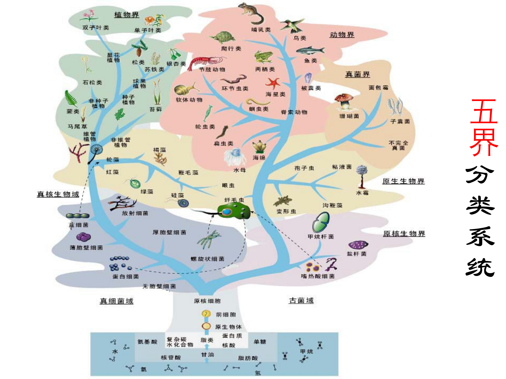
  
.. image:: image/常见化石一览.png
  :alt: 常见化石一览
  :align: center

原核生物界（无成型的细胞核）、原生生物界（真核单细胞生物）、动物界、植物界、真菌界。

`常见化石门类.pdf`_

第二章--生命起源与生物进化
****************************

早期生物的发生和演化
========================

已发现的前寒武纪化石表明早期生物的演化存在4次飞跃。

1. 最早生物的出现

澳大利亚皮尔巴（Pilbara）地区大约35亿年的Warrawoona群碳质燧石叠层石种发现到而丝状细菌是目前最早的可靠化石记录

南美Onverwacht Seriers（约34亿年前）也发现了可能为蓝藻和细菌的球星或椭圆形有机体。

2. 早期生物分异

加拿大Ontario 西部苏必利尔湖沿岸的前寒武纪 Gunflint 组（约20亿年前）中发现的生物8属12种的微化石证实经过10亿年的演化，原核生物已发展到相当繁盛的程度，这可能与后期富氧大气圈的出现有关。

3. 从原核生物演化出真核生物

澳大利亚北方 Amadens 盆地的 Bitter Springs 组的燧石（约10亿年前）发现了4个属，其中出现了原生动物蓝藻。

在中国北方中元古代串岭沟组（年龄约17~18亿年）中发现的大型球状疑源类化石是早期真核生物的可靠证据。

4. 后生动物的出现

后生动物出现的时间一般认为在距今5.6亿~5.8亿年间，澳大利亚的埃迪卡拉动物群为其典型代表（主要为腔肠、环节、节肢）

显生宙生物的演化
=========================

1. 寒武纪生物大爆发

埃迪卡拉纪末期出现的小壳动物群，是继埃迪卡拉动物群之后首次出现带壳生物，动物界从无壳到有壳的演化是生物进化史上的有一次飞跃，并被认为是寒武纪生物大爆发的序幕。

寒武纪生物大爆发的主幕以5.2亿年前产于中国云南澄江地区寒武系第二统第三纪的澄江动物群为代表。澄江动物群精确记录了寒武纪早期生物大爆发的史实。99%的动物门类在此次生物大爆发出现。

2. 动植物从水生到陆生的发展

志留纪末期至早、中泥盆世，地壳上陆地面积增大，植物界由水域扩展到陆地。植物逐渐有了茎叶的分化，出现了原始的输导系统（维管束）等。

总鳍鱼类项两栖类过渡性质的化石中发现于晚泥盆世地层中。

动物完全摆脱水生到陆生，是两栖类演化到爬行类，得益于羊膜的产生。

3. 动物界各门类的演化谱系

.. image:: image/动物界各门类的演化谱系.jpg
  :alt: 动物界各门类的演化谱系图
  :align: center

古生物与环境
********************************

每一种生物对每一个因素都有一个耐受范围，称为生态幅或耐受性范围。生态幅的中间为最拾区，他的两端为两个生理受抑区，超过生理受抑区为不能耐受区。

生物的环境分区
====================

化石的保存关键是埋藏条件，绝大部分化石通过水环境沉积保存。

海洋的环境分区

1. 滨海生物区，常具有坚硬的外骨骼，或牢固地附着生长在岩石上；有的营潜穴生活火灾硬底营钻孔生活。
2. 浅海生物区，生物种类多样。
3. 半深海生物区，生物种类少
4. 深海生物区，极少。

生物的生活方式
=====================

根据海底生物的居住地段和运动方式，可以划分生物的生活方式。

海洋生物的生活方式
1. 底栖生物
2. 游泳生物
3. 浮游生物

影响生物生存的主要环境因素
================================

1. 温度
2. 水深
3. 光
4. 盐度
5. 底质
6. 气体
7. 海拔
8. 生物因素

居群、群落和生态系统
=============================

居群又叫种群

环境的古生物学分析方法
===========================

由于环境和生物的关系，可以通过化石还原古环境

1. 指相化石法，指能够反映某种特定环境的化石。如造礁珊瑚反映温暖、清澈、正常盐度的浅海。
2. 形态功能分析法，深入研究化石的基本构造，并力求阐明这些构造的生态功能，据此来重塑化石古生物的生活方式。
3. 群落古生态分析方法，根据群落的生态组合类型来分析古环境，并根据不同生态类型的群落在纵向上的岩体来分析推断古环境的演变过程。

群落古生态研究方法
----------------------

1. 在待检测地层中尽可能多地采集化石，并对化石产出的层位和岩性进行详细的登记和描述。
2. 对每一层位上的化石组合进行解析，识别出原地埋藏的化石和异地埋藏的化石。
3. 对原地埋藏的化石要进行群落的风度和分异度的统计。
4. 通过对群落中各种的风度统计，来确定群落中的优势种和次要种，并通过与相关群落比较确定器特征中。然后更具器特征中和优势种对群落进行命名。
5. 拖过群落的分度和分异度数据，分析群落中的居群数量。
6. 更具群落在被研究的地层剖面上的垂直分布及群落类型自下而上的岩体，就可以综合推断沉积环境的变化情况。

古动物
********************************

指动物界内的古动物，即不包括原生动物。

.. image:: image/动物界各门类的演化谱系.jpg
  :alt: 动物界各门类的演化谱系图
  :align: center

海绵动物门和古杯动物门(原始多细胞动物)
==========================================
属于侧生动物，不认为是真后生动物。

最显著的特点是多细胞，但无明显的细胞分化，无组织和器官。也就是由一组形态相近的细胞组合而成。相互不依赖。

1. 海绵动物门

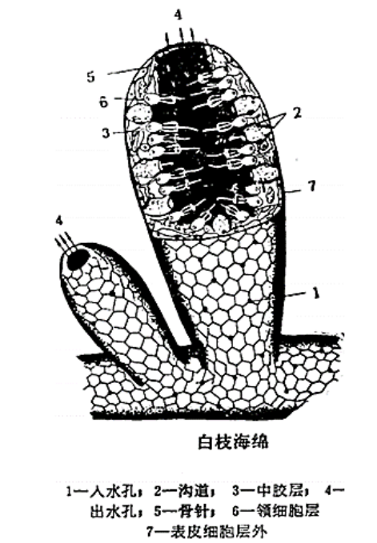

亦称多孔动物门(Porifera)

海洋中营固着生活的一类单体或群体动物,
是最原始的一类后生动物。多细胞,但还没
有形成组织或器官。身体由两层细胞构成体
壁,体壁围绕一中央腔,中央腔以出水口与
外界相通。体壁上也有许多小孔或管道与外
界或中央腔相通。

根据骨骼特点分为3个纲:钙质海绵纲
(Calcarea)、六放海绵纲(Hexactinellida)
和寻常海绵纲(Demospongiae)

2. 古杯动物门

.. image:: image/古杯动物门.png
  :alt: 古杯动物门结构图
  :align: right
  :width: 10em

古杯是绝灭了的低等多细胞后
生浅海底栖动物。古杯为单体,
形状多样,常呈杯状、锥状、
圆柱状和盘状等;也有群体,
呈树丛状和链状等。杯体表面
有光滑的、有具瘤状突起或具
纵向与横向褶纹的。个体从几
毫米~几十厘米不等。

已描述的古杯约有300多个属,
1000多种

腔肠动物门和珊瑚纲(低级真后生动物)
======================================

从腔肠动物开始可以看到明显的组织和组织间的协同工作，因而被称为最原始的真后生动物。

.. image:: image/腔肠动物.png
  :align: right
  :alt: 腔肠动物结构图
  :width: 10em

腔肠动物门(Coelenterata)

* 低等二胚层多细胞真后生动物,有组织无器官。
* 体壁由内胚层、外胚层和中胶层组成,由体壁包围形成肠腔,司消化和吸收作用。
* 身体多呈轴射对称,少数为两侧对称。体型可以归纳为水螅型和水母型两类。这两种体型往往是一种腔肠动物生活史的两个阶段。绝大多数海生。

按生活方式和形态分为水螅型（底栖），水母型（游泳）。

1. 水螅型

圆筒状,有基盘,开口向上,固着。单体或群体

2. 水母型

圆盘状、伞状,口朝下, 漂游。单体。

.. image:: image/腔肠动物门划分.png
  :align: center
  :alt: 腔肠动物门划分

珊瑚纲总体介绍
----------------------

腔肠动物门中化石最多的一个纲

有单体和复体之分，复体一般指示温暖、清澈的正常浅海，水深20m左右，水温25~30摄氏度最为合适。

单体生活范围广，低温和各种深度都有分布。

珊瑚无器官，有组织，身体结构可以视为被板状组织或轴状（只有中轴一类）的组合。

珊瑚的内部结构：

1. 横列结构：顺着横向排列的板状构造，将珊瑚划分为纵列的多个壁室。
2. 纵列结构：顺着纵向排列的板状构造，根据生长顺序和长度可划分为多级隔壁。
3. 边缘构造：鳞板:位于隔壁之间上拱的小板；泡沫板:切断隔壁的大小不等的板。鳞壁被隔壁分割，泡沫板不被隔壁分割。
4. 轴部构造：中轴或中柱，中轴为实心，中柱为降至的蛛网状构造。

珊瑚的生长顺序由下至上，发育有横向的年轮，可以用来指示时间。

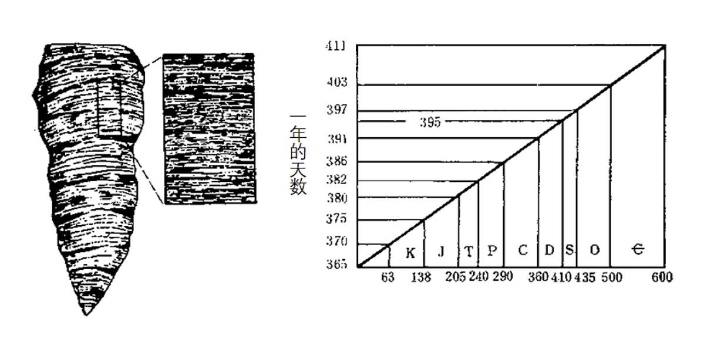

四射珊瑚亚纲
------------------------

四射珊瑚有单体和复体之分，单体多为锥状。

复体紧密相连为块状复体，覆体间有一定距离为从状复体。

四射珊瑚的外部构造：

1. 顶部虫体居住的杯形凹陷：萼
2. 年轮

四射珊瑚的组合类型：

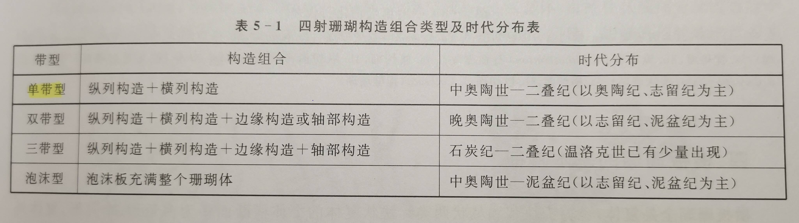

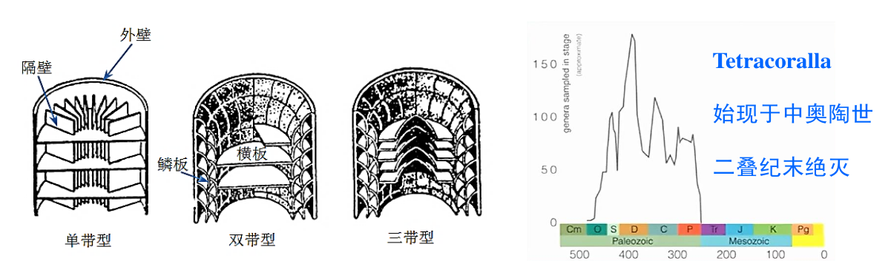

四射珊瑚化石代表
^^^^^^^^^^^^^^^^^^^^^^^^^

1. *Hexagonaria* 六方珊瑚，D-P

多角状复体，隔壁常不达中心，鳞板呈人字型。

2. *Litostrotion* 石柱珊瑚，密西西比亚纪C1

多角状或从状复体，隔壁较长，具有明显的中轴。

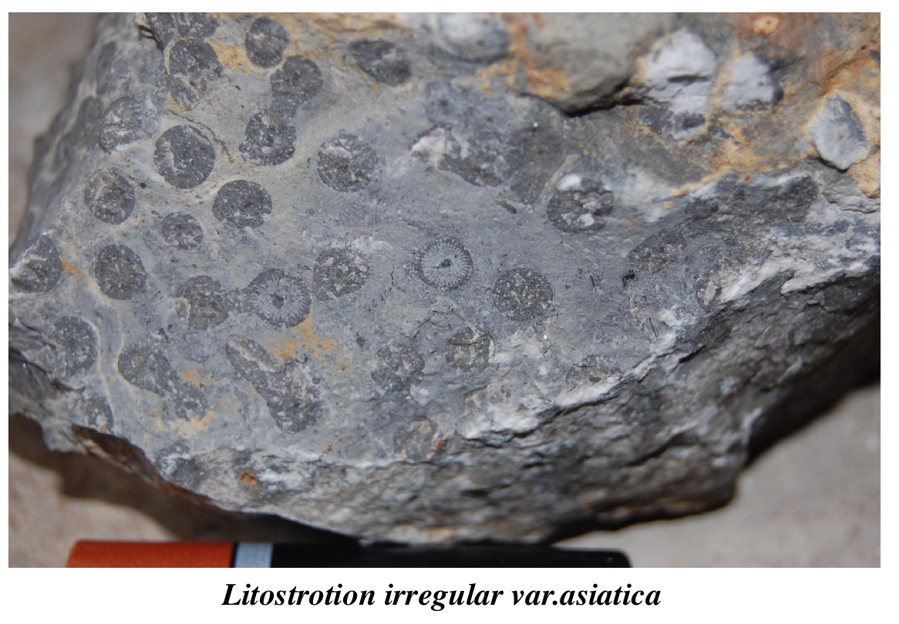

横版珊瑚亚纲
---------------------------

全为复体

无隔壁或隔壁不发育，横版极为发育

有独特的联结构造，孔状、管状、板状，使各个腔室联结起来。

横版珊瑚化石代表
^^^^^^^^^^^^^^^^^^^^^^^^^

1. Michelinia

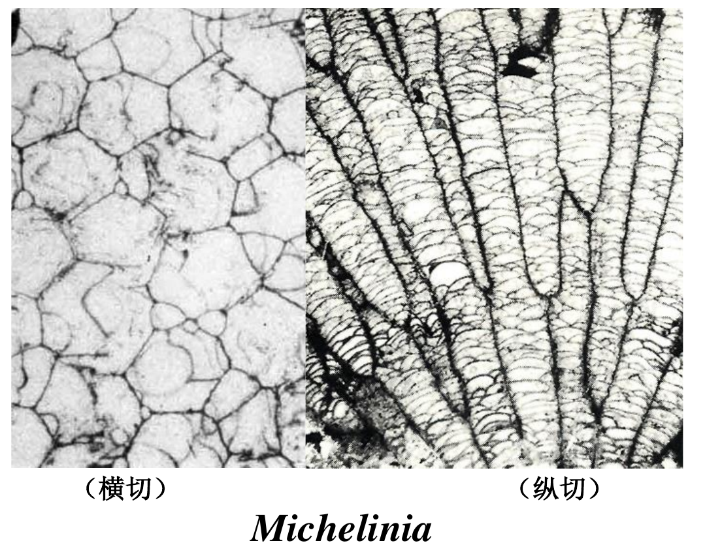

2. Hayasakaia 早坂珊瑚

.. image:: image/早坂珊瑚.png
  :align: center
  :alt: Hayasakaia

软体动物门双壳纲、头足纲、腹足纲(原口动物之一)
========================================================

软体动物门数量多、分布广,是动物界第二大门类。
适应能力强,陆上和海上均有代表,如蜗牛、田螺、乌贼等

身体可分为头、足、内脏团和外套膜四部分, 不分节,外套
膜包裹内脏团并且常分泌钙质硬壳。
水生种类鳃呼吸,陆生种类以外套膜当肺呼吸

依据软体和硬壳形态等特征可分为十个纲：

.. image:: image/软体动物分纲.png
  :align: center

软体动物分纲代表

.. container:: custom

  .. image:: image/软体动物分纲代表1.png
    :align: center
  .. image:: image/软体动物分纲代表2.png
    :align: center
  .. image:: image/软体动物分纲代表3.png
    :align: center
  .. image:: image/软体动物分纲代表4.png
    :align: center
  .. image:: image/软体动物分纲代表5.png
    :align: center
  .. image:: image/软体动物分纲代表6.png
    :align: center

软体动物门双壳纲（Bivalvia）
-------------------------------------

水生、两侧对称,具左右两瓣外壳

由两瓣外套膜包围成外套腔,腔内具瓣状鳃，也称瓣鳃纲(Lamellibranchiata)

足位于身体前腹方,常似斧形，也称斧足纲(Pelecypoda)

双壳纲身体结构：

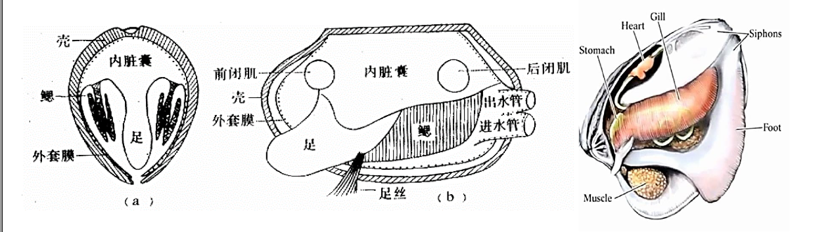

双壳类壳体的基本构造
^^^^^^^^^^^^^^^^^^^^^^^^^^^^

壳体结构如图：

.. image:: image/双壳纲壳体结构.png
  :align: center
  :alt: 双壳纲壳体结构

喙：最早形成的壳尖，多指向前方

壳顶：包括喙周围壳体最大弯曲区

后壳顶脊：由喙向后腹方延伸的一条隆脊

后壳面：后壳顶脊与后背缘之间的壳面

铰合线：两壳后缘铰合的边缘线

前耳、后耳：喙前和后方翼状伸出部分

耳凹：耳与壳体之间的槽状凹陷

壳饰：

同心饰：同心纹、线、 脊、层（皱）

放射饰：线、脊、褶， 分叉、插入

网状饰

刺、瘤、节等

.. image:: image/双壳纲壳的定向.png
  :align: center
  :alt: 壳的定向

壳分前、后、背、腹、左、右
两壳铰合的一方称背方，相对壳开闭的一方为腹方
一般喙指向前方，壳前后不对称者，一般后部较长

双壳纲的地史分布
^^^^^^^^^^^^^^^^^^^

始现于寒武纪第二世∈2

Ｏ为辐射分化期

S-D进一步分化新类别并出现淡水类型

Mz迅速发展

Rec.达全盛

软体动物门头足纲
------------------------

是软体动物门中发育最完善、最高级的一个纲
全部海生、食肉动物、海底爬行或水中游泳
两侧对称，头、眼发育、位于前方，中央有口。腕的一部
分环列于口周围，用于捕食；另一部分则靠近头部的腹侧，
构成排水漏斗，是独特的运动器官。

鳃呼吸

四鳃：
具外壳

二鳃：
具内壳或无壳

.. image:: image/头足纲生态图.png
  :alt: 头足纲生态图
  :align: center

头足纲身体结构
^^^^^^^^^^^^^^^^^^^

.. image:: image/头足纲身体结构.png
  :alt: 头足纲身体结构
  :align: center

头足纲外壳类化石特征
^^^^^^^^^^^^^^^^^^^^^^

.. image:: image/头足纲化石代表.png
  :alt: 头足纲化石代表
  :align: center

1. 头足纲壳的基本构造

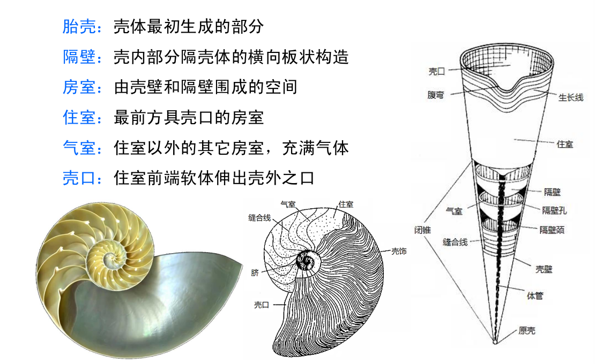

.. image:: image/头足纲壳的基本构造2.png
  :align: center
  :alt: 头足纲壳的基本构造

.. image:: image/头足纲壳的基本构造3.png
  :align: center
  :alt: 头足纲壳的基本构造

2. 头足纲外壳类体管类型

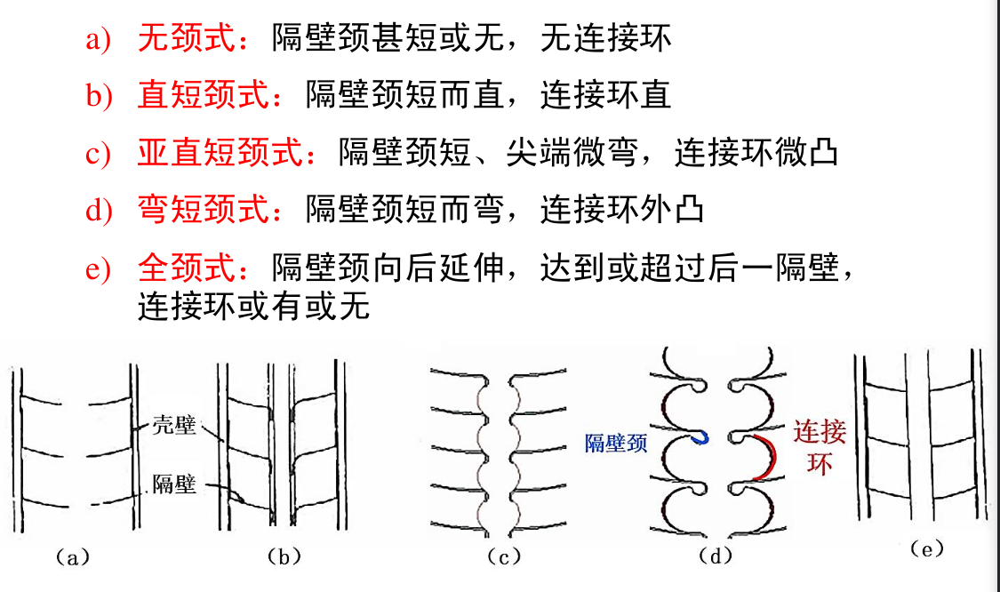

3. 头足纲外壳类缝合线类型

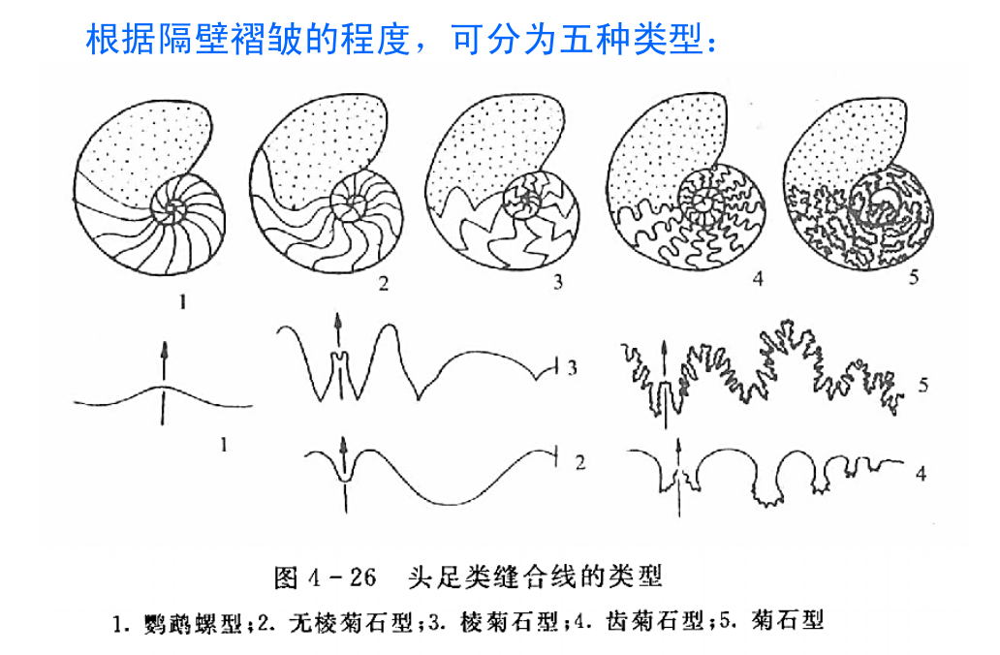

4. 头足纲外壳类壳饰

.. image:: image/头足纲外壳类壳饰.png
  :align: center
  :alt: 头足纲外壳类壳饰

5. 头足纲外壳类定向

.. image:: image/头足纲外壳类定向.png
  :align: center
  :alt: 头足纲外壳类定向

头足纲的生态和地史分布
^^^^^^^^^^^^^^^^^^^^^^^^^^^^

1. 头足纲生态

* 全为海生
* 现代鹦鹉螺（只有一个属Nautilus）生活于浅海区，也可达较深的海区，营游泳或底栖爬行生活
* 化石外壳类都具气室，壳壁较薄，壳面的脊或瘤也是空的，具有一定的游泳能力，其游泳能力的强弱因壳形不同而有所差别。

2. 头足纲地史分布

.. image:: image/头足纲地史分布.png
  :align: center
  :alt: 头足纲地史分布

软体动物门腹足纲（Gastropoda）
------------------------------------

通称螺类。

具有明显的头部，体外有一枚螺旋卷曲的贝壳，仅寒武
纪早期地层中的某些腹足类动物其贝壳对称。

头部发达，具眼、触角。
足发达，叶状，位腹侧，故称腹足类。

腹 足 类 构 造
^^^^^^^^^^^^^^^^^^^^^^^

.. image:: image/腹足类构造.png
  :align: center
  :alt: 腹足类构造

节肢动物门和三叶虫纲(原口动物之二)
=========================================

节肢动物门（Arthropoda）门类最庞大，占现生动物的
85%，如虾、蜘蛛、蚊子、苍蝇等。

生态领域极广，几乎遍布所有生态领域，部分寄生。

体节愈合成头、胸、腹或头、胸、尾三部分，附肢分节。
体披甲壳或厚皮，几丁质或磷酸钙质，脱壳生长。

1. 节肢动物门传统分类

.. image:: image/节肢动物门传统分类.png
  :align: center
  :alt: 节肢动物门传统分类

2. 节肢动物门代表

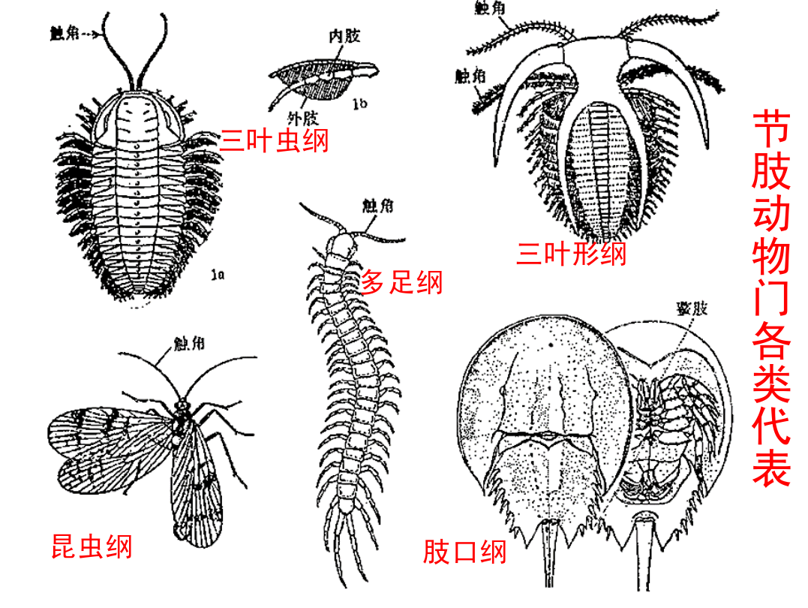

.. image:: image/节肢动物门代表2.png
  :align: center
  :alt: 节肢动物门代表

3. 节肢动物门现代分纲

.. image:: image/节肢动物门现代分纲.png
  :align: center
  :alt: 节肢动物门现代分纲

三叶虫纲（Trilobita）
-------------------------

Cambrian-Permian,Cam.- Ord.最盛，二叠纪末灭绝，是
节肢动物门中化石最多的一类。

三叶虫纲身体结构
^^^^^^^^^^^^^^^^^^^^

身体扁平，背甲坚硬，腹侧为较软的腹膜和附肢  

背甲为两条纵向背沟，划分出一个轴叶和两个肋叶，故称三叶虫。

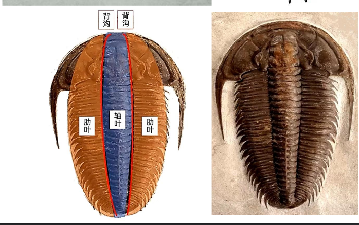

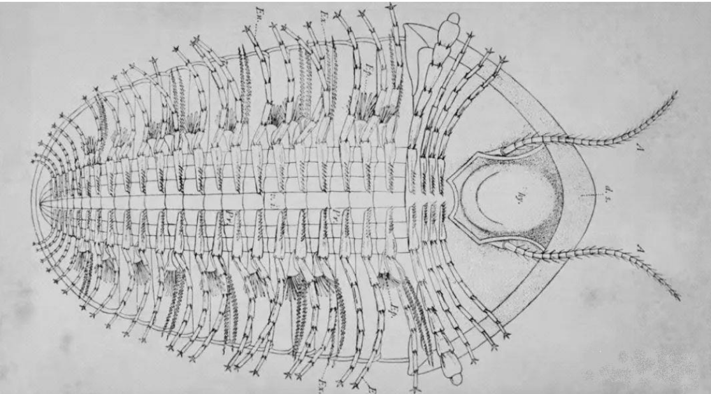

三叶虫纲背甲化石特征
^^^^^^^^^^^^^^^^^^^^^
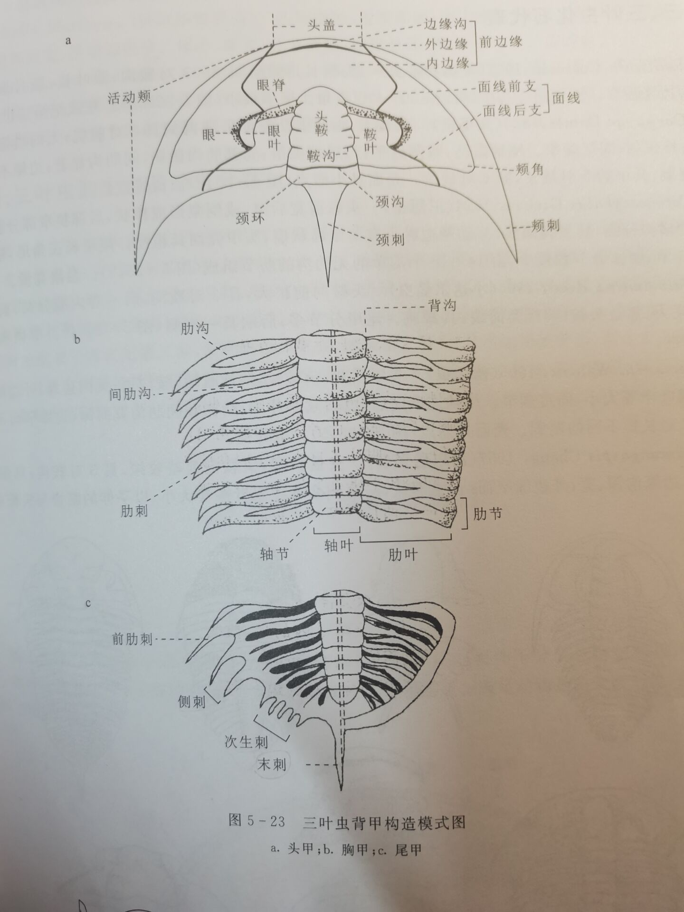

1. 头甲

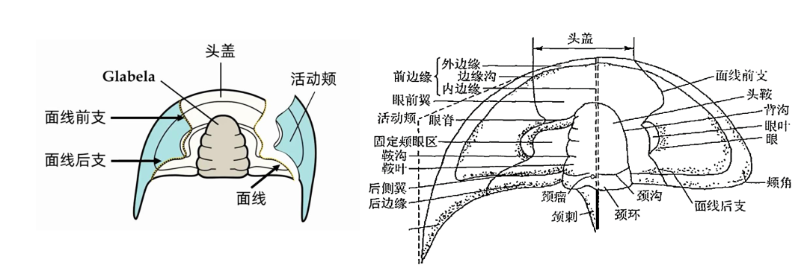

形状多呈半圆形，中间隆起部分为头鞍和颈环，其余扁平部分称颊部。

头鞍：形状为锥形、截锥形或梨形，后端有颈沟与颈环分开。

鞍沟：头鞍之间的夹角上横向或倾斜的浅沟，一般＜5对。鞍沟间为鞍叶

前边缘：头鞍之前的颊部。它被边缘沟划分为内边缘和外边缘。

颊角：头甲侧缘与后缘。

眼叶：在面线中部，固定颊外侧有一对半圆形突起。对眼起支撑作用。其形状、大小及距头鞍的位置，在分类上十分重要。

眼脊：眼叶前端的一条凸起脊线，与头鞍前侧角相连。

面线：大多数三叶虫的头甲背面被一对面线穿过，因此推测三叶虫蜕壳时，虫体由面线裂开得出

.. image:: image/三叶虫面线类型.png
  :align: center
  :alt: 三叶虫面线类型

面线类型是三叶虫重要的分类依据

2. 胸甲

.. image:: image/三叶虫胸甲结构.png
  :align: center
  :alt: 三叶虫胸甲结构

* 由若干形状相似，相互连衔接并可活动的胸节组成
* 胸节数目最少2节，最多40节
* 每一胸节都有一对背沟，把胸节分为中央的轴节和两侧的肋节
* 各肋节之间为间肋沟所分隔，每个肋节上有肋沟。肋沟深而宽，间肋沟窄而细。
* 肋节末端钝圆，或延长成刺

3. 尾甲

.. image:: image/三叶虫尾甲结构.png
  :align: center
  :alt: 三叶虫尾甲结构

* 由若干体节愈合而成，1节~30节
* 多呈半圆形或近三角形
* 中央为尾轴，两侧为肋部
* 肋沟较间肋沟深而宽
* 边缘宽窄不一，有时具有各种尾刺

尾甲类型：

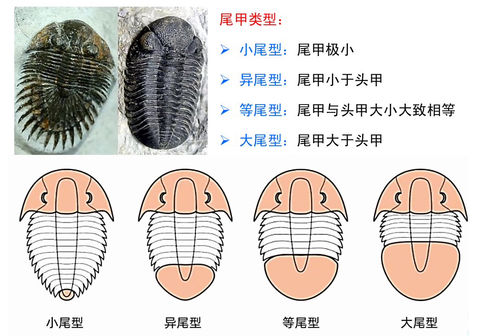

三叶虫代表化石简述
^^^^^^^^^^^^^^^^^^^^^^^^^^

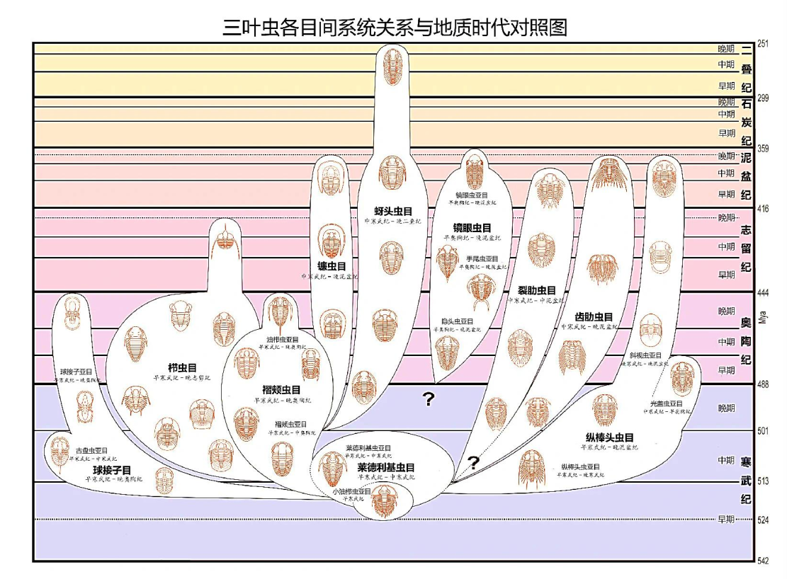

1. 球接子目(Agnostina)

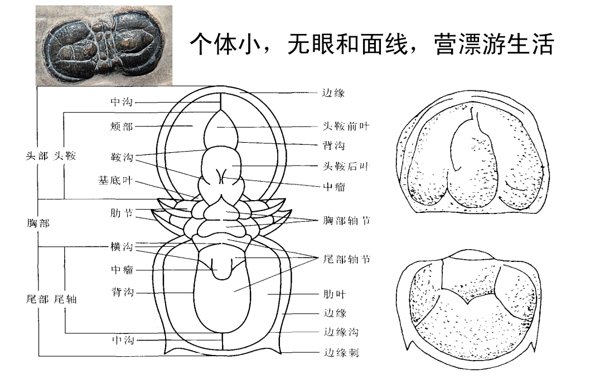

三叶虫纲生态和地史分布
^^^^^^^^^^^^^^^^^^^^^^^^^^

1. 地史分布

始现：寒武纪第二世

分布时限：寒武纪至二叠纪

最繁盛期：寒武纪，占统治地位

退居次要：奥陶纪，不占统治地位

急剧衰退：志留纪至二叠纪，只留少数类别

绝灭：二叠纪末

2. 不同地史的特点

* 早寒武世三叶虫：头大、尾小，胸节多，头鞍长、锥形，鞍沟显著，眼叶发育，靠近头鞍，胸节肋刺发育

* 中、晚寒武世三叶虫：尾甲变大，多为异尾型；胸节数减少，头鞍较短，多具内边缘；眼叶较小，鞍沟数量减少，且很少穿越头鞍

* 奥陶纪三叶虫：尾甲更大，多为等尾型甚至大尾型，胸节数量进一步减少，一般8-9节，头鞍向前扩大，鞍沟、背沟，甚至颈沟都不发育

* 志留纪至二叠纪三叶虫：急剧衰退

3. 三叶虫实习辨别

* Ptychagnostus 褶纹球接子Cam2
* Redlichia 莱德利基虫 Cam2
* Drepanura 蝙蝠虫Cam31
* Shantungaspis 山东盾壳虫Cam13
* Damesella 德氏虫Cam23
* Coronocephalus 王冠虫 S2
* Nankinolithus 南京三瘤虫O3

.. image:: image/王冠虫.png
  :align: center
  :alt: 王冠虫

腕足动物门和苔藓动物门(原口后口过渡生物)
==========================================

苔藓动物门（Bryozoa）
--------------------------

又称多个员动物门（Polyzoa）或外肛动物门（Ectoprocta）
水生原口-后口的过渡动物，其个员构成形状和大小各异的群
体。苔藓动物各种间差异甚大。Monobryozoon属为一小属，
生活于海洋的沙粒之间，长度不及1mm；而Zoobotryon属生
活于暖水，其群体从码头的桩架构上成丛或成链状挂下，直
径可达45.7cm。苔藓动物生长于突出于海岸的岩石上，植物
上或船体上。

苔藓动物可分为三纲︰被唇纲（Phylactolaemata, 生活于淡
水），窄唇纲（Stenolaemata, 海生），以及裸唇纲
（Gymnolaemata, 多为海生）。

.. image:: image/苔藓动物门化石.png
  :align: center
  :alt: 苔藓动物门化石

腕足动物门(Brachiopoda)
-----------------------------

腕足动物门是海生底栖、单体群居、具真体腔、硬体不分节且两侧对称的无脊椎动物。体外披着凉拌大小不等的壳，
壳质主要为钙质或几丁磷灰质。腕足动物是滤食性动物，其滤食器官为纤毛腕。

腕足动物门身体结构
^^^^^^^^^^^^^^^^^^^^^^^^

.. image:: image/腕足动物门.jpg
  :align: center
  :alt: 腕足动物门

腕足动物门化石结构
^^^^^^^^^^^^^^^^^^^^^^^
1. 化石代表

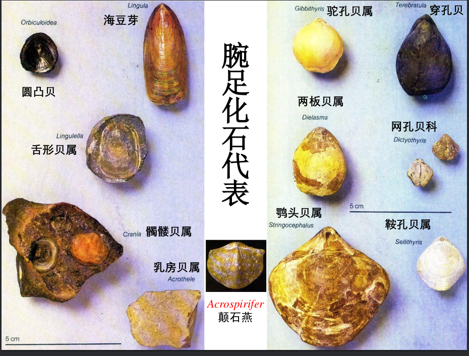

2. 壳体定向

.. image:: image/腕足动物门壳体定向1.png
  :align: center
  :alt: 腕足动物门化石代表

.. image:: image/腕足动物门壳体定向2.png
  :align: center
  :alt: 腕足动物门化石代表

``待补充``

腕足动物门的生态和地史分布
^^^^^^^^^^^^^^^^^^^^^^^^^^^^^^^^^^^^
1. 生活方式

肉茎固着：如Lingula
腹壳固着：如李希霍芬贝（Richtofenia）类的
腹壳特化成珊瑚状，并以根状刺固着
以腹壳自由躺卧，如扭月贝类
以腹壳的刺支撑，如长身贝类

2. 地史分布

*  始现于早寒武世
*  三次大繁盛：O、D、C-P
*  二叠纪末急剧衰退
*  进入中生代，数量虽然还较多，但己明显进入衰退期，而软体动物却大发展
*  新生代，腕足动物面貌己接近现代

腕足类实习
^^^^^^^^^^^^^^^^^^^^^

*  Lingula 舌形贝 Cam-Rec.
*  Sinorthis 中华正形贝O1
*  Yangtzeella 扬子贝O1
*  Dictyoclostus 网格长身贝C-P
*  Yunnanellina 小云南贝 D3
*  Cyrtospirifer 弓石燕 D3
*  Stringocephalus 鹗头贝D2

.. image:: image/腕足动物门-舌形贝.png
  :align: center
  :alt: 腕足动物门-舌形贝

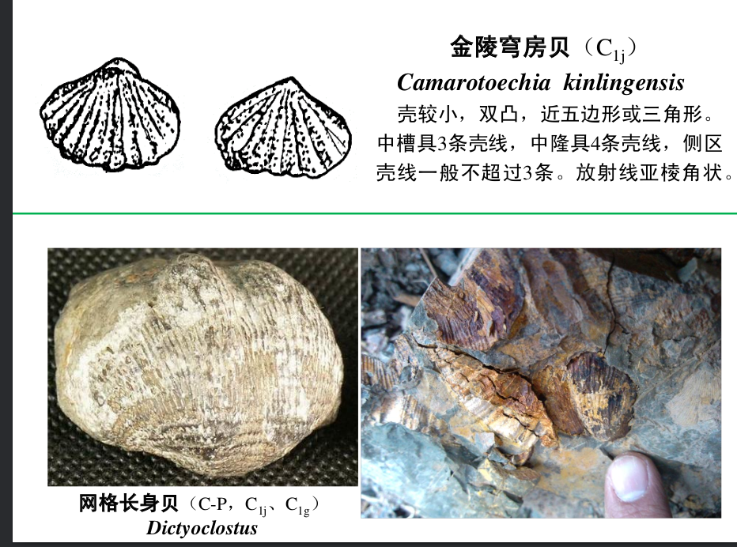

腕足动物门-具铰纲
------------------------

具铰合构造，有各种支腕构造，钙质壳。下分8个目：

古植物
*****************

微体化石
*****************

地层的划分和对比
*****************

基本概念
==================

地层学：研究层状岩石形成的先后顺序、
地质年代、时空分布规律（狭义）、形
成环境条件及其物理、化学性质的地质
学分支学科。其核心目标是建立地球科
学时间坐标。

地层（ Stratum ）——赋予了时间属性的层状岩石

野外所见所有成层状的岩石称为岩层，包括沉积岩 、部分火成岩和变质岩。
当探讨其形成年代、形成先后顺序和地质填图单元时，称其为地层。

地层学的研究对象是地质历史中形成的岩层。岩层是地
层的基本组成单元。

地层划分：是指根据岩层具有的不同物质属性把岩层组
织成不同的单位

地层对比：是指根据不同地区或不同剖面地层的各种属
性进行比较，确定地层单位的地层时代或地层层位的对
应关系。地层的时间属性对比是最重要和最基本的对比。

地层律
====================

1. 地层叠覆率（ Law of superposition ）

原始沉积形成的地层，在未经构造变
动改造的情况下，总是上新下老。

2. 原始水平率（ Principle of original horizontality ）
3. 侧向连续率（ Principle of lateral continuity ）

4. 地质体切割率（ Principle of cross-cutting relationships ）

切割律的基本内容为：较新的地质体切割较老的地质体。

5. 化石层序率（ Principle of faunal succession ）

.. image:: image/化石层序律.png
  :align: right
  :alt: 化石层序律
  :width: 25em

地层越老，所含
的生物越简单，
反之亦然；不同
时代地层，有不
同的化石组合。
新生代地史

新生代地史
*****************

中国历史大地构造
*********************

References
***********

.. _常见化石门类.pdf: https://github.com/sicheng1806/essentials/blob/main/docs/source/cjhsml.pdf

