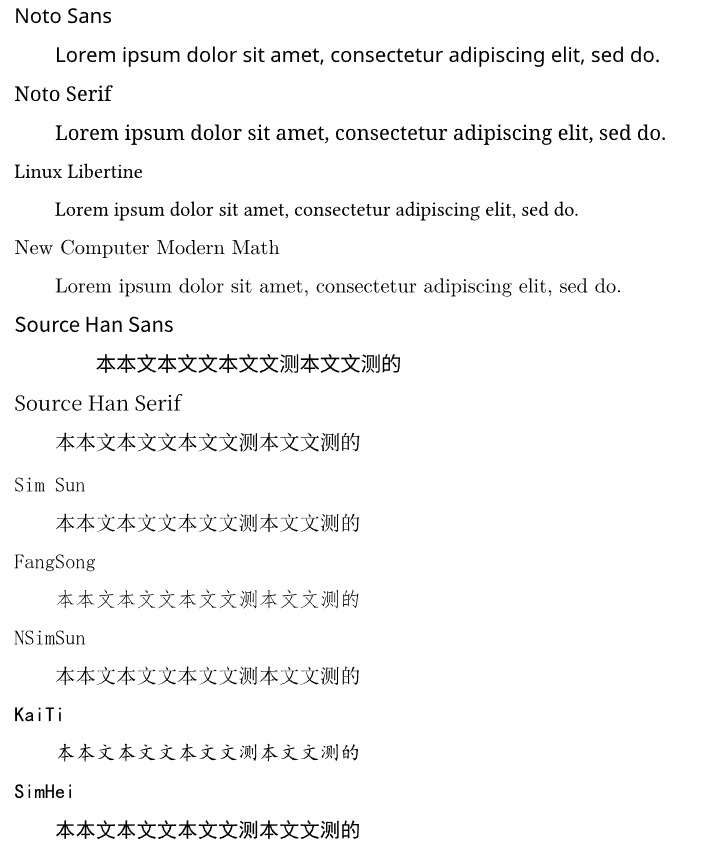

****************
Typst摘要
****************

.. contents:: 

个人整理的排版模型
=====================

容器(content)
----------------------

容器管理内部容器的布局方式，即排版。

page容器处理容器的方式
-------------------------

page容器是管理每一页排版的容器函数，它返回的content，单独为n页，具体根据容器内部内容决定，但不会跟其他页面混杂。假设容器都为方形，都具有高度和宽度。页面容器会按照内联容器相互连接可以成为一行，外联容器单独成行。每行高度由容器最高的容器高度决定。行的间距也可以调节。

- 设置页面大小，排版方向，页面边距，页眉页脚，页编号等，决定了正式排列内容的区域。
- 使用colums容器对正式排列内容的区域进行分列
- 使用par容器划分段落，排列。
- 对于内部的字符，自动调用text容器处理。

text容器
------------

text容器是处理字符的特殊容器，可以抽象为字符的1维序列，可以设置字符的size,font，style,weight，颜色(fill)，字符间距，容器高。值得注意的是在被其他容器包含时，会自动横式填充。

对于在其中的非字符容器，其中对字符部分的设置不会影响到容器的大小，但是可以影响到容器内部的字符。
所以，text容器是用来实例化文字的的特殊容器，对非文字部分没有影响，只是将他们简单的排列包含在一起。

colums容器
----------------

分列，值得注意的是，使用主动使用colums容器可以使不同的列在一页排布。

grid容器
----------------

将内容排步在给定大小的网格中形成的新的容器。

par容器
-------------

段落容器，将内部内容按行排列，具体取决于其外部page容器的设置，可以设置行距，换行，对齐方式和缩进。page容器内中的分行排列即是由par容器完成的。两者不可分割。

* 根据横向边距和容器类型以及换行符、缩进分行
* 根据align容器确定对齐方式，没有则自动调用
* 确定行间距

**内联式容器和非内联容器的排版区别**

**不同高度内联式容器排版**

align容器
------------

确定内部分行的容器的对齐方式，参数类型为类枚举的`alignment`

columns容器
---------------

angle 容器 
-------------------

改变原有容器的旋转角度成为具有新的行和高的矩形容器，一些容器对其有选项。

box容器和block容器
---------------------

都为指定高度宽度的矩形容器，可以填充背景色，放置内容等。区别在于box容器是内联的，block不是。

hide容器
------------

用于隐藏内容

还有许多其他容器请查阅官方文档
--------------------------------

set和show规则
==================

**函数式show规则**

**show set规则**

**set规则**

**set-if规则**

代码模式与模块和包
=====================

对北京大学学位论文模板的学习
===============================

使用cetz画图
=================

代码模式的数据类型
=====================

字体设置
------------

字号大小
^^^^^^^^^^^^

.. code:: C

    #let 字号 = (
    初号: 42pt,
    小初: 36pt,
    一号: 26pt,
    小一: 24pt,
    二号: 22pt,
    小二: 18pt,
    三号: 16pt,
    小三: 15pt,
    四号: 14pt,
    中四: 13pt,
    小四: 12pt,
    五号: 10.5pt,
    小五: 9pt,
    六号: 7.5pt,
    小六: 6.5pt,
    七号: 5.5pt,
    小七: 5pt,
    )

字体
^^^^^^^^^

.. code:: C 
    
    #let 字体 = (
    仿宋: ("Times New Roman", "FangSong"),
    宋体: ("Times New Roman", "SimSun"),
    黑体: ("Times New Roman", "SimHei"),
    楷体: ("Times New Roman", "KaiTi"),
    代码: ("New Computer Modern Mono", "Times New Roman", "SimSun"),
    )

.. note:: 
    这些中的大部只在windows平台，其中Times New Roman虽然经典，但似乎已经过时了。对于linux平台见下：

字体概况
^^^^^^^^^^^

**支持部分免费或全部免费的字体**

* 文泉驿：一个由 FanQ 领导的自由字体在线协作社区 
  
  * 文泉驿微米黑 : 
  * 文泉驿正黑体 
  * 文泉驿点阵宋
  * Unibit
* Droid: Google Android 旧字体
  
  * Droid Sans Fallback: 微米黑他爹，中日韩支持。
* cwTeX:台湾 TeX 社区的繁体字体，中文部分另有拆出来 OFL 的版本。

  *  cwTeX明体
  *  cwTeX粗黑
  *  cwTeX仿宋
  *  cwTeX楷书 
  *  cwTeX圆体
* Fandol: 简体中文 Tex 字体 GPL+FE
* 文鼎开放字体
  
  * 文鼎PL简报宋
  * 文鼎PL细上海宋
  * 文鼎PL简中楷
  * 文鼎PL中楷
  * 文鼎PL明体U20-L
* CJKUnifonts
* 柳体：huangjiahua开发的GB2312字体，适合用作艺术字体。
* 思源宋体：Adobe 联合 Google 于 2017 年 4 月 3 日发布了思源宋体（ Source Han Serif，Google 称 Noto Serif CJK）。和思源黑体一样，思源宋体以 “SIL 开放字体许可证” 开源发行，且同样含简繁日韩四种汉字写法和七种粗细字重给出。
* 方正免费字体：方正黑体、方正书宋、方正仿宋、方正楷体
* 思源黑体：是Adobe与Google所领导开发的开源字体家族，。公开之时为当时涵盖字元数量最多的字体，44,666个字元分属于65,535个字形中，此为OpenType字体技术的极限。

**如果不需商业发布，可以导入windows上的字体**

linux 平台的字体导入方法

- 储存字体的文件位于 `/usr/share/fonts/*` ，位于这个目录下的字体文件，包括在深层文件夹内的字体文件，都可以作为系统字体文件。
- linux 可用 `fc-list` 命令查看安装的字体，输出内容中也有目录，可以通过它查看字体和字体存放路径
- windows 上的字体位于 `c:\windows\Fonts\*` 字体文件一股脑堆在此
- 字体格式有 `.ttf`, `.otf`, `.pfb` , `.pcf` 等,具体查看linux下的字体目录，其按 `./字体格式/字体名称/字体文件` 整理。
- 经检查，未拷贝字体文件前，我的系统中有
  
  * Noto：Google 开发的一个开源字体项目。该项目的目标是提供一套包含所有语言字符的免费字体，以便在计算机上实现全球化和多语言支持。
    
    * 拉丁字体可以选用其 `Noto Sans` 或 `Noto Serif` 。 Sans指无衬线，Serif指有衬线（小装饰）
  * wqy中的 wqy-zenhei
  * SourceHan: 官网安装，有其无衬线和有衬线的版本
    
    * 中文推荐思源宋体(有衬线)和思源黑体(无衬线)
    * 可以使用windows中的宋体和黑体和仿宋(`SimSun`, `SimHei`, `FangSong`)

字体风格
^^^^^^^^^^^

**字体分类**

字体一般分为：

* Sans 无衬线
* Serif 有衬线
* Mono  等宽（有的没有）

**字体风格(style)**

* normal 正常
* italic 斜体
* oblique 简单倾斜

**字体重度(weight)**

指字体的轻重（粗细、着色深度等）

Linux下我的字体设置
^^^^^^^^^^^^^^^^^^^^

通过前面的调查和实践，我导入了部分windows中文字体，下载了思源字体。

* 对于拉丁字体
  
  * `Noto Serif`
  * `Noto Sans`
  * `Linux Libertine` （个人更喜欢这个，但是它字形较小，会显得中文大一些）
* 对于数学公式
  
  * 其实不用特意设置
  * `New Computer Modern Math`
* 对于中文
  
  * `Source Han Sans` 思源黑体
  * `Sourch Han Serif` 思源宋体
  * `SimSun` 宋体（from windows）
  * `FangSong` 仿宋 (from windows)
  * `NSimSun` 宋体(from windows)
  * `KaiTi` 楷体(from windows)

.. code:: C
    
    // Linux fonts
    #let 字体 = (
    仿宋: ("Noto Serif", "FangSong"),
    宋体: ("Noto Serif", "SimSun"),
    黑体: ("Noto Serif", "Source Hans Sans"),
    楷体: ("Noto Serif", "KaiTi"),
    代码: ("New Computer Modern Mono", "Times New Roman", "SimSun"),
    )

**字体示例**

布局设置
------------

下划线
^^^^^^^^^^^^^

typst中的 `underline` 只对字符添加下划线，如果要设置封面中的下划线，可以利用 `line` 块。
由于 `line` 返回的是不内联的内容块。所以需要与线上的内容分开。

.. code:: c

    grid(
        columns: (80pt)
    )

