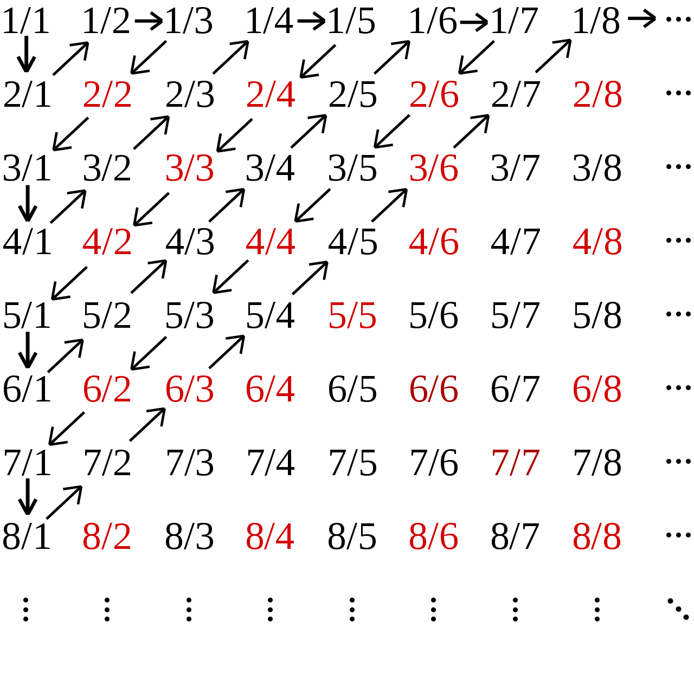

实数和空间线段的关系 
***************************

此章虽然是微积分的基石般的存在，但是却可以十分直观的带过，也就是理解实数(有理数+无理数)才和\
空间线段或数轴是一一对应的。实数数域具有许多运算的封闭性，在一般的运算规则下，运算的结果都位于\
实数域中，也就是实数数域的完备性。但是数域之间的关系是及其有意思的，毕竟数量是数学的灵魂嘛。

这章用到了些许公理系统、谓词系统、集合论和群论的知识，虽然都很浅很浅不影响阅\
读，但是想深入理解，可以去学习这些数学领域的有趣知识。

本章的内容有：

* 什么是实数：介绍数域，从自然数、整数、有理数、无理数到实数。
* 数域的封闭性： 介绍不涉及极限的封闭性。
* 实数与几何线的性质和对应性。

.. contents:: 

什么是实数
============

**概念**

* 数域 ： 暂时看成数和运算的有机结合，具体到群论再深入了解
* 自然数： 0与正数，具体的概念可以由 0 定义 运算后继完成。具体内容见下。
* 整数: 可以由自然数定义运算加减构成。具体内容见下。
* 有理数： 可以由整数定义运算乘除构成。具体内容见下。
* 无理数： 可以有有理数定义幂和开方构成。具体内容见下。
* 实数： 可以由有理数与无理数构成。具有很棒的几何性质。
* 可数集：
* 稠密集：
* 无穷集：
* 封闭性：
* 邻域：

自然数域
-----------

自然数域可以由一个基本元加一个元算后继构成，正数同理。这是自然数域公理化研究的一个结果，十分有趣。同时揭示了自然数的一个重要的性质：单向无穷。

皮亚诺公理
^^^^^^^^^^^^

皮亚诺的这五条公理用 *非形式化* 的方法叙述如下：

1. 0是自然数
2. 每一个确定的自然数a，都有一个确定的后继数a' ，a' 也是自然数；
3. 对于每个自然数b、c，b=c当且仅当b的后继数=c的后继数
4. 0不是任何自然数的后继数
5. 任意关于自然数的命题，如果证明：它对自然数0是真的，且假定它对自然数a为真时，可以证明对a' 也真。那么，命题对所有自然数都真。

所以，0是自然数的起点，1是0的后继，2是1的后继，依此类推，所有自然数的后继都是自然数。
所以自然数为 {0,1,2,3,...}。

第五条公理保证了数学归纳法的正确定，被称为归纳法原理。

根据这五条公理可以建立起一阶算术系统，也称皮亚诺算术系统。

更正式的定义如下：

一个戴德金-皮亚诺结构为一满足下列条件的三元组(X, f, x)：

1. X是一集合，x为X中一元素，f是X到自身的映射。
2. x不在f的值域内。(对应上面的公理4)
3. f为一单射。(对应上面的公理3)
4. 若A为X的子集并满足：
   * x属于A,且
   * 若a属于A,则f(a) 亦属于A
   
   则A = X。

正式定义可以用谓词逻辑表示如下:

戴德金-皮亚诺结构可以描述为满足所有以下条件的三元组 (S, f, e)

* :math:`(e\in S)`
* :math:`(\forall a\in S)(f(a)\in S)`
* :math:`(\forall b\in S)(\forall c\in S)(f(b)=f(c)\implies b=c)`
* :math:`(\forall a\in S)(f(a)\neq e)`
* :math:`(\forall A\subseteq S)(((e\in A)\land (\forall a\in A)(f(a)\in A))\implies (A=S))`

上面 :math:`S对应自然数集合，f对应后继运算，e对应0`

**皮亚诺算术**

上述公理系统可以定义加法和乘法系统，并保持系统的封闭性。

皮亚诺算术(PA)的公理：

* :math:`\forall x(Sx\neq 0)`
* :math:`\forall x,y((Sx=Sy)\Rightarrow x=y)`
* :math:`(\varphi [0]\wedge \forall x(\varphi [x]\Rightarrow \varphi [Sx]))\Rightarrow \forall x(\varphi [x])`
* :math:`\forall x(x+0=x)`
* :math:`\forall x,y(x+Sy=S(x+y))`
* :math:`\forall x(x\cdot 0=0)`
* :math:`\forall x,y(x\cdot Sy=(x\cdot y)+x)`

解释:

* 由于没有严格的接受过谓词逻辑，作稍微不严格的解释
* :math:`S为后继运算，\varphi 为这个公理中的任意运算，在它的那条公理，并未看懂,+即加法，\cdot 即乘法，都为二元运算`
* 第一条为之前的公理，任意自然数的后继不为0。
* 第二条为等号公理，也是之前的公理，将等号用后继表示。
* 第四条和第五条定义了加法的性质，可以将 :math:`x+y = x+S^{y}0 = S^y(x)如果用S^y 表示持续进行y次后继的话`
* 第六条和第七条定义了乘法的性质，可以将 :math:`x\cdot y = x\cdot S^{y}0 = x\cdot S^{y-1}0 + x = \sum\limits_{i=1}^{y}x`

如果要证明在加法和乘法下封闭，只需证明任意自然数加法乘法都可以用自然数的后继或0表达就行了。

归纳法原理和无穷递降法
-------------------------

在自然数公理中可以得到三个十分重要的性质。

* 归纳法原理
* 自然数具有最小数，0
* 自然数对加法和乘法封闭

前两条的运用就是重要的数学归纳法和无穷递降法(或最小数原理)

数学归纳法
^^^^^^^^^^^^

最简单和常见的数学归纳法是证明当 n n等于任意一个自然数时某命题成立。证明分下面两步：
1. 证明 “当 n = 0 时命题成立。”
2. 证明 “若假设在 n = m n=m时命题成立，可推导出在 n = m + 1 n=m+1时命题成立。

归纳法的核心在与将任意问题，转化为两步证明，且核心在于第二个证明。
曾经对归纳法的思考让我认识到，归纳法的灵魂在于结构的转变。例如：

**数学归纳法示例**

:math:`证明：公式(\sum\limits_{i=0}^{n}{i^2} = \frac{1}{6}n(n+1)(2n+1))对于n属于任意自然数成立`

* 当 :math:`n = 0 时，左边=0=右边`，
* 若 :math:`n=N时成立，对于n'=N+1时有`

  .. math:: 
    
    & 即证：左边=\frac{1}{6}N(N+1)(2N+1) + (N+1)^2 = \frac{1}{6}(N+1)(N+2)(2N+3) = 右边\\
    & 对于上式可以转化为结构更良好的：(N+1)^2 = \frac{1}{6}(N+1)\left [(N+2)(2N+3) - N(2N+1)\right ] \\
    & (N+2)(2N+3) - N(2N+1) = 6(N+1) 成立。

无穷递降法
^^^^^^^^^^^^

无穷递降法是利用自然数一定有最小数的性质。常用来证明方程无解，是反证法的一种。
一般步骤为：

* 假设方程有解，并设X为最小的解。
* 从X推出一个更小的解Y。
* 从而与X的最小性质矛盾。所以，方程无解。

原理即是解所在数域的最小性，例如自然数，正整数，正数等数域。

无穷递降法的灵魂也在于利用结构和数域的性质看到结构是否具有最小的解。

**无穷递降法举例**

.. math:: 证明方程： a^2+b^2 = 3(s^2+t^2) \quad 无正整数解。

* 假设方程有最小正整数解 :math:`(a_1,a_1,s_1,s_2)` ，则：
  
  .. math:: 
    & a_1^2 + b_1^2 = 3(s_1^2 + t_1^2) \\
    由于在正整数域有： & \exists a_2,b_2 \in Z^+ (a_1 = 3a_1,b_1 = 3b_2) \\
    得到 ： & (3a_2^2 + 3b_2^2) = (s_1^2 + t_1^2) \\
    可知： & (s_1,t_1,a_2,b_2) 是更小的解，矛盾。所以原方程无解。

* 对于得到 :math:`a_2,b_2时，如果在自然数域的话，有a_2=a_1=0=b_1=b_2这种选项，但在正数域没有`

整数域和有理数域
---------------------

在此不做严密介绍。具体等群论，集合论。

**整数的产生**

* 整数数域对加减乘封闭，可以类比自然数定义前继和后继来造整数。
* 只是任何元素，包括0都位于前继和后继的值域之中。
* 且一个数的后继的前继是这个数本身。
* 在此基础上定义减法

可以得到整数的性质：

* 不具有单向无穷性，具有双向无穷性。
* 具有离散性，可列。也是最小的无穷集之一，也就是与自然数集等阶无穷。
* 对于加法，减法，乘法封闭。

**有理数的产生**

* 有理数域对加减乘除封闭，可以通过定义除法运算，前继，后继来造有理数系统。
* 有理数可以通过整数的分式表达，这是其最重要的性质之一。
* 有理数同样具有离散性，可列。和自然数集等阶无穷。具体的证明方法为：
  
  .. math:: 

    & 0 , \\
    & 1 ， -1 ,  \\
    & 2 , -2 , \frac{1}{2}, -\frac{1}{2} , \\
    & 3 , -3 , -\frac{1}{3} , \frac{1}{3},\frac{3}{2},-\frac{3}{2},\frac{2}{3}, , -\frac{2}{3}, \\
    & ...  \\
    & \frac{n}{1},-\frac{n}{1} , \frac{1}{n},-\frac{1}{n},...,\frac{n}{n-1},-\frac{n}{n-1},\frac{n-1}{n},-\frac{n-1}{n}\\

    有理数集是可数集

**有理数的其他性质**

* 稠密性：注意到有理数对除法封闭，所以得到对任意有理数的邻域都于有理数的交集不为空，即有理数集是稠密集。
  
  这意味着任意的线段长度，都可以用有理数逼近。这个性质在极限定义后立即显现出其优势。

无理数域
-----------

很早以前，在那个还是欧几里得几何和求解代数方程的古典数学时代，人们曾由于有理数的稠密性认为\
几何线段和有理数是一一对应的，无理数还藏在隐秘的数字、几何角落，被遇到的人们选择性忽视。但是真相\
永远会浮现于世。

**不同进制的小数求解**

.. math:: 

   \left \{ \begin{matrix}
    a =  (a_l\dots a_1a_0.a_{-1}a_{-2}\dots a_{-n})_m = \sum\limits_{k = -n}^{l} a_{k} \times m^k  \\
    a_k = \frac{(a \% m^{k+1} ) - (a \% m^{k} )}{m^k} \\
   \end{matrix} \right.

**有理数的小数表达**

有理数可以用有限小数和无限循环小数表达，这个事实用简单的除法运算就可以得到。
而且小数的这种性质是不受数制影响的。也就是无论有理数无论在哪个数制，都会呈现\
有限小数和无限循环小数。例如:

.. math:: (1/3)_{10} = (0.333\dot{3})_{10} = (0.1)_{3}

所以小数可以体现有理性和无理性。

那什么是无理数呢。

**无理数的小数表达**

无理数可以用无限不循环小数表达，但其实这种表达是不切实际的，因为无限+无规律导致几乎无法分辨无理数。
目前有重要作用的无理数如 :math:`\pi,e` 用特定的符号表达。其他的如 :math:`\sqrt{2},sin15^\circ` 直接由表达式表达，
还有无限形式的极限表达，无限连分数表达。有没有一种统一的表达方式呢？

关于无理数的公理化表达，可能要到实数的公理话表达中解决，因为实数包括无理数和有理数，而无理数和有理数是互斥的。
之前的推导中，相关数域之间的关系也是包含于，而不是互斥。下一个包含于关系的数域为实数。

**无理数的性质**

* 无理数不可数，即不可列。这是由于实数为不可数集，但有理数为可数集倒推过来的。所以无理数集比有理数应该大得多。
* 无理数域中的加减乘除都不封闭。这样看来，将其称为一个数域是有点不可行了。无理数中的四则运算规律为：
  
  .. math:: 无理数 op 有理数 \in 无理数集 ................op为四则运算

  这说明，无理数的无理性在四则运算下只能由其自身消除。

无理数的更多有趣的信息待之后的探索。

连分数
---------

实数除了用小数表达，还可以使用连分数表达，且连分数表达有更优美的性质。

**实数的连分数表达**

.. math:: 
    & a = [a_1,a_1,...] = a_1 + \frac{1}{a_2 + \frac{1}{a_3 + \dots}} \\
    & \left \{ 
    \begin{matrix}
     a = & f_1 = 1 + \frac{1}{f_2} \\
     f_n = & 1 + f_{n+1} \\
     a_n = & f_n // 1 
    \end{matrix} \right.

实数可以表达为唯一的连分数，或连分数序列。
连分数在近似上也有很好的作用，是最佳逼近的基础。

有理数可以表达为有限的连分数。无理数可以表达为无限的连分数。这个现象根据定义很容易得到。
因为有限的连分数可以化为整数项分式，而无理数不能。

二次无理数(整数项二次方程的无理根)可以用循环连分数表示。

其他有趣的性质在之后接触时再详述。反正在分数的表示下无理数一定是无限序列。

实数数域
------------

实数数域具有一系列优良的性质，由于从有理数到实数的跨越太大，想要导出实数需要更强大的工具。

**实数系统的构造**

在数学里，实数系统可以透过不同方式被定义。
其中，基本方法是通过一些公理将实数系统定为一个完备的有序数域。
通过集合论公理，可以证明基本方法中给定的公理是绝对的，即是说如果有两个模型都符合那些公理，
那么这两个模型必然是同构的。这样的模型须是从更基础的对象构建而成的，
而多数的模型的建立都是借助于有理数域。

一个实数系统由以下要素构成

* 一个集合 R 
* R当中的两个不同元素 0 和 1 
* R上的两种二元运算 :math:`+ , \times` (分别叫做加法与乘法)
* R上的一个二元关系 :math:`\ge` (即序关系)构成。 
* 上述要素符合以下性质：
  
  1. :math:`(R,+,\times)是一个域`。即
     
     * :math:`{\displaystyle \forall x,y,z\in R,x+(y+z)=(x+y)+z,x\times (y\times z)=(x\times y)\times z}(加法与乘法的结合性)`
     * :math:`{\displaystyle \forall x,y\in R,x+y=y+x,x\times y=y\times x}(加法与乘法的交换性)`
     * :math:`{\displaystyle \forall x,y,z\in R,x\times (y+z)=(x\times y)+(x\times z)}(乘法对加法有分配律)`
     * :math:`{\displaystyle \forall x\in R,x+0=x}(存在加法单位元:0)`
     * :math:`{\displaystyle \forall x\in R,x\times 1=x}(存在乘法单位元:1)`
     * :math:`{\displaystyle \forall x\in R,\exists -x\in R,x+(-x)=0}(存在加法逆元:-x)`
     * :math:`{\displaystyle \forall x\in R,x\neq 0\Rightarrow \exists x^{-1}\in R,x\times x^{-1}=1}(存在乘法逆元:x^{-1})`

  2. :math:`{\displaystyle (R,\leq )} 是一个全序集。` 即

     * :math:`{\displaystyle \forall x\in R,x\leq x}(自反性)`
     * :math:`{\displaystyle \forall x,y\in R,}若 {\displaystyle x\leq y} 且 {\displaystyle y\leq x}，则有 x=y(反对称性)`
     * :math:`{\displaystyle \forall x,y,z\in R,}若 {\displaystyle x\leq y}且, {\displaystyle y\leq z}，则有{\displaystyle x\leq z}(传递性)`
     * :math:`{\displaystyle \forall x,y\in R,x\leq y} 或 {\displaystyle y\leq x}(完全关系性)`
  3. :math:`R上的两个运算{\displaystyle +,\times } 均与序关系{\displaystyle \leq }相容` 即

     * :math:`{\displaystyle \forall x,y\in R},若 {\displaystyle x\leq y,}则 {\displaystyle x+z\leq y+z}(加法下保持次序)`
     * :math:`{\displaystyle \forall x,y\in R},若 {\displaystyle 0\leq x} 且 {\displaystyle 0\leq y}，则 {\displaystyle 0\leq x\times y}(乘法下保持次序)`
  4. :math:`序关系{\displaystyle \leq }符合戴德金完备性`。即：:math:`若 R 的一个非空子集 A有上界，那么A也有上确界`。换言之，

     * :math:`若 A 是 R 的一个非空子集，而且 A 有上界，那么 A 有一上确界 u ，使得对 A 的任何上界 v ，均有{\displaystyle u\leq v.}`
     
     戴德金完备性，又称实数的完备性。有许多等价命题,如：

     * 最小上界性，又称上确界定理。
     * 柯西收敛准则
     * 闭区间套定理
     * 单调有界定理
     * 聚点定理

这只是其中一种定义方式，但是是最常用的。
这种构造有趣的是有理数满足其中3条公理（同时还满足(阿基米德公理)），所以我们知道第4条公理——实数完备性公理是实数区别与有理数的核心性质。

实数完备性公理及其等价命题
---------------------------

**实数完备性公理的直观感受**

前面三条有理数系统也具备，所以可以很容易就接收。第四条定理中运用了一些新的概念和解释。

概念：

* 有序集的上界： 即为大于这个有序集所有元素的元素。可以属于或不属于此集合。
* 有序集的上确界： 最小的上界。由上可知上界或下界是不唯一的，但是确界呢。

第四条公理叫确界存在定理，在实数中一个集合有上界则一定存在上确界。
这是一个极好的性质，因为可以由比较宽松的条件得到一个比较严格的性质。

我们知道有理数域不具有完备性，完备性是实数域独有的性质。但有理数具有实数不一样的性质——可列性，我喜欢理解为离散的。

虽然有理数之间的间隔可以趋向无限小。但似乎就是缺少什么。

**有理数不满足上确界存在定理**

.. math:: 

    & 证明: 有理数域Q的子集A，存在上界，但是A不一定存在上确界。即： \\
    & 可能 {\displaystyle \nexists 上确界 u \in Q, 使 \forall 上界 v \in Q ，有 u \ge v} \\
    \\
    & 有限有序集一定有上确界。且上确界就是它的最大元素。所以需要考虑无限集。 \\
    & 依靠函数图像：有上界的函数中的 y = a - \frac{1}{x} 其中 x \gt 0 且 x \in Q 。\\
    & 得到有理数集 \{ a - \frac{1}{x} | x \in Q 且 a \in Q \} ,很明显a就是其上确界，并不能证明，但近了一点。\\
    & 如果需要证明命题，就需要构造一个上确界看起来不像个有理数，但元素是有理数的。 \\
    & 在这个考虑中蕴含了一点，无限有理数集合排序后可能趋向一个无理数。\\
    & 更准确的说是 实数。\\
    & 这是一个事实，后面会遇到很多实例，如求e的级数表达，以及任意一个无理数的连分数表达时获得的分数序列。 \\

**确界存在定理**

这些等价命题对于数学分析的证明是十分重要的，因此做些正式的描述：

* 上确界与下确界
  
  * 上界与下界:
    
    设 :math:`S` 是一个非空实数集，如果 :math:`\exists M \in R,使得 \forall x \in S,有 x \ge M` , 则称 :math:`M是S的一个上界`;同理\
    可定义下界。
  
  * 上确界与下确界：
    
    设实数集 :math:`S有上界，记U为S的上界全体构成的集合`,则这个集合的最小数为 :math:`S的上确界` ,记为：

    .. math:: \beta = \mathrm{sup}S.
    
    同理可得下确界 :math:`\mathrm{inf}S`.
  
  * 上确界和下确界的性质：
    
    .. math:: 
        \left \{
        \begin{matrix}
        上界： \forall x \in S,有 x\ge\beta \\
        最小的上界： \forall \varepsilon \gt 0 , O(\beta,\varepsilon) \wedge S \neq \emptyset
        \end{matrix}\right.

* 确界存在定理：

  非空有上界实数集必有上确界，非空有下界实数集必有下确界。

  如果认可实数和小数的对应关系(实际上需要证明实数的完备性)，可以利用小数构造来“证明”一下：

  .. math:: 
    & 显然需要证明的是无最大值有上界的无限集具有上确界,这样的集合如 \{ a - \frac{1}{n} | n = 1,2,3,...\} \\
    & 虽然不能直接得到最大值，但是通过无限小数的构造，可以得到有限位数小数集的最大值 \\

  .. math::
    & 令a_{n} 为将非空有界实数集用十进制小数表示后第n位的数的最大值，a_n = \{0,1,2,3,...,9\} \\
    & 且S_n 表示S中元素在n位截断的集合,注意S_n必定为有限集 \\
    & 则\alpha_n = a_0.a_1a_2...a_n , 且 \forall x \in S_n ,有 \alpha_n \ge x \\
    & 则 \alpha = a_0.a_1a_2... ,有 \forall x  \in S， \alpha \ge x 和 \exists x 有 x \ge \alpha_n \\ 
    & 且 \forall \varepsilon \gt 0 , \exists x,n_0 ,有 \beta - x \lt \alpha - \alpha_n \lt \frac{1}{10^{n_0}} \lt \varepsilon \\
    &&\Box

下面将用确界存在定理证明其他等价命题。

**柯西收敛准则**

* :math:`数列\{x_n\}收敛的充分必要条件是:\{x_n\}是基本数列，即`
* :math:`\forall \varepsilon \gt 0,\exists N \in Z^+使\forall n\neq m \gt N \quad 有\quad \mid x_n - x_m \mid \lt \varepsilon`
  
证明略

**闭区间套定理**

* 如果一列闭区间 :math:`\{[a_n,b_n]\}` 满足条件
  
  1. :math:`[a_{n+1},b_{n+1}] \subset [a_n,b_n],n=1,2,3,\cdots ;`
  2. :math:`\lim\limits_{n\to\infty} (b_n - a_n) = 0` 
* 则称这列闭区间形成一个闭区间套
* 且存在惟一的实数 :math:`\varepsilon` 属于所有的闭区间套，且 :math:`\varepsilon = \lim a_n = \lim b_n.`

证明：

1. 由条件1： :math:`集合A:\{ a_n | n = 1,2,3,...;\}和集合B:\{ b_n|n = 1,2,3,...;\}有\mathrm{sup}A \le \mathrm{inf}B`
2. 有条件2:  :math:`\lim(b_n-a_n)=(\mathrm{inf}B-\mathrm{sup}A) = 0`
3. 之后见单调有界数列收敛定理，可得闭区间收敛定理的结果，如果为开区间的话确界和极限依然存在，但确界和极限可能不位于区间中。

**单调有界数列定理**

* 单调有界数列必定收敛

数列收敛的概念参见下章。

1. 由题： :math:`设数列\{x_n\}单调递增有界`
2. 由确界存在定理： :math:`集合X:\{x_n\}有上确界\mathrm{sup}X`
3. 由上确界的性质： :math:`\forall \varepsilon \gt 0,\exists x_N 满足： \mid x_N - \mathrm{sup}X \mid \lt \varepsilon`
4. 由单增： :math:`\forall n \gt N,满足：\mid x_n - \mathrm{sup}X \mid \lt \mid x_N - \mathrm{sup}X \mid \lt \varepsilon`
   
   :math:`\Box`

此外由证明知:

* 单调有界数列的极限为该数列集合的上确界

**聚点定理**

略

实数系统的具体构造
-------------------

**柯西序列**

柯西序列的基本思想是通过收敛的有理数数列来获得所有实数。
是个很直观的构造，这样的序列叫柯西序列。
每一个实数都对应趋向其的柯西序列。
此外利用极限的四则运算可以得到实数的四则运算。
这样得到的系统只用证明其满足上面的四条公理即可。

**戴德金分割**

戴德金分割采用有理数集上的划分 :math:`(A/B)，其中A的任意元素小于B的任意元素，A和B的交集为Q` ，
由划分的性质可知， :math:`A/B \quad 可以直接用 A表示` , 则任意实数 r:

.. math::  \forall r \in R ，可以用 \{x \in Q | x \lt r \}

如果将集合A按大小排序，可以得到一个惟一的单增柯西序列，其极限就为r。这指明了戴德金分割和柯西序列之间的关系。

容易产生疑惑的点在于，假如你找到两个相邻的有理数，则位于两个有理数之中的无理数有很多个，导致戴德金分割与实数不一一对应。
但其实，你找不到相邻的有理数，任意有理数之间都有无穷的有理数，有理数是稠密的，所以你不可能列完所有戴德金分割，虽然有理数是可列的。

**在了解实数后的小数表达**

无限小数可以和实数一一对应，可就是同构。可以利用柯西序列来理解。

.. math:: 
    & 对于任意一个实数r，由最多n位的m进制小数组成的有理数集中，可以找到惟一的n位小数 x_n  \\
    & 满足: x_n \le r \lt x_n + m^n \\
    & 序列\{x_n|n = 0,1,2,3,...;\} 则 为一趋向于r的柯西序列。

实数数域的封闭性(哪些运算在实数域封闭)
==========================================

实数与几何线的性质和对应性
=========================================

