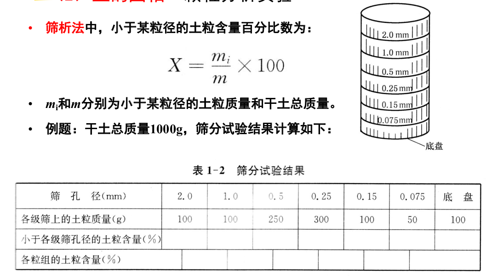
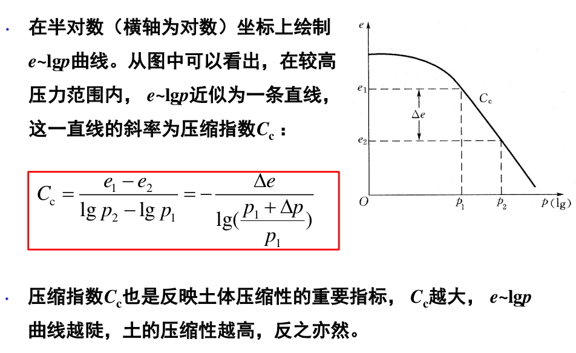

土力学实验与参数性质
=====================

.. contents:: 

* 渗透系数的测定

土力学实验
-----------

颗粒分析实验
^^^^^^^^^^^^^^^

* 筛析法

界限含水率实验
^^^^^^^^^^^^^^

相对密实度实验
^^^^^^^^^^^^^^^^

击实实验
^^^^^^^^^

渗透系数的测定
^^^^^^^^^^^^^^^^^

土力学概念和参数
----------------

土和土的三相
^^^^^^^^^^^^^^

**定义** 

* 地球表层的整体岩石在大气中经受长期的风化
  作用后，覆盖在地表的没有胶结或胶结很弱的颗粒
  堆积物。

**土的划分**

* 根据来源：有机土和无机土
* 根据搬运或沉积条件划分：残积土和运积土
  
  * 残积土是指岩石经风化后仍留在原地未经搬运的堆积物。
  
    .. image:: ./images/canjitu.png

  * 运积土是指岩石风化后经流水、风和冰川等动力搬运离开产地的堆积物。
  
    * 河流冲积土：由水流冲积形成的，称成为河流冲积土。
    * 风积土：由风力搬运形成的堆积物，分为风积砂和黄土，常见于干旱、半干旱地区，颗粒均匀。
         
      * 黄土：在干燥状态强度较高，但是遇水易发生土体结构破坏，使地基产生剧烈下沉，这种性质称为湿陷性。
        
        根据湿陷系数，分为湿陷性黄土和非湿陷性黄土。

        湿陷的过程：盐类胶结物遇水强度迅速降低、荷载过大引
        起湿陷性黄土结构的崩解。
    * 冰川沉积土：由冰川剥落、搬运形成的堆积物。几乎未经流水搬运直接从冰层中搁置下来的称为冰碛土。
    * 有机土：沼泽地的沉积物，在停滞或流水不畅的浅水地区，植物大量繁殖，完全或部分分解、腐烂、变质形成。

  .. image:: ./images/tudexingchengfenlei.png

**土的组成**

土的组成：三相——土颗粒、水及溶解物、空气和其他气体

**成土矿物**

* 土的固相–成土矿物

  * 原生矿物：岩石在物理风化过程中形成的碎屑物，保持了与原岩相
    同的矿物成分。一般较粗，吸水能力弱，性质较稳定，无塑性。常
    见的原生矿物：石英、长石、云母
  * 次生矿物：岩石在化学风化过程中，因化学成分改变而形成的新的
    矿物。主要是黏土矿物，土粒极细，常呈片状，吸水能力强，性质活
    泼，有塑性。常见的次生矿物：高岭石、伊利石、蒙脱石
    
    * 黏土矿物的晶体结构：硅-氧四面体和铝-氢氧八面体
      
      * 高岭石：一层硅片一层铝片叠接而成（1：1晶格），层间主要由氢键相
        连，联接力强，水分子不能进入。整体不带电，局部具有极性负电，
        分布于江西景德镇、江苏苏州、河北唐山等地。长石的风化产物。
      * 伊利石：两层硅片中间夹一层铝片组成（2：1晶格），晶胞之间有钾
        离子存在，联接力较强，但比高岭石弱。云母在碱性介质中风化的产物。

        .. image:: ./images/jinti1.png
        
      * 蒙脱石：伊利石进一步风化或火山灰风化的产物，也是由两层硅片中
        间夹一层铝片组成（ 2：1晶格），晶胞间为范德华力联接，联接力很
        弱，水分子容易进入导致膨胀，膨胀土的特殊性质。
        
        .. image:: ./images/jinti2.png
      
      吸水性和膨胀性强弱：高岭石 < 伊利石 < 蒙脱石

**土中水**

**土的气相**

* 土中气体的种类：空气、微生物活动和有机质分解产生的二氧化碳、沼气、硫化氢等。
* 土中气体的类型：与大气连通的气体、以气泡形式存在的封闭气体。
* 连通气体：对土的性质影响不大。
* 封闭气体：增加土体的弹性，减小土的渗透性。

**土的结构**

* 土的结构是指土粒或粒团在空间的几何排列、相邻土粒或粒团间的电作用力两个方面。

  土的结构类型：单粒结构、分散结构、絮状结构

* 单粒结构是砂、砾等粗粒土在沉积过程中形成的代表性结构。颗粒间以点-点接触为主。
  根据颗粒排列密实程度，分为紧密和疏松两种情况。一般来说，单粒结构的土性质较稳定。但是，疏松状态的砂土，在地
  震力作用下易发生结构破坏，产生地基液化现象。
* 分散结构是黏土颗粒在淡水中沉积时，生成的结构。由于稳定的需要，片状的黏土颗粒之间的排列以面-面接触为主，
  呈明显的各向异性。
* 絮状结构是黏土颗粒在咸水中沉积时，常生成的结构。由于土颗粒的角、边常带正电荷、面带负电荷，因此絮凝结构中土粒
  之间以角、边与面的接触或边-边搭接形式为主。絮状结构中土颗粒排列任意，孔隙大、强度低、压缩性高，对扰动
  敏感。
  
土的级配与不均匀系数、曲率系数
^^^^^^^^^^^^^^^^^^^^^^^^^^^^^^^^^

**级配**

* 土的级配：土中各种大小粒组的土粒质量占干土总质量的相对比例，常用百分数表示。
* 粒组: 按一定的粒径划分为的土颗粒小组
  
  如果以小于某粒径的土粒含量百分比数表示：

  .. math:: X = \frac{m_i}{m_s} \times 100
  
  * :math:`m_i` 为小于某粒径的土粒质量。如，小于 2.0 mm 的土粒含量百分比 :math:`m_{2} = 90`
  
  土级配的好坏影响到土的工程性质。
  
  级配良好的土能压实到较高的密实度，透水性较小，强度
  较高，压缩性较低，工程性质一般较好；反之，级配差的土工程性质一般较差。
* 粒径分布曲线：粒径为横坐标（对数比例尺）、 **小于某粒径的质量占比** 为纵坐标绘成的曲线。
* 粒组频率曲线：粒径为横坐标（对数比例尺）、 **各粒组的土粒含量比例** 为纵坐标绘成的曲线。
* 实际土颗粒形状不规则，这里的粒径指的是等效粒径，筛分法中以
  土筛孔径代表，密度计法中以下沉速度相同的同物质的球体直径代表。

**不均匀系数和曲率系数的定义**

.. math:: 
    &\ 不均匀系数: \quad C_u = \frac{d_{60}}{d_{10}} \\
    &\ 曲率系数: \quad C_c = \frac{d_{30}^2}{d_{60}d_{10}}

* :math:`d_60，d_30，d_10` ：粒径分布曲线上小于某粒径的含量为60%、30%、10%时对应的粒径。

**级配良好的判别标准**

* 对于纯净的砾、砂（细粒含量小于5%），级配良好土需同时满足 :math:`C_u ≥ 5和 3 ≥ C_c ≥ 1` ；否则为级配不良土。

**级配连续的判别方法**

* 粒径分布曲线
  
  曲线平滑说明级配连续（A土） ，曲线有水平台阶说明级配不连续（C土）。

* 粒组频率曲线

  * 单峰（a曲线）：说明级配连续。
  * 双峰（b曲线）：有可能是连续或不连续；双峰之间的谷点大于3%说明级配连续，否则是不连续的。

土的密度 :math:`\rho` 和重度 :math:`\gamma`
^^^^^^^^^^^^^^^^^^^^^^^^^^^^^^^^^^^^^^^^^^^^^

.. math:: 

    \rho = \frac{m}{V} \\
    \gamma = \rho g 

* 密度的单位g/cm3或kg/m3 ，重度的常用单位kN/m3
* 土的重度常见范围：16 ~ 22 kN/m3
* 测定方法：环刀法

土粒比重 :math:`G_s`
^^^^^^^^^^^^^^^^^^^^^^^^^^^^^^^

土粒的质量（或重量）与同体积4˚C水的质量(或重量）之比。

.. math:: G_s = \frac{\rho_s}{\rho_{w4^\circ \mathrm{C}}} = \frac{\gamma_s}{\gamma_{w4^\circ \mathrm{C}}}

.. math:: \rho_{w4^\circ \mathrm{C}} = 1.0 g/cm^3

* 无量纲，常见范围：2.65-2.75
* 测定方法：比重瓶法

土的含水率 :math:`\omega`
^^^^^^^^^^^^^^^^^^^^^^^^^^^^^^^^^^^

.. math:: \omega = \frac{m_w}{m_s}

* 测定方法：烘干法（105˚C左右）

孔隙比 :math:`e` 和空隙率 :math:`n`
^^^^^^^^^^^^^^^^^^^^^^^^^^^^^^^^^^^^^^^^^^

.. math:: 
    e = \frac{V_v}{V_s} 
    n = \frac{V_v}{V}

* 计算方法 
  
  .. math:: 

    &\ n = 1 - \frac{V_s}{V} = 1 - \frac{\rho_d}{\rho_s} = 1 - \frac{\rho_d}{G_s\rho_{w4}} \\
    &\ e = \frac{\rho_s}{\rho_d} - 1 \\
    &\ \frac{1}{1 + e} = 1 - n

饱和度 :math:`S_r`
^^^^^^^^^^^^^^^^^^^^^^^^^^

.. math:: S_r = \frac{V_w}{V_v}

* 表示孔隙中水充满的程度。
* 干土的饱和度为0，饱和土的饱和度为100%。
* 计算方法：
  
  .. math:: S_r = \frac{\omega G_s}{e}

干密度与干重度
^^^^^^^^^^^^^^^^^^

* 计算方法
  
  .. math:: 
    \rho_d = \frac{\rho}{1 + w} = \frac{\rho_s}{1 + e}
    \\
    \gamma_d = \rho_d g 

饱和密度 :math:`\rho_{sat}` 和 饱和重度 :math:`\gamma_{sat}`
^^^^^^^^^^^^^^^^^^^^^^^^^^^^^^^^^^^^^^^^^^^^^^^^^^^^^^^^^^^^^^^

* 计算方法
  
  .. math:: \rho_{sat} = \frac{m_s + V_v \rho_w}{V} = \rho_d + n\rho_w 
  .. math:: \gamma_{sat} = \rho_{sat}g 

浮重度 :math:`\gamma '`
^^^^^^^^^^^^^^^^^^^^^^^^^^^^^

.. math:: \gamma ' =  \gamma_{sat} - \gamma_w
.. math:: \rho ' = \frac{G_s - 1)\rho_w}{ 1 + e}

无黏性土相对密实度 :math:`D_r`
^^^^^^^^^^^^^^^^^^^^^^^^^^^^^^^^^^^

对无黏性土来说，其松密状态对土的工程性质影响很大。在不同的土
之间，孔隙比和干密度的比较是没有意义的。因此，我们用相
对密实度的概念，来综合衡量各类型无黏性土的松密程度：

.. math:: D_r = \frac{e_{max} - e_0}{e_{max} - e_{min}} = \frac{(\rho_d - \rho_{dmin})\rho_{dmax}}{(\rho_{dmax} - \rho_{dmin})\rho_{d}}

* :math:`e_0` 无黏性土的天然孔隙比或填筑孔隙比
* :math:`e_{max},e_{min}` 可由
* 注意 :math:`e_{max} = \frac{\rho_s}{\rho_{dmin}} - 1`

.. note:: 
  * 当Dr = 1时，e = emin，土处在最密实状态；
  * 当Dr = 0时，e = emax，土处在最疏松状态；
  * 天然土的相对密实度可能大于1，也可能小于0。

**工程中无黏性土的划分**

黏性土的界限含水率 :math:`\omega_L,\omega_p,\omega_s` 和 塑性指数 :math:`I_p` 和 液性指数 :math:`I_L`
^^^^^^^^^^^^^^^^^^^^^^^^^^^^^^^^^^^^^^^^^^^^^^^^^^^^^^^^^^^^^^^^^^^^^^^^^^^^^^^^^^^^^^^^^^^^^^^^^^^^^^^^^^^^^^^^^^^^

**黏性土体积在不同状态与含水率的关系**

• 可塑性指的是土体在外力作用下可改变形状，而不显著改变体
  积，外力卸除后仍能保持已获得的形状的性质。
• 从流态到可塑态到半固态，黏性土体的体积随含水率而变化；
• 土体进入固态，体积不再随含水率变化。
• 黏性土每两种状态之间的界限含水率，称为稠度界限或阿特贝界限。
• 三种 **界限含水率** 如下：液限（流动状态与可塑状态的界限含水率）
  、塑限（可塑状态与半固体状态的界限含水率）、缩限（半固体
  状态与固体状态的界限含水率）。

• 液限：液塑限联合测定法、碟式仪法
• 塑限：液塑限联合测定法、搓滚法
• 缩限：收缩皿法

**塑性指数和液性指数**

.. math:: 

    塑性指数 I_P = \omega_L - \omega_P 
    液性指数 I_L = \frac{\omega - \omega_P}{\omega_L - \omega_P} = \frac{\omega - \omega_P}{I_P}

• 塑性指数表示土在可塑状态的含水率的变化幅度，以整数表示。
• 塑性指数越大，可塑态的含水率变化范围越大，土中弱吸着水的含量可能较高。
• 一般的，塑性指数越高，土中的粘粒含量越高，因此塑性指数是细粒土重要的分类指标。
• 液性指数表征了土的天然含水率与界限含水率的相对关系，
  表示了天然土所处的软硬状态，由其定义可知：

  .. math:: 
    \omega \le \omega_P时，I_L \le 0 ，土处于坚硬状态 \\
    \omega_P\lt \omega \le \omega_L时，0\lt I_L \le 1，土处于可塑状态 \\
    \omega_L\lt\omega 时，1.0\lt I_L，土处于流动状态 \\

土的压实性和压实曲线
^^^^^^^^^^^^^^^^^^^^^^

**概念**

* 土的压实是指以人工或机械的方法，使得土颗粒能够克服粒间阻
  力，产生相对位移，从而减少土中孔隙，提高土的密实程度。
  工程上密实度一般用干密度 :math:`\rho_d` 来控制。
* 击实试验:将黏性土样分成若干份，每一份配成不同的含水
  率。将试样放入击实仪内进行击实试验，击实完成后测得土
  样的含水率和干密度，绘制击实曲线。 影响击实结果的因素有：
  含水率、击实功能、粗粒含量等。
* 击实曲线,击实实验得到的 :math:`\rho_{dmax} - \omega` 的关系曲线。

不同种类土的压实曲线特性不同。

**细粒土的压实性与最优含水率**

当压实能力固定时，土的最大干密度和含水率之间的关系：

• 当填土含水率较低时，土层表面的吸着水膜很薄，颗粒间引
  力占优势，使得土颗粒相互错动很困难，干密度小。
• 随着含水率增大，吸着水膜增厚，击实中的斥力增大，土颗
  粒容易错动，定向排列增多，干密度相应增加。
• 当填土含水率大于wop时，填土中存在密闭气泡，很难排出
  ；同时一部分击实功能作用在孔隙气上转化为孔隙气压力，
  颗粒间受到的力很小，土体体积很难发生变化。

不同击实功能（击数表示）：同一种土料在不同含水率下分别用不同的击实功能（击数）
进行击实试验，得到一组随击数而异的含水率-干密度关系曲线。

* 随击实功能的增加，最大干密度增大，而最优含水
  率减小。但是最大干密度随击实功能增大的趋势是逐渐减弱的。
* 含水率较低时击数的影响较显著。含水率较高时，含水率与干密度
  关系曲线接近于饱和线，这时提高击实功能是无效的。根据三相比例
  关系可知饱和线的方程：

  .. math:: \omega = \rho_w\(frac{1}{\rho_d} - frac{1}{\rho_s}) = \frac{\rho_w}{\rho_d} - \frac{1}{G_s}

* 填土施工时，应将土料含水率控制在最优含水率wop附近，这样
  可以用较小的能量获得较大的干密度。含水率过低填土易湿陷，
  过高使得填土的其他力学性质恶化。

**粗粒土的压实性**

土的工程分类
^^^^^^^^^^^^^^^^

• 主要分类依据：1）粗粒土的颗粒大小；2）细粒土的塑性和界限
  含水率。
• 在我国，土的工程分类有《土的工程分类标准》和《建筑地基基
  础设计规范》等。其中《土的工程分类标准》与国际规范类似。

**粗粒土的分类方法(按照级配)**

* 粗粒土的分类方法–土的工程分类标准
   
  .. image:: ./images/culitu_fenlei1.png
  .. image:: ./images/culitu_fenlei2.png
  .. image:: ./images/culitu_fenlei3.png
  .. image:: ./images/culitu_fenlei4.png

* 粗粒土的分类方法–建筑地基基础设计规范
  
  该规范按土粒大小、粒组的土粒含量或土的塑性指数
  把地基土分为碎石土、砂土、粉土、黏性土和人工填
  土等，然后再进一步细分。
  
  * 碎石土的分类：漂石、块石、卵石、碎石、圆砾、角砾。
  * 砂土的分类：砾砂、粗砂、中砂、细砂、粉砂。

  .. image:: ./images/culitu_fenlei21.png
  .. image:: ./images/culitu_fenlei22.png

**细粒土的分类方法(按照稠度和级配)**

* 细粒土的分类方法–建筑地基基础设计规范

  若土的塑性指数小于或等于10，且粒径大于0.075mm的
  颗粒含量不超过全重的50％，则该土属于粉土。
  
  .. image:: ./images/xilitu_fenlei1.png

**特殊土的分类方法**

略

土的流变和管涌
^^^^^^^^^^^^^^^

略

土的压缩性和压缩曲线(压缩系数 :math:`a_v`,压缩指数 :math:`C_c`,回弹再压缩指数 :math:`C_s`)和体积压缩系数 :math:`m_v`,压缩模量 :math:`E_s`
^^^^^^^^^^^^^^^^^^^^^^^^^^^^^^^^^^^^^^^^^^^^^^^^^^^^^^^^^^^^^^^^^^^^^^^^^^^^^^^^^^^^^^^^^^^^^^^^^^^^^^^^^^^^^^^^^^^^^^^^^^^^^^^^^^^^^^^^^^^^^^^^^^^^^^^^^^^^^^^^^^^^^^^^^^^^^^

* 土的压缩：在外力作用下，土体体积缩小的现象。
* 饱和土体的固结：孔隙水逐渐向外排出，孔隙体积逐渐减小
  的过程。这一过程所需的时间和土的渗透性有关，砂土固结
  快，饱和黏土固结慢。
* 土的固结：在荷载作用下土体孔隙水逐渐排出产生的压缩。
  一般固结和压缩讨论的对象是天然地基土的沉降问题。
* 土体的压缩仅由孔隙体积减小产生。因此，土的压缩变形常
  由孔隙比e的变化来表示。
* 压缩曲线: 固结实验中 普通坐标中的e~p曲线或半对数坐标中的e~lgp曲线。

**压缩系数**

e～p曲线不是直线，压缩系
数av的大小依赖于割线两点选取的
位置。

习惯上采用100 ~ 200 kPa 压力范围
上得到的压缩系数来衡量土的压缩
性高低（写作a1-2）

* a1-2 < 0.1 MPa-1时，属低压缩性土；
* 0.1 MPa-1 ≤ a1-2 < 0.5 MPa-1时，属中压缩性土；
* a1-2 ≥ 0.5 MPa-1时，属高压缩性土。

**压缩指数**

**回弹再压缩指数**

1. 卸荷后土样的变形分为可恢复的弹性
   变形和不可恢复的塑性变形两部分；
2. 回弹曲线和再压缩曲线不重叠、构成
   一个回滞环，说明土体不是弹性材料；
3. 在同一段压力范围内，回弹曲线和再
   压缩曲线比初始压缩曲线平缓许多，说
   明在回弹和再压缩范围里土的压缩性大
   大降低；
4. 当再加荷压力超过开始卸荷的压力（
   B点）时，再压缩曲线趋于初始压缩曲
   线的延长线。
5. 实际应用中，认为回弹曲线和再压缩曲线在e~lgp曲线上是一
   段直线，可以定义回弹指数或再压缩指数Cs。Cs比Cc小得多，
   一般为Cs = (0.1 ~ 0.2) Cc

**体积压缩系数**

.. math:: 
  m_v = -\frac{1}{V}\frac{\mathrm{d}V}{V} = \frac{\Delta V / V}{\Delta p}

由体积压缩系数和压缩系数的定义可得：

.. math:: m_v = \frac{a_v}{1 + e_1}

**压缩模量**

* 定义为在侧限条件下，竖向应力与竖向应变之比，即体积压缩系数mv的倒数
  
  .. math:: E_s = \frac{1}{m_v} = \frac{1 + e_1}{a_v}

