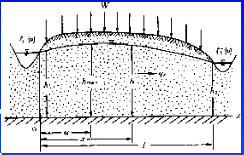
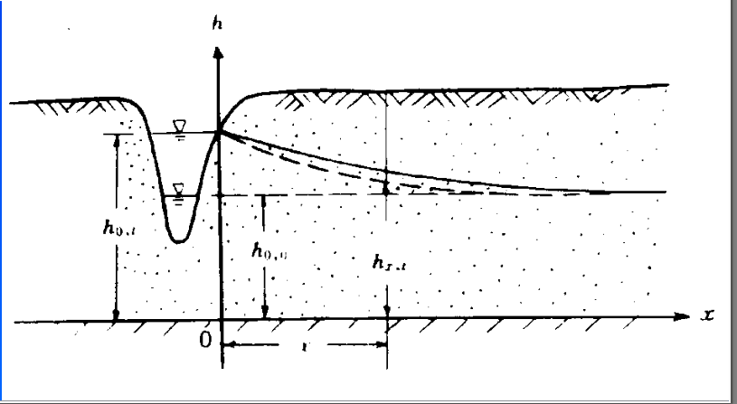

河渠附近的地下水运动
=============================

**研究任务**

河渠附近的地下水运动研究的对象是河渠和潜水相联系的系统，

主要任务是确定潜水面，潜水的流动，分水岭的确定。以及利用潜水位和潜水运动解决其他问题。

对应的数学问题为，解微分方程，流网刻画，水头极值的确定。

**导言**

由第一章可知，河渠中的地下水问题一般被视为二维问题，由公式

.. math:: \nabla (Kh\nabla H) + W^{降雨} = \mu h_t

确定浅水面水头和潜水面高度。

一维稳态潜水面模型
----------------------

**模型条件**

* 稳态模型：: 降水入渗和河渠水头保持稳定
* Dupuit假设 : 河渠基本平行，潜水面水头直接使用2维的水头公式计算
* 含水层均质各向同性，密度和K为常数

**数学模型**

.. math:: 

    \left\{\begin{matrix}
        \frac{\mathrm{d}(h\frac{\mathrm{d} h}{\mathrm{d} x})}{\mathrm{d} x} + \frac{W}{K} = 0 \\
        h(0) = h_1 \\
        h(l) = h_2 
    \end{matrix}\right.

由微分方程结合模型实际意义，设分水岭位置为a，分水岭水位为 :math:`h_a` 得到含义公式

:math:`h_a^2 - h^2 = \frac{W}{K}(距分水岭距离)^2`

.. math:: 

    \left\{\begin{matrix}
    h^2 + \frac{W}{K}(x - a)^2 =  h_a^2\\
        h_1^2 +\frac{W}{K}(a)^2  = h_a^2 \\
        h_2^2+ \frac{W}{K}(l - a)^2=   h_a^2 
    \end{matrix}\right. 

**水头**

解得 

.. math:: h^2 = \frac{W}{K}x(l - x) + \frac{h_2^2 - h_1^2}{l} x + h_1^2
    :label: 2_1

**水头和流量之间的关系**

.. math:: 
    &\ q = -Kh\frac{dh}{dx} = -\frac{K}{2}\frac{dh^2}{dx} = \frac{K}{2}\frac{2W}{K}(x - a) = W(x -a ) \\

**流量**

由上式得

.. math::  q = W(x - a)= W(x - l/2) - K\frac{h_2^2 - h_1^2}{2}
    :label: 2_2

**分水岭和分水岭水头**

* a  为分水岭位置

.. math:: a = l/2 + \frac{K}{W}\frac{h_2^2 - h_1^2}{2l}
    :label: 2_3

* :math:`h_a` 为分水岭水头

.. math:: h_a^2 = \frac{h_1^2 + h_2^2}{2} + \frac{W}{K}(\frac{a^2 + (l - a)^2}{2}) =  \frac{h_1^2 + h_2^2}{2} + \frac{W}{K}\left [(\frac{l}{2})^2 + (\frac{K}{W}\frac{h_2^2 - h_1^2}{2l})^2\right]

稳态下河渠间潜水特征
-------------------------

当 W = 0 时，河渠间的潜水面为一抛物线，此时以及不存在分水岭了,直接得到 

.. math:: h^2 = c_1 x + h_1 = \frac{h_2^2 - h_1^2}{l}x + h_1^2

每一断面的流量相等为 :math:`q = -\frac{K}{2}\frac{h_2^2 - h_1^2}{l}`

当 :math:`W \gt 0` 时，河渠间的潜水面为上椭圆曲线,此时存在分水岭。

稳态承压水模型
----------------

在满足各向同性均匀且可以视为二维模型的条件下，此时的偏微分方程为

.. math:: \nabla^2 H = 0

**二维调和函数是否一定可以转换为 r 的单变量函数**

河渠水位迅速变化为定值的河渠间地下水非稳定模型
------------------------------------------------

**模型条件**

与稳态河渠潜水面模型基本相同，但发生顺时回水

**数学模型**

.. math:: 

    \left\{\begin{matrix}
    \frac{\partial }{\partial x}(Kh\frac{\partial h}{\partial x}) = \mu\frac{\partial h}{\partial t} \\
    h^2_{x,0} = h_{0,0}^2 + \frac{h^2_{l,0} - h^2_{0,0}}{l}x \\
    h_{0,t} = h_1 \\
    h_{l,t} = h_2
    \end{matrix}\right.

**求解**

.. math:: 

    (1)
    &\ 令 u = \frac{h^2}{2} \\
    &\ 微分方程变为： \\
    &\ \frac{\partial }{\partial x}(K\frac{\partial u}{\partial x}) = \mu\frac{1}{\sqrt{2u}}\frac{\partial u}{\partial t} \\
    &\ 假设潜水面厚度变化不大，用潜水面厚度的平均值h_m 代替 \sqrt{2u} \\
    &\ \frac{\partial^2 u}{\partial x^2}  = a\frac{\partial u}{\partial t} 方程化为泊松方程\\
    (2)
    &\ 变化后的数学模型为 \\
    &\ \left\{\begin{matrix}
    \frac{\partial^2 u}{\partial x^2}  = a\frac{\partial u}{\partial t} \\
    u_{x,0} = u_{0,0} + \frac{u_{l,0} - u_{0,0}}{l}x \\
    u_{0,t} = u_1 \\
    u_{l,t} = u_2
    \end{matrix}\right. \\
    略

**应用**

分析大堤防洪中修建防渗墙后对地下水动态和周边环境的影响
