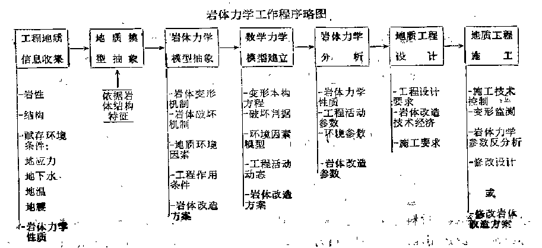
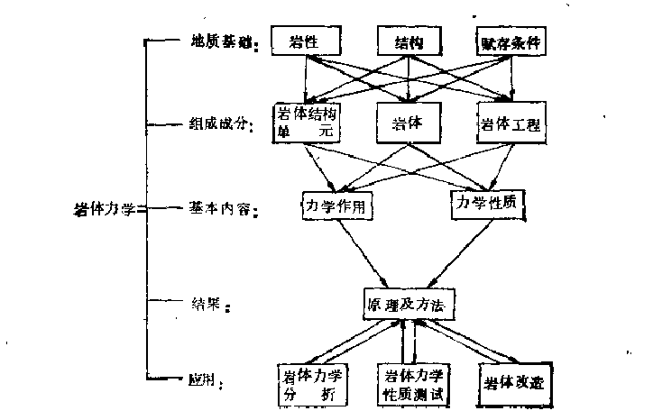

*******************
岩体力学
*******************

**目录**

.. toctree:: 
    :caption: 三大岩体力学问题的简单抽象模型求解

    ./边坡岩体稳定性分析
    ./地下洞室围岩稳定性分析
    ./地基岩体稳定性分析

.. toctree:: 
    :caption: 岩体的地质特征——岩体力学地质基础

    ./岩体结构概念
    ./岩块的物理力学性质
    ./结构面的物理力学性质
    ./岩体的物理力学性质
    ./岩体的赋存环境

.. toctree:: 
    :caption: 岩体结构的力学效应

    ./岩体的变形与本构关系
    ./岩体的破坏与强度理论

.. toctree:: 
    :caption: 岩体力学分析原理及方法

    ./岩体力学介质划分
    ./连续介质岩体力学
    ./板裂介质岩体力学
    ./块裂介质岩体力学
    ./碎裂介质岩体力学

**0. 本书的安排**

本章解决岩体力学的初步认识问题，基于对岩体力学的初步认识，将分三个部分介绍岩体力学。

第一部分为岩体的地质特征，解决工程地质信息收集问题和地质模型建立问题。

第二部分为岩体结构的力学效应，解决岩体的变形、破坏问题。以解决力学模型的建立问题。

第三部分为岩体力学分析原理和方法，在力学模型建立的情况下情况下对具体课题进行数学模型的建立和求解。

此外在开始正式的介绍岩体力学理论之前，会给出边坡、地下洞室、基岩的简单抽象力学模型的求解。遇到的问题
可以直接参考后文。

对于每章的编排方式，暂时不给出。

**1. 岩体力学解决的问题**

岩体力学是研究经受过变形、遭受过破坏的地质体在环境因素改变时再变形和再
破坏规律的理论和应用的科学

**2. 岩体力学研究的对象**

岩体力学研究的对象为与上述地质体对应的岩体。

岩体是经历过多次而反复的地质作用，经受过变形，遭受过破坏，形成一定的
岩石成分、一定的结构、赋存于一定的地质环境中的地质体，在作为力学作用
研究对象时被定义为岩体。

**3. 工程地质与岩体力学之间的关系**

工程地质是应用地质知识解决工程问题的学科，岩体力学是工程地质学的分支学科。

工程地质工作是工程地质环境研究。解决的第一个问题就是环境问题。解决的第二个
问题是工程地质定量化研究。工程地质定量化研究包括的内容十分广泛，从工作过程
来讲分为三个阶段：

1. 岩体力学特性普查。这一阶段包括岩体地质特征研究、岩体力学性质研究，并在
   此阶段进行工程可行性论证。
2. 进行地质工程问题专题研究，为方案论证提供证据。
3. 施工过程中的岩体变形观测和监测反分析，为修改方案设计提供资料。

岩体力学贯穿工程地质工作的始终。

**3. 岩体力学的特征**

1. 岩体力学理论是建立在工程地质实践基础之上的，岩体力学是工程地质分支学科。
2. 岩体力学以岩体为研究对象，岩体具有其他力学研究对象的独特特征。
3. 岩体力学综合性很强。在岩体力学工作过程中都需要大量的综合分析。
4. 存在大量不确定性和模糊性，因为工程环境中的岩体结构不可能完全测出。

**4. 岩体力学工作程序**

岩体力学工作不是简单的试验和计算，而是一项工程。

岩体力学工作的第一步必须 **搜集地质信息**，包括岩性、结构、岩体赋存条件，也包括岩体力学性质。

岩体力学工作最重要的一环是把 **地质信息抽象为力学模型**，为此

1. 首先以岩体结构为纲，将地质信息抽象为地质模型。地质模型实际上是岩体结构图。
2. 在地质模型-地质构造图基础上，研究岩体各种力学作用，如变形、破坏，进一步抽象为不同的岩体力学介质。
   如 **连续介质** 、 **块裂介质** 、 **板裂介质** 、 **碎裂介质** 。 
3. 然后根据工程作用条件再抽象为不同的力学模型，有的可能抽象为一种力学模型，有的可抽象为若干种力学模型。
   一般说来，完整结构岩体和块裂结构岩体只能抽象为一种力学模型；而板裂结构和碎裂结构岩体则可构成多种力学
   模型，如板裂结构岩体可形成溃屈力学模型、倾倒力学模型、梁板弯折力学模型等。

岩体力学模型选定后，才能输入本构方程、破坏判据、工程活动方案、岩体改造方案。给出数学力学模型、进行力学分析
和地质工程设计。

最后还需在施工过程中组织变形监测和岩体力学参数反分析。

**5. 岩体力学运用的其他学科知识** 

1. 搜集地质信息过程中，会用到统计分析的知识，在利用地质信息建立地质模型的过程中，也会用到概率论和随机变量等知识。
   例如节理的分组配套，结构面随机模拟模型等。
2. 比较多的力学知识，例如弹性力学、工程和材料力学、结构力学、塑性力学和流变相关力学。在建立力学模型和数学模型中
   都无可避免。
3. 数学模型求解时的微分方程知识。
4. 反分析过程中可能利用模糊数学分析，灰色系统等知识。
5. 也有一些研究者尝试结合人工智能解决实际问题，但我觉得对理论建设没有直接帮助。

**6. 岩体力学和其他力学的关系和区别**

岩体力学发展的早期将岩体视为一种连续介质的材料，这个阶段主要将岩体力学与材料力学相联系，但脱离实际，理论并不符合实际，
这个阶段可以视为岩体材料力学。

随着对岩体结构的认识，岩体力学逐渐向岩体结构力学靠拢，认为岩体结构是岩体变形和破坏的主导特征，材料的物理性质为辅助。
所有岩体力学的显著特征便在于研究岩体结构对力学特征的重要影响，是结构力学的分支。

**7. 岩体力学课题**

岩体力学课题可从应用和理论两个方面来考察

* 应用方面考察
  
  1. 边坡变形和破坏问题
  2. 地质变形和破坏问题
  3. 地下洞室变形和破坏问题

* 从基础理论上考察
  
  1. 岩体结构基本规律
  2. 岩体变形、破坏规律或称为岩体力学作用规律
  3. 岩体力学性质规律
  4. 岩体力学分析原理
  5. 岩体改造原理

**8. 岩体力学研究的基本内容**

* 岩体结构基本规律研究
* 岩体变形机制及本构规律研究
* 岩体破坏机制及破坏判据研究
* 岩体力学性质形成规律研究
* 岩体力学分析原理及方法研究
* 岩体改造原理及方法研究
* 岩体力学测试原理及方法研究

**i. 岩体力学编写日志**

1. 第一版：初步掌握岩体力学的基本内容和方法。实际解决问题的要求是
   简单抽象模型的边坡岩体稳定性分析、地下洞室围岩稳定性分析、地基岩体稳定性分析。

