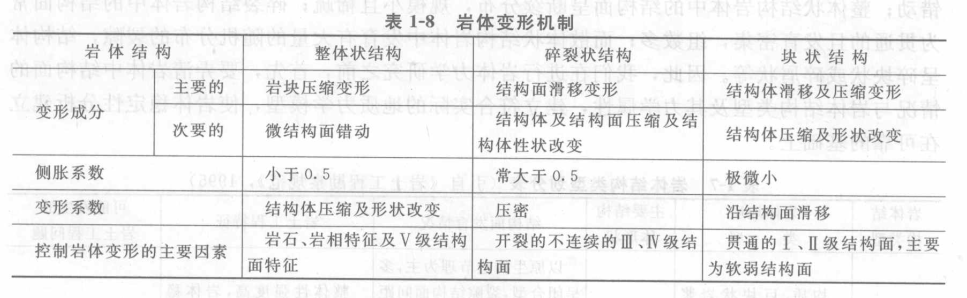
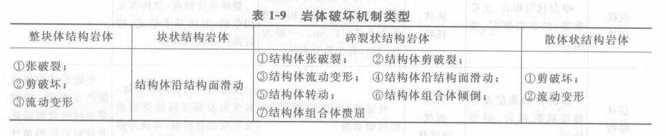
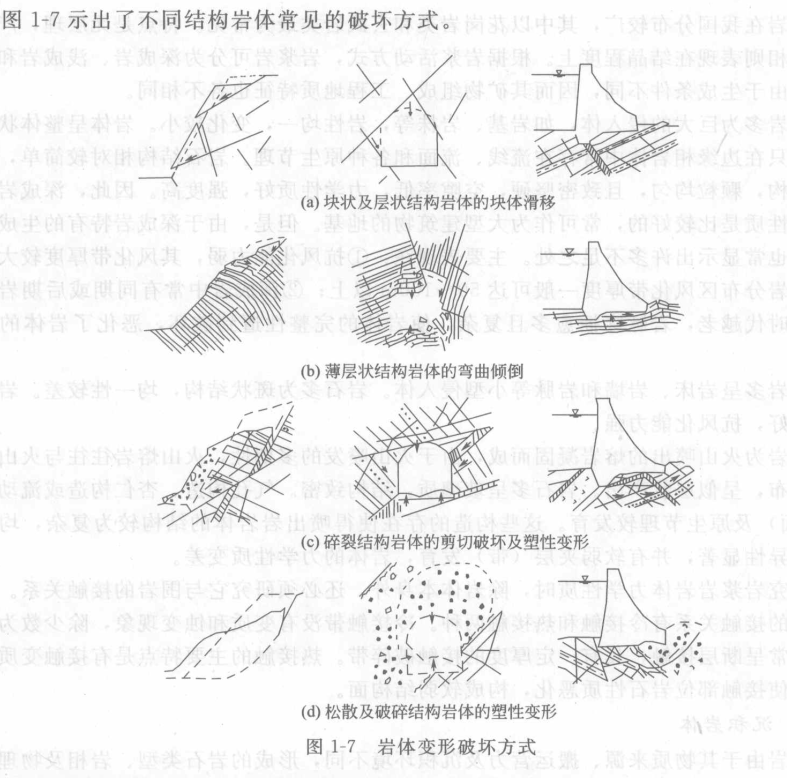
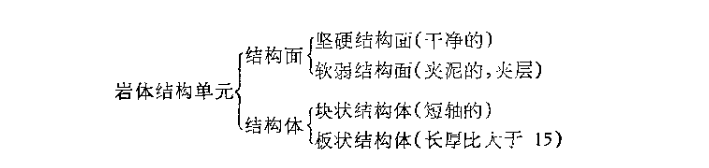

岩体结构概念 
***************************

岩体结构控制论
=================

**岩体变形和岩体破坏受控于岩体结构**

岩体变形与连续介质的变形明显不同，岩体变形由结构面变形和结构体变形两部分构成，并且结构面变形起到控制作用。
因此，岩体的变形主要决定于结构面的发育状况。

岩体的破坏机制也受空余岩体结构。结构控制的主要方面有：岩体破坏的难易陈度、岩体破坏的规模、岩体破坏的过程及
岩体破坏的主要方式等。

**分析岩体结构对岩体稳定性的控制作用应注意哪些方面**

1. 在工程地质模型基础上，经初步岩体结构分析，对岩体稳定性可作出宏观与定性的判断。
2. 依据岩体结构，尤其是结构面（特别是控制性结构面与软弱结构面）与工程岩体的依存关系，壳准确确定岩体稳定性的边界条件。
3. 结构面的组合关系，尤其是在软弱结构面共同作用下控制着岩体变形破坏方式与失稳机制。
4. 岩体结构同样控制工程岩体的环境因素。地下水完全受控与岩体结构，地应力主要受区域地质构造背景的控制。
   但就具体工程而言，地应力的作用方式与强度仍受到岩体结构的制约。
5. 在岩体结构力学效应中，通过起伏角、尺寸效应和结构面产状，可充分反映岩体结构对岩体稳定性的控制作用。

结构面的统计分析
===================

结构面在岩体内的分布常具有随机性，特别是IV级和部分III级结构面。这些结构面的几何参数可以看作随机变量进行统计分析来获得结构面分布。

对结构面进行统计分析，首先应对结构面进行系统统计，即采样。采样方法较多，目前以测线法应用最为广泛。

结构面的测线法采样
------------------

略

结构面分布的概率分析
-----------------------

略

结构面网络模拟
--------------------

略

概念参考
============

岩体(rockmass)
----------------

**岩体** 是指在地质历史过程中形成的，由岩块和结构面网络组成的，具有一定的结构并赋存于一定的天然应力状态
和地下水等地质环境中的地质体，是岩体力学研究的对象。

概念强调由一定岩石成分组成，由于一定岩体结构，和赋存环境。

* 具有一定岩石成分
* 具有一定的岩体结构
* 具有一定的赋存环境

岩体结构(rockmass structure)
---------------------------------

* **岩体结构** 是指岩体中结构面与结构体的排列组合特征。（或：不同类型的岩体结构单元在岩体内排列组合形式）
* **结构单元** 是指岩体结构的基本组成成分，可分为两类四种。

结构面(structure plane)和结构体
--------------------------------------------

* **结构面** 是指地质历史发展过程中，在岩体内形成的具有一定的延伸方向和长度，厚度相对较小的地质界面或带。
  或：岩体内开裂的和易开裂的地质界面称为岩体结构。

  它包括物质分异面和不连续面。
*
* **结构体** 被结构面切割而成的岩块称为结构体

**1. 结构面的地质成因类型**

根据地质成因的不同，可将结构面划分为原生结构面、构造结构面和次生结构面。

* **原生结构面** 岩体在成岩过程中形成的结构面，其特征与岩体成因密切相关，可继续分为沉积结构面、岩浆结构面和变质结构面。
  
  * **沉积结构面** 沉积岩在沉积和成岩过程中形成的结构面，包括层理面、软弱夹层、沉积间断面和不整合面等。
  * **岩浆结构面** 岩浆在侵入及冷凝过程中形成的结构面，包括岩浆岩体与围岩的接触面、各期岩浆岩之间的接触面和原生冷凝节理等。
  * **变质结构面** 可分为残留结构面和重结晶结构面。

    * **残留结构面** 主要是沉积岩经变质后，在层面上绢云母、绿泥石等鳞片状矿物富集并呈定向排列而形成的结构面，如千枚岩的千枚理面和板岩的板理面的。
    * **重结晶结构面** 主要有片理面和片麻理面等，它是岩石发生深度变质和重结晶作用下，片状矿物和柱状矿物富集并呈定向排列形成的结构面，它改变了原岩的
      面貌，对岩体的物理力学性质常起控制性作用。

* **构造结构面** 岩体在形成后在构造应力作用下形成的各种破裂面，包括断层、节理、劈理和层间错动等。
  
  规模大者如断层、层间错动等，在地下水的作用下，有的已经泥化或者已经变成软弱夹层。因此这部分构造结构面的力学性质很差。
  
  规模小者如节理、劈理，多数短小密集，主要影响岩体的完整性和力学性质。

* **次生结构面** 岩体在形成后在外营力作用下产生的结构面，包括卸荷裂隙、风化裂隙、次生夹泥层和泥化夹层等。

**2. 结构面的力学成因类型**

在较低围限压力下，岩体的破坏方式有剪切破坏和拉张破坏，相应地结构面可分为剪性结构面和
张性结构面。

* **剪性结构面** 由剪应力形成的结构面，破裂面两侧岩体产生相对滑移。连续性好，面较为平直，延伸较长
  并有擦痕、镜面等现象发育。
* **张性结构面** 由拉应力形成，如羽毛状张裂面、纵张裂面及横张裂面、岩浆中的冷凝节理等。张性结构面有张开度大、连续性差、形态不规则、面粗糙，起伏度大及破碎带较宽等特征。

**结构面的规模及分级**

按范围和对工程的影响分为5级。

* I 级。 指大断层或区域性断层。一般工程应尽量避开。
* II 级。 指延伸长而宽度不大的区域性地质界面，如较大的断层，层间错动、不整合面及原生软弱夹层。常控制工程区的山体稳定性或岩体稳定性，影响工程布局。
* III 级。指长度数十米到数百米的断层、区域性节理、延伸较好的层面及层间错动等。主要影响或控制工程岩体。
* IV 级。 指延伸较差的节理、层面、次生裂隙、小断层及发育的片理、劈理面等。是构成岩块的边界面，破坏岩体的完整性，影响岩体的物理力学性质及应力分布状态。
* V级。 又称微结构面，指隐节理、微层面、微裂隙及不发育的片理、劈理等，其规模小，连续性差，常包含在岩块内。主要影响岩块的物理力学性质。

上述5级结构面中，I、II级结构面又称为软弱结构面，III级结构面多数也为软弱结构面，IV、V级结构面为硬性结构面。

岩块及其特征
------------------

**岩块** 指不含显著结构面的岩石块体，是构成岩体的最小岩石单元体。