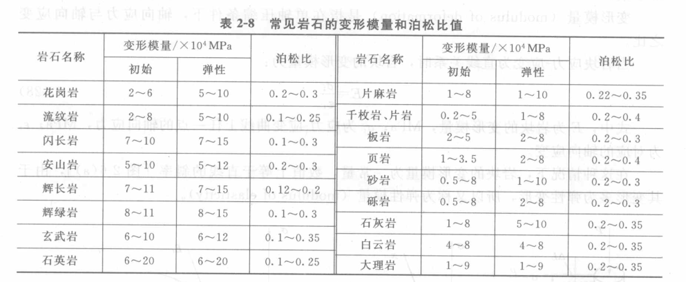

岩块的物理力学性质 
***************************

岩块的物理力学性质研究，主要通过室内岩石实验方法进行，因此，岩石室内实验是岩块物理力学性质研究的重要手段。

单轴压缩条件下岩块的变形性质
============================

连续加载下的变形性质
----------------------

**岩块的典型全应力-应变曲线**

用含微裂隙且不太坚硬的岩块制成试件，在刚性压力机上进行单轴压缩试验时，可以得到下面的曲线。

* 体积应变 :math:`\varepsilon_V = \varepsilon_L - \varepsilon_D`

单轴连续加载的典型曲线变形阶段
^^^^^^^^^^^^^^^^^^^^^^^^^^^^^^^^

1. 孔隙裂隙压密阶段(OA)
   
   在该阶段，试件中原有的张开性结构面或微裂隙逐渐闭合，岩石被压密，此阶段主要是孔隙和裂隙的压缩，孔隙
   和裂隙的闭合先快后慢。

2. 弹性变形至微破裂稳定发展阶段(AB-BC)

   该阶段的曲线呈近似直线关系，在弹性变形阶段呈直线关系，且此时变形可恢复，在微破裂稳定发展阶段逐渐变为曲线关系，
   变形主要表现为塑性变形，微破裂多余的应变导致曲线的斜率逐渐减小，但变化不明显。这一阶段的上界应力称为屈服极限。

3. 非稳定破裂发展阶段(或称 累进性破裂阶段)(CD)
   
   进入本阶段，微破裂的发展发生了质的变化。由于破裂过程中造成的应力集中效应使外荷载保持不变的情况下，依然发展破裂，
   破裂又会不断发展，从而发生正反馈调节效应。直至试件完全破坏，试件体积压缩转为扩容。轴向应变和体积应变速率迅速增大。
   试件承载能力达到最大。本阶段的上界应力称为峰值强度或单轴抗压强度。

4. 破坏后阶段(D-)

   当岩块承载力达到峰值后，内部结构完全破坏，但试件仍基本保持整体状。到本阶段，裂隙快速发展、交叉且相互联合形成宏观断裂面，
   但并不降到零，还有一定的承载能力。

总体而言岩块的变形可以分为两个阶段：

* 峰值前阶段（或称前区）
* 峰值后阶段（或称后区）

岩块的性质各异，不是所有的岩块都具有典型曲线的曲线特征，有的相当不明显。因此有必要讨论
具体岩块的变形特征，并分类。

峰值前岩块的变形特征
^^^^^^^^^^^^^^^^^^^^^

米勒根据28种岩石的试验成果，将岩块峰值前应力-轴向应变曲线分为6类。

.. image:: ./images/fenzhiqian.png

1. 类型I——直线
   
   近似为直线，知道发生突发性破坏。
   这类岩块以弹性变形为主。如玄武岩、石英岩、辉绿岩等坚硬、极坚硬岩石表现出该类变形特征。

2. 类型II——直线+下凹

   开始为直线，至末端则出现非线性屈服阶段。
   如石灰岩、砂砾岩和凝灰岩等较坚硬且少裂隙的岩石。

3. 类型III——上凹+直线
   
   发育裂隙的坚硬岩石，如花岗岩、砂岩及平行片理加载的片岩

4. 类型IV——上凹+直线+下凹（中部很陡的S形曲线）

   如大理岩和片麻岩等某些坚硬变质岩

5. 类型V——上凹+直线+下凹（中部较缓的S形曲线）

   是某些压缩性较高的岩石如迟滞片理加载的片岩常见的曲线类型

6. 类型VI——上凹+直线（很小的直线段后为不断增长的塑性变形和蠕变变形）
   
   如盐岩等蒸发岩和极软岩。

法默根据峰值前曲线，把岩石划分为准弹性，半弹性，非弹性三类。

峰值后岩块的变形特征
^^^^^^^^^^^^^^^^^^^^^

目前研究仍在进行中。略
   

循环荷载条件下的变形特征
--------------------------------

三轴压缩条件下岩块的变形性质
===============================

蠕变性质
===========

岩石的物理性质参数
======================

颗粒密度(:math:`\rho_s`)
-------------------------------

岩石中固体部分的密度。单位一般为 :math:`g/cm^3`

块体密度(:math:`\rho_d,\rho_{sat},\rho`)
-------------------------------------------

根据岩石含水量不同分为：

* 干密度 :math:`\rho_d = \frac{m_s}{V}`
* 天然密度 :math:`\rho = \frac{m}{V}`
* 饱和密度 :math:`\rho_{sat} = \frac{m_{sat}}{V}`

测定岩石块体密度的方法主要有两种：

* 量积法：适用于规则试件
* 蜡封法：适用于不规则试件

空隙率(:math:`n,n_o,n_b,n_a,n_c`)
-----------------------------------------------

岩石中有相对较多的孔隙和裂隙，与大气不连通的空隙为闭型空隙，反之为开型空隙。
开型空隙还有大开、小开之分。

* 大开空隙:常温常压下水能进入的空隙
* 小开空隙：高压或真空条件下水能进入的空隙

* 总空隙率 :math:`n = \frac{V_v}{V} = (1-\frac{\rho_d}{\rho_s})`
* 总开空隙率 :math:`n_o = \frac{V_{vo}}{V} = \frac{\rho_d}{\rho_w} W_p`
* 大开空隙率 :math:`n_b = \frac{V_{vb}}{V} = \frac{\rho_d}{\rho_w} W_a`
* 小开空隙率 :math:`n_a = \frac{V_{va}}{V} = n_o - n_b`
* 闭空隙率 :math:`n_c = \frac{V_{vc}}{V} = n - n_o`

岩石的空隙性指标通过 密度 与 吸水性指标换算求得。

岩石的水理性质参数
=========================

吸水率(:math:`W_a`)
-------------------------

岩石的吸水率 :math:`W_a` 是指岩石试件在大气压力和室温条件下自由系入睡的质量 与 岩样的干质量之比。

.. math:: W_a = \frac{m_{w1}}{m_s}

饱和吸水率(:math:`W_p`)
------------------------------

岩石的饱和吸水率是指岩石试件在高压或真空条件下吸入水的质量 和 岩样干质量之比：

.. math:: W_p = \frac{m_{w2}{m_s}

饱水系数
------------------------

岩石的吸水率与饱和吸水率之比，反映了大小开空隙的相对比例关系

.. math:: 饱水系数 = \frac{W_a}{W_p}

软化系数(:math:`K_R`)
----------------------------

反映了岩石浸水饱和后强度降低的性质，用 饱和抗压强度 与 干抗压强度 的比值来表示：

.. math:: K_R = \frac{\sigma_{cw}}{\sigma_c}

研究表明，当岩石中含有较多的亲水性和可溶性矿物，且含大开空隙较多时，岩石的软化性较强，软化系数较小。

抗冻系数(:math:`R_d` )和质量损失率(:math:`K_m` )
-----------------------------------------------------------

岩石的抗冻性指岩石抵抗冻融破坏的能力，常用抗冻系数和质量损失率来表示。

* 抗冻系数 指 试件经反复冻融后的干抗压强度与冻融前干抗压强度之比
  
  .. math:: R_d = \frac{\sigma_{c2}}{\sigma_{c1}}

* 质量损失率指冻融试验前、后干质量之差与试验前干质量之比：
  
  .. math:: K_m = \frac{m_{s1} - m_{s2} }{m_{s1}}

  冻融试验时要求先将岩石试件浸水饱和，然后在 :math:`-20\sim20^{\circ}\mathrm{C}` 温度下反复冻融25次以上。冻融具体条件可以按照工程气候选定。

渗透系数(:math:`K`)
--------------------

同水力学

岩石的自由膨胀率(:math:`V_H,V_D`)
--------------------------------------

指岩石试件在无任何约束条件下浸水后所产生的膨胀变形与试件原尺寸之比，

* 轴向自由膨胀率 :math:`V_H = \Delta H / H`
* 径向自由膨胀率 :math:`V_D = \Delta D/ D`

H 和 D 分别为高度和直径。

岩石的侧向约束膨胀率(:math:`V_{HP}`)
---------------------------------------

指将具有侧向约束的试件浸入水中，使岩石试件仅产生轴向膨胀变形而求得的膨胀率：

.. math:: V_{HP} = \Delta H_1 / H

岩石的膨胀压力
------------------

指岩石试件浸水后，使试件保持原有体积所施加的最大压力。

岩石的崩解性指数
------------------

略

岩石的热学性质参数
====================

略

岩块的变形性质参数
===================

与普通材料一样，岩块的变形也有弹性变形、塑性变形和流变变形之分。常通过岩块变形试验
所得到的应力-应变-时间关系及变形模量、泊松比等参数进行研究。

单轴压缩条件下的岩块变形参数
-----------------------------

变形模量(:math:`E,E_i,E_t,E_s`)
^^^^^^^^^^^^^^^^^^^^^^^^^^^^^^^^^^^^^^^

.. image:: ./images/Evalue.png
    :scale: 100

当岩块应力-应变为直线关系时，岩块的变形模量为

.. math:: E = \frac{\sigma_i}{\varepsilon_i}

常见单位 MPa。

当应力-应变为非直线关系时，变形模量有多种

* 初始模量 :math:`E_i`: 指曲线原点处的切线斜率：
  
  .. math:: E_i = \frac{\sigma_i}{\varepsilon_i}

* 切线模量 :math:`E_t`: 定义上指曲线上任意点处斜线的斜率，在此特指中部直线的斜率：
  
  .. math:: E_t = \frac{\sigma_2 - \sigma_1}{\varepsilon_2 - \varepsilon_1}

* 割线模量 :math:`E_s` : 指曲线上某特定点与原点连线的斜率，通常取 :math:`\sigma_c/2` 处的点与原点的连线
  的斜率，

  .. math::  E_s = \frac{\sigma_{50}}{\varepsilon_{50}}

泊松比(:math:`\mu` )
^^^^^^^^^^^^^^^^^^^^^^^

指单轴压缩条件下，横向应变与轴向应变之比

.. math::  \mu = \mid\frac{\varepsilon_d}{\varepsilon_L}\mid

在实际工作中，常采用 :math:`\sigma_c/2` 处的泊松比代表岩块的泊松比。

常见岩石的变形模量和泊松比值
^^^^^^^^^^^^^^^^^^^^^^^^^^^^^^

弹性力学中其他变形参数
^^^^^^^^^^^^^^^^^^^^^^^^^^^^^

在弹性力学中，剪切模量G、弹性抗力系数 K 、拉梅常数 :math:`\lambda` 体积模量 :math:`K_V` 等的计算公式：

.. math:: 

    &\ G = \frac{E}{2(1 + \mu)} \\
    &\ \lambda = \frac{E\mu}{(1 + \mu)(1 - 2\mu)} \\
    &\ K_V = \frac{E}{3(1 - 2\mu)} \\
    &\ K = \frac{E}{(1 + \mu)R_0}

三轴压缩条件下的岩块变形参数
-----------------------------

变形模量(E)
^^^^^^^^^^^^^

随围压的增大，岩块的变形模量和泊松比都有不同程度的提高，这时变形模量通过

.. math:: E = \frac{1}{\varepsilon_L}(\sigma_1 - 2\mu \sigma_3)

泊松比(:math:`\mu`)
^^^^^^^^^^^^^^^^^^^^^^

同单轴压缩

其他参数
^^^^^^^^^^^^^

同单轴压缩

岩块的蠕变参数
-------------------

蠕变的应变随时间关系曲线
^^^^^^^^^^^^^^^^^^^^^^^^

蠕变由应变-时间关系曲线表示 :math:`\varepsilon(t)`

Chugh对三种岩石进行单轴压哦随和拉伸蠕变试验后，提出如下经验公式:

.. math:: \varepsilon(t) = A + Blgt + Ct
    :label: ytlx_1_2

* A 为顺时应变
* 初始蠕变 (Blgt)
* 等速蠕变 (Ct)

岩块的强度性质
==================

单轴抗压强度(:math:`\sigma_c`)
----------------------------------

指在单轴压缩条件下，岩块所能承受的最大压应力，简称抗压强度。

岩块的抗压强度通常是采用标准试件在压力机上加轴向荷载，直至试件破坏求得：

.. math:: \sigma_c = \frac{p_c}{A}

除抗压试验外，还可用点荷载试验和不规则试件的抗压试验简介地求岩块的单轴抗压强度 :math:`\sigma_c`

如用点荷载试验求时，用如下经验公式换算：

.. math:: \sigma_c = 22.82I^{0.75}_{s(50)}

* :math:`I^{0.75}_{s(50)}` 为直径为50mm的标准试件的点荷载强度。

影响单轴抗压强度的因素
^^^^^^^^^^^^^^^^^^^^^^

略

在一定围压(:math:`\sigma_3` ) 下三轴压缩强度(:math:`\sigma_{1m}`)
---------------------------------------------------------------------

.. math:: \sigma_{1m} = \frac{p_m}{A}

* :math:`p_m` 为试件破坏时2的轴向荷载，N。
* A 为试件初始横截面面积，:math:`mm^2`

摩擦角(:math:`\phi` ) 和 内聚力 :math:`C`
---------------------------------------------

根据一组试件得到的三轴压缩强度和对应的围压以及单轴抗拉强度，可以得到岩块的包络线。

包络线与正应力坐标轴的交点称为包络线的顶点。

包络线上所有点的切线的角度和切应力截距分别为此破坏面的内摩擦角和内聚力。

研究表明，在围压不大时，岩块的强度包络线常可近似地视为一直线。围压变化很大的情况下，在应力低时内摩擦角大，内聚力小，围压大时，与之相反。

围压不大时可求出他们之间的关系:

.. math::  
    
    sin\phi = \frac{(\sigma_{1m} - \sigma_3 )/2 }{(\sigma_{1m} + \sigma_3)/2 + Ccot\phi} \\
    \sigma_{1m} = \frac{1 + sin\phi}{1-sin\phi}\sigma_3 + 2C \sqrt{\frac{1 + sin\phi}{1-sin\phi}} \\
    \sigma_{1m} = \sigma_3 tan^2(45^\circ + \phi/2) + 2Ctan(45^\circ + \phi/2) \\

进一步可以推得：

.. math:: \sigma_c = 2C tan(\pi/4 - \phi/2)
.. math:: \sigma_t = \sigma_c tan^2(\pi/4 - \phi/2)
.. math:: C = \frac{\sqrt{\sigma_c\sigma_t}}{2}
.. math:: \phi = arccot(\frac{\sigma_c - \sigma_t}{2\sqrt{\sigma_c\sigma_t})

当强度包络线为曲线时，有人提出了一个计算三轴压缩强度的经验关系式。

略

单轴抗拉强度(:math:`\sigma_t` )
--------------------------------------

岩块的抗拉强度是通过室内试验测定的，包括直接拉伸法和间接法两种。间接法中有
劈裂法、抗弯法及点载荷法等。以劈裂法和点荷载法最常用。

**直接拉伸法**

将圆柱状试件两端固定在材料试验机的拉伸夹具内，然后对试件施加轴向拉载荷直至破坏，试件抗拉强度为：

.. math:: \sigma_t = \frac{p_t}{A}

**劈裂法**

将圆柱体或立方体试件横置于压力机的承压板上，且在试件上、下承压面上各放一根垫条。然后以一定的加荷速率加压，
直至试件破坏。加垫条的目的是把所加的面布载荷转变为线布荷载，以使试件内产生垂直于轴线方向的拉应力。

在这种条件下有：

.. math:: 

    \sigma_x = \frac{2p}{\pi DL} \\
    \sigma_y = \frac{6p}{\pi DL} \\
    \sigma_t = \frac{2p_t}{\pi DL}

略

剪切强度
---------------

略