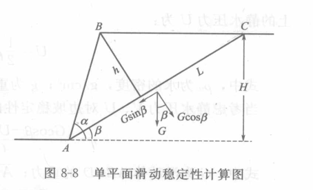

*******************
边坡岩体稳定性分析
*******************

**问题描述**

斜坡是地表广泛分布的一种地貌形式。斜坡的变形与破坏常给人类工程活动及生命财产带来巨大损失。
边坡岩体稳定性分析就是研究斜坡的失稳问题。目前用于边坡岩体稳定性分析的方法，主要有数学力学分析
法（包括块体极限平衡法、弹性力学和弹塑性力学分析法和有限元法等）、模型模拟试验法（包括相似材料
模型试验、光弹试验和离心模型试验等）及原位观测法等。此外还有许多诸如破坏概率法等新方法。

这里只使用块体极限平衡法。

**块体极限平衡法**

极限平衡法事先假定滑动面，并认为滑动岩体为刚体。在此基础上用力学平衡关系得到反应稳定性的系数。

* 稳定性系数，反应滑动面上抗滑力和滑动力的比例关系。
* 安全系数，人为规定的认为对工程安全的稳定性系数的允许的最小数值。通常安全系数在1.05~1.5之间。

边坡岩体稳定性计算
========================

平面滑动
-----------

**单平面滑动**

1. 考虑重力，摩擦力和凝聚力的公式

   .. math:: 
        F_r = Gsin\beta \\
        F_s = Gcos\beta tan\phi_j + C_j L \\
        
        \eta = \frac{F_r}{F_s} = \frac{tan\phi_j}{tan\beta} + \frac{2C_j}{h\gamma} \\
        \eta = \frac{tan\phi_j}{tan\beta} + \frac{2C_j}{\gamma H}\frac{sin\alpha}{sin(\alpha - \beta)}

2. 考虑地下水的影响——水压力

   .. image:: ./images/danpingmian2.png

   设张裂隙高 Z ,水柱高 :math:`Z_w` ， 则张裂隙中的静水压力和AD中的渗流水压力需考虑。

   .. math:: 
        张裂隙静水压力 V = \frac{1}{2}\gamma_w Z_w^2 \\
        AD面静水压力 U = \frac{1}{2} \gamma_w Z_w \frac{H - Z}{sin\beta} \\
        F_r = Gsin\beta + Vcos\beta \\ 
        F_s = (Gcos\beta - U - V sin\beta)tan\phi_j + C_j \frac{H - Z}{sin\beta} \\
        \eta = \frac{(Gcos\beta - U - Vsin\beta)tan\phi_j + C_j\frac{H -Z}{sin\beta}}{Gsin\beta + Vcos\beta}

3. 考虑地震作用
   设地震所产生的总的水平地震作用标准值为 :math:`F_{EK} = \alpha_1 G` ，:math:`\alpha_1` 为水平地震影响
   系数，按地震烈度查表确定: 

   .. image:: ./images/earth_qurck_alpha.png

**同向双平面滑动**

略

**多平面平面滑动**

略

楔形体滑动
------------

略

边坡岩体滑动速度计算及涌浪估计
==================================

