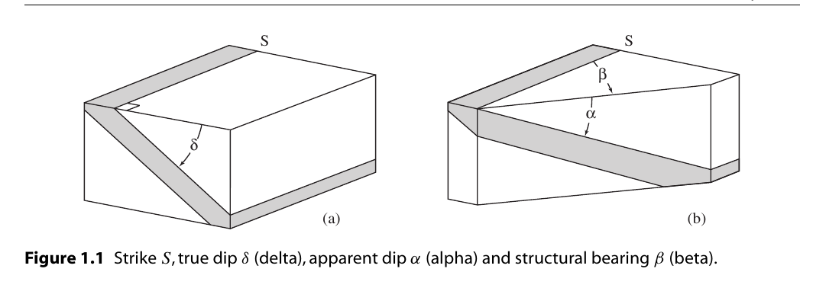
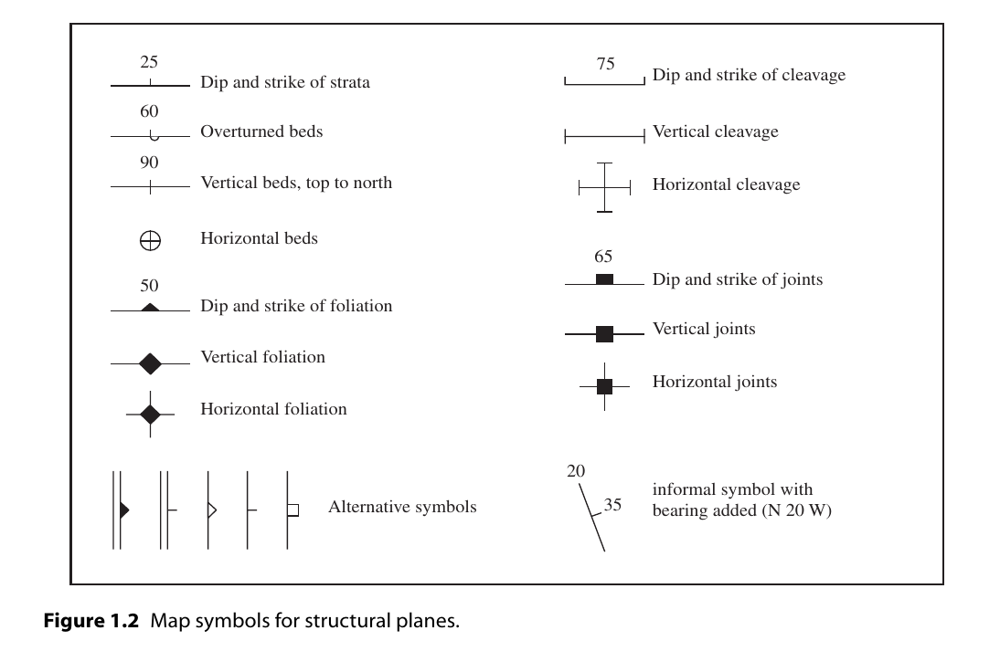
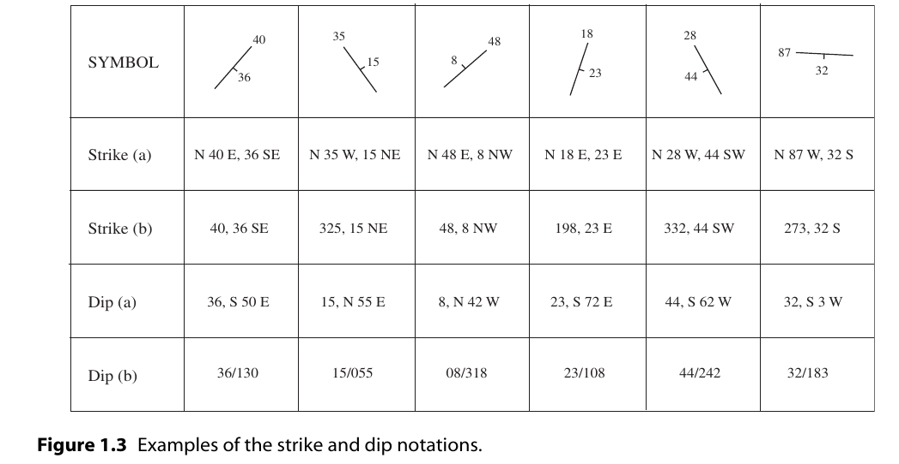

结构面(Structural planes)
=============================

.. contents:: 

定义
-------------

* **Plane** : 平面，几何上的平面
* **Attitude** : 产状，描述平面或线方位的综合术语
* **Trend** : ，走向，用 Bearing 或 Azimuth描述
* **Bearing** : 从正北或正南向东或向西测量的水平角，是用符号表示法表示的角度，如 :math:`N30E`
* **Azimuth** : 从正北顺时针旋转所得角度，用数字表示法,如 :math:`30^\circ`
* **Strike** : 平面走向
* **Structural bearing** : 平面的bearing
* **Inclination** : 倾角，从水平面向下至平面量测
* **True dip** : 真倾角
* **Apparent dip** : 视倾角

Dip and Strike
--------------------------

1. 走向的表示

* ``N 65 W, 25 S`` : bearing 为 65 度，倾角为25度，向S倒。
* ``295,25 S`` : azimuth 为 295度，倾角为25度，向S倒。

2. 倾角标注

* ``25,S 25 W`` : 倾角25度，倾向 S 25度 W。
* ``25/205`` : 倾角25度，倾向 205度。有时也这样表示 ``205/25`` ，为了避免冲突，倾角总是两位数，倾向总是三位数

其他
----------------------

关于产状的测量，误差分析，各种测量方法在此暂时不展开，请参考原文
