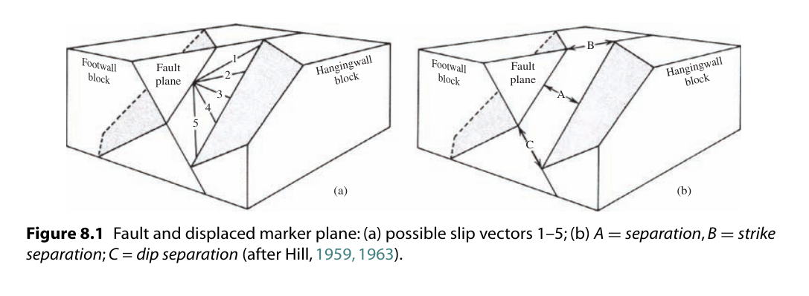

断层(Faults)
===========================================

.. contents:: 

概念
----------------------

* **Fault** : 断层
* **Fault zone** : 一系列平行或交错断层的区域
* **Echelon faults** : 阶梯断层，一系列相关的短的、平行并且以重叠交错形式展布的断层区
* **Shear zone** ： 剪性区域
* **Footwall** : 下盘
* **Hangingwall** : 上盘
* **Cut-off line** : 
* **Slip** : 
* **Separation** : 
* **Contracional fault** :
* **Extensional fault** :

