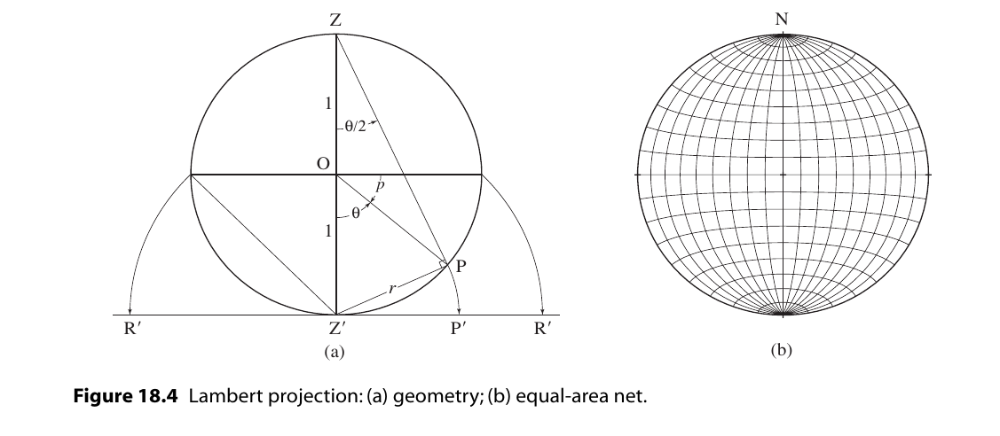
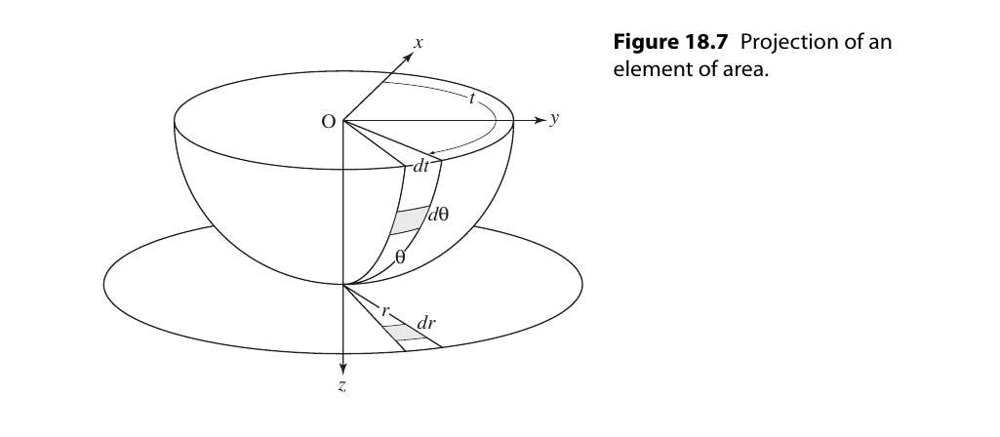
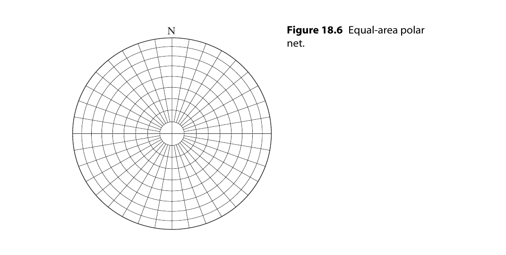
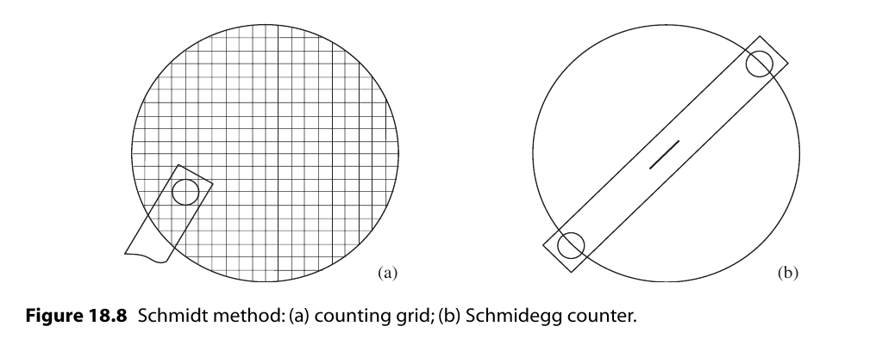
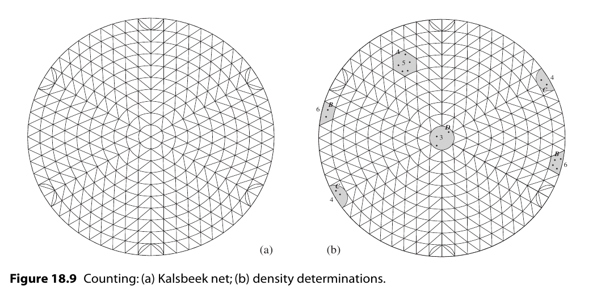
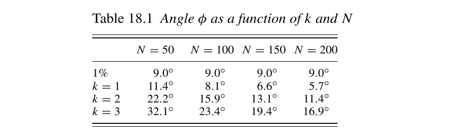
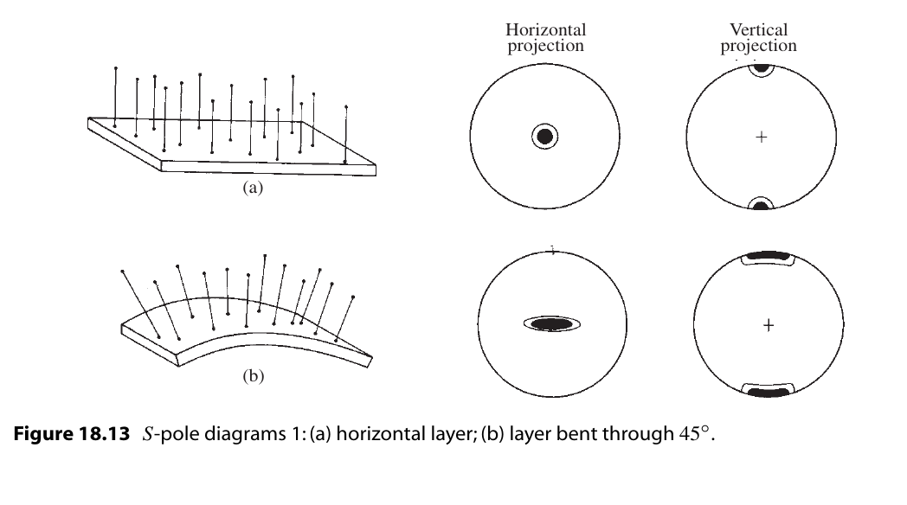
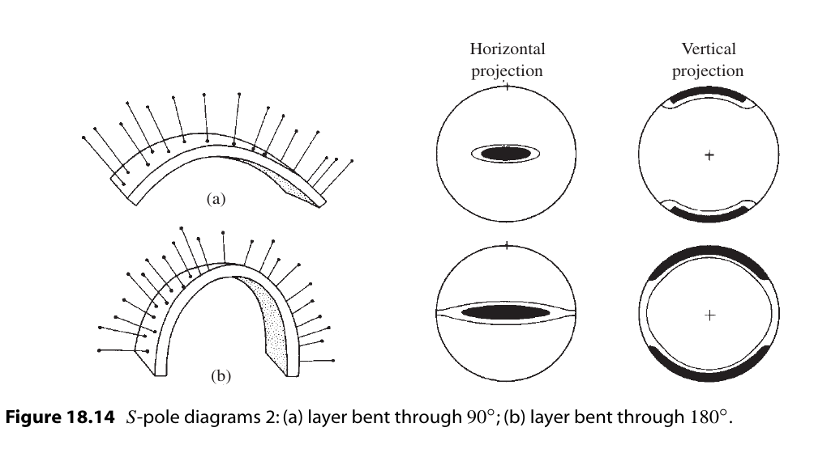
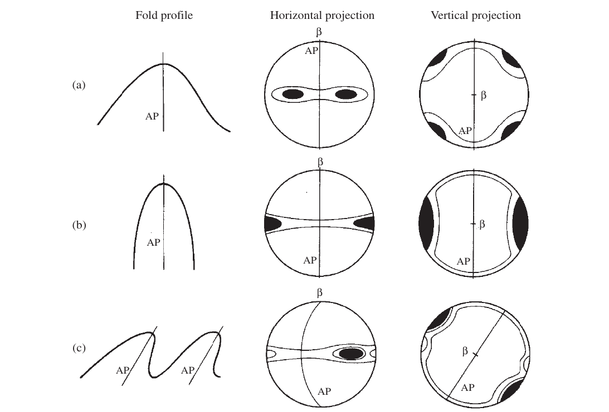
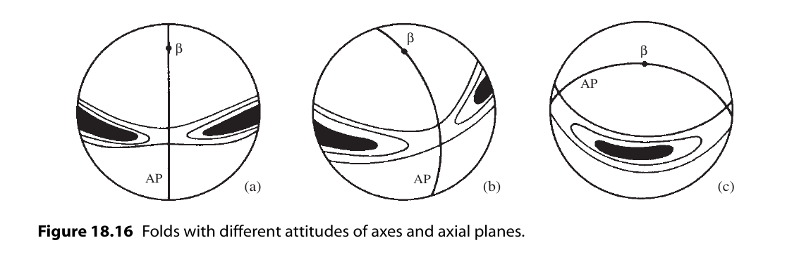

构造分析(Structural analysis)
===========================================

.. contents:: 

简介
-----------------------

尽管使用立体投影的优点现在应该是显而易见的，但涉及线与面之间角关系的问题可以用描述几何的方法来解决。
但是，如果要以图形方式解决某些结构问题，立体网的使用是必不可少的。
岩体的三维几何结构，特别是复杂岩体的三维几何结构就是其中之一。
同样的基本技术也可以应用于更简单的情况，这是一种方便的介绍方法的方式。

S-pole方法和Beta diagram方法
----------------------------------

在圆柱形褶皱中，枢纽区域可能过于光滑，或者褶皱可能太大或不完全暴露，无法对铰链线的姿态进行精确的现场测量。
如果可以测量褶皱表面上许多地方的产状，则可以通过数据的简单立体图来确定褶皱枢纽的方向。

**Problem**

* 利用下列褶皱翼部的产状，确定褶皱的轴向。::

    1. N 88 E, 16 N            4. N 41 E, 50 SE
    2. 2. N 68 E, 30 NW        5. N 35 E, 35 SE
    3. N 60 E, 45 NW           6. N 20 E, 20 E

**Methods**

1. Beta diagram : 在赤平投影图上画出所有平面。平面交于一点，这点为 :math:`\beta` 轴
2. S-pole diagram : 画出所有平面的极点，极点交于一平面，这个平面的极点为 :math:`\beta` 轴

褶皱枢纽和轴面
---------------------------

略

Lambert 等面积投影
----------------------------

如果在赤平投影上绘制在下半球的均匀分布，会发现点的分布并不均匀，点会向网格中心汇聚，这样造成了与面积
相关方法的使用困难，为了解决这个问题，通常使用 *Lambert equal-area projection* 。

考虑一个单位参考球体的过直径的铅垂面，在这个面上倾伏角为 p 的直线 P。作角 :math:`\theta = 90 - p`。
。投影面是由过极轴最低点Z'的水平面，这个点的投影P’，是由旋转Z'P得到的。如上图。

.. math:: 

    &\ r = 2sin\frac{1}{2}\theta \\
    &\ r_max = 2sin45^\circ = \sqrt{2} \\
    &\ 修正投影圆为单位圆 = r' = \sqrt{2}sin\frac{1}{2}\theta \\

微分法证明等面积：

.. math:: 

    &\ 证明图中两个阴影区域相等 \\
    &\ r = 2sin\frac{1}{2}\theta \\
    &\ dA_q = d\theta t(\theta) \\
    &\ t(0) = 0 , t(\pi/2) = dt \\
    &\ t(\theta) = \frac{sin\theta}{sin(\pi/2)} = sin\theta \\
    &\ dA_q = d\theta dt sin\theta \\
    \\
    &\ rdr = d\theta sin\theta \\
    &\ dA_q = rdrdt \\
    \\
    &\  dA_t = \frac{1}{r}dtdr \\
    &\ dA_q = dA_t \\
    &\ 证明完毕

Schmidt 网
^^^^^^^^^^^^^^^^^^^^

.. image:: ./images/等面积投影网.png
    :align: center
    :alt: Schmidt net

同赤平投影网同样的做法，利用等面积投影法可以得到等面积投影网，又叫 Schmidt net。

极点网
^^^^^^^^^^^^^^^^^^^^

同赤平投影网同样的做法

密度图(Contoured diagrams)
-----------------------------------------

借助等面积投影的性质，可以确保点在施密特网上的分布等于点在球面上的分布。

但是散点图并不好作比较和分析。
解决这个问题的方法通常是作在施密特网上作密度图。
一旦散点图出来，密度也可以计算出来，由一系列的方法可以完成这个任务。( [Stauffer1966]_ , [Turner1963]_ , [Denness1970]_ )

密度图制作方法
^^^^^^^^^^^^^^^^^^^^^^

**Schmidt method**

最初的和仍然广泛使用的计数方法是施密特方法 [Turner1963]_ 。
点图叠加在间距为R/10的网格上。
计数是用一种叫做施密德格计数器的特殊工具完成的(Knopf & Ingerson, 1938, p. 245)。
在图表主体中，计数器一端的圆圈以每个网格节点为中心，记录在圆内数据的个数。
如果计数圆与投影圆边界重叠，则使用工具的两端，记录在两端圆内数据的个数。
该工具还可以用作自由计数器,以确定更详细的密度变化。

**Kalsbeek method**

接下来介绍另一个更简单通用的方法。

为了使用这种方法，我们需要一个特殊的计数网格 [Kalsbeek1963]_ 。
投影区域被小三角形完全分割，六个三角形等于1%区域。

*计数*

1. 将点图和第二张描图叠加在计数网上。在每个六边形的中心，写上该六边形内的点的总数(参见图18.9b, A点)。
   对于图的内部，每个重叠六边形的中心都会有数字。 
   对于图中没有点的部分，六边形可以留空，而不是为每个六边形标注零。

2. 在投影网的边界，将网一侧各半六边形中的点与另一侧的互补半相结合，并将此数字沿原图写在网的两侧(见B点)。

3. 辐条两端的点使用互补的半圆(点C)进行计数。在最中心，使用1%的小圆(点D)。

这个或任何这样的人工计数技术都有一个问题。
正如我们所看到的，施密特网的性质是这样的:球体上的一个小圆的形状投射成一个椭圆形的区域，它的形状随倾角而不恒定。
在过去，人们通过使用可变形状的计数器来解决这个问题。
这需要更多的工作，而且对于大多数目的来说，这是不必要的。
而计算机生成的图表完全消除了这个问题。

*绘制等密度线*

.. image:: ./images/等密度图.png
    :align: center
    :alt: 等密度图

1. 在图的内部，A点的等密度线见上。这个等密度线可以很容易通过观察画出。
   找出密度最大的区域是非常简单的。

2. 对于接近边缘的等密度线，会用到半六三角形的计数。
   见B点

3. 当应该严格画一条与边界相交的等高线，但很明显它会立即再回圈时，允许避免与边界实际接触(点C)。
4. 当初步轮廓完成后，可以进行一些修改以改善图的外观(图18.10b):
   
   * 在计数过程中发现的最大值可能不是图的真正最大值。
     通过将点图返回到计数网，可以找到最大的浓度。
     使用中间1%的圆圈作为自由计数器，移动图表，直到最大数量的点位于其中。
   * 所有的等高线可能不是显示图案所必需的;最多六个通常可以在不产生杂乱的情况下显示出图案。例如，如果间距非常接近，则可以消除中间轮廓。
     最终图中剩余等高线的值在图例中以2-4-8-12% / 1%面积的形式表示，最大为14%。
   * 浓度最大的区域往往变黑。虽然通常是不必要的，图案可以用在较少集中的区域。
     特别有效的是使用渐变的点状图案，使浓度较高的区域具有更密集的外观。
     线条图案会影响视觉效果，应该避免使用。
    
散点图的统计分析
^^^^^^^^^^^^^^^^^^^^^

散点不可避免地涉及到统计性质的问题，可以使用各种技术来提取有关其最佳拟合和置信度的信息 [Mardia1972]_ ; [Watson1983]_ ; [Fisher1987]_ ，
但仍存在许多问题。下面使用一个更直观的几何方法区介绍这个主题 [Vollmer1995]_ 。

首先，散点图的分布是否有意义。面对散点图时，我们如何确定散点图之间的差异及其差异的重要性。

想象我们从特定的数据集中取了一个点画在散点图上。在等区域网上，我们将计数器放置在网上的任意一个位置。在这样一个实验中可能会有两种情况——
点在计数器中（成功），或者不在计数器中（失败）。对一个半径为R的区域A，实验成功的概率p为

.. math:: p = a/A = r^2/R^2
    :label: 1\0实验概率

对于1%计数器，p = 0.01。

现在考虑随机放置总量为N的情况。实验的期望数可以用二项分布描述 [Walpole1993]_ 。二项分布的期望为

.. math:: 

    &\ p_k = C_N^kp^k(1-p)^{(n-k)} \\
    &\ E = \mu = \Sigma kp_k = np \\
    &\ \sigma^2 = \Sigma (k - \mu)^2p_k = np(1-p) \\

Kamb 认为 随机分布的情况下偏差大于 :math:`3\sigma` 的概率是极其小的，
可以用数据偏离 :math:`3\sigma` 的数据量来作为判断数据是否具有有意义的
概率分布的判据。其作图方法如下。

.. math:: 
    &\ 令 E = 3\sigma \\
    &\ (Np)^2 = Np(1-p) \\
    &\ p = 9/(N + 9) \\

现在我们需要确定完成这个的计数器大小。

.. math::

    &\ p = r^2/R^2 \\
    &\ r = 3R/\sqrt{N + 9}

有了这个，我们现在有一种方法来区分那些有意义的偏离一致性的散点图。
如果用这种大小的计数器绘制的图表显示出更大的波动，那么它可能不是随机的。

因为它们是在考虑特定的结构问题时产生的，所以大多数图表都有清晰可辨的模式，
即使它们也有局部的、微不足道的波动。明显非随机的分布不再用二项分布来描述。
在这种情况下，Kamb标准的主要好处是它减少了样本量的影响，因此可以比较具有不同点数的图表。

然而，Vollmer(1995)也发现 :math:`E = 3\mu` 倾向于过度平滑浓度较强的数据集。对于这些，需要一个较小的计数器。
对于离群点较少的数据集，可以通过将 :math:`3\mu 用 k\mu` 代替

.. math:: p = \frac{k^2}{N + k^2} and r = \frac{kR}{\sqrt{N + kappa^2}}

通过kamb统计密度完成密度图的方法，叫Kamb方法。

电脑成图
^^^^^^^^^^^^^^^

大量数据点的散点图绘制和密度图绘制是一种理想的计算机应用。
这不仅节省了大量的时间和精力，而且可以以各种方式快速检查数据，这个任务通过人力基本无法完成。

Schmidt网上圆形计数器形状变化的问题是通过在半球表面而不是投影平面上计数来解决的(Warner, 1969)。
虽然手工操作很困难，但实际上通过编程让计算机这样做更容易。单位球球冠的半径为

.. math:: 
    &\ 球冠面积 a = 2\pi(1-cos\phi) \\
    &\ 概率 p = a/A = 1 - cos\phi \\
    &\ \phi cos\phi = 1 - \frac{k^2}{N + k^2} = \frac{N}{N+k^2} \\

密度是通过使用点积确定网格节点的位置向量和每个数据向量之间的夹角来找到的(参见§7.3)。
如果这个角度小于或等于φ，则计数增加。根据最终的节点数据，可以自动绘制轮廓。

许多计算机程序已经被描述(参见Vollmer, 1995，一个很好的讨论和早期的参考资料)，其中一些是现成的:Allmendinger (2001)， 
Holcombe (2001)， Jacobson (1996)， RockWare (2001)， Wallbrecher(2005)。最近，Haneberg (2004, p. 43-47)
给出了使用Mathematica的基本方法的一个很好的一般描述。

1. 我们使用Kalsbeek网络而不是常规的方形图，对于每个结点：
   * 坐标轴原点位于投影网中心，+x = east , +y = north。
   * 每个结点的单位向量的方向余弦 :math:`l_N,m_N,n_N` 由结点的倾伏角和走向算出。
2. 计算每个样本的方向余弦 :math:`l_D,m_D,n_D` 。

3. 按顺序访问每个节点，并计算所有数据点和节点的点积。如果数据到结点的角距小于计数圈的角距则该节点的计数加1。
   最终将密度z由计数个数除以总数得出。
4. 为了正确计算与原始或附近的节点相关的密度，具有小倾角的数据点的相反向量被复制到上半球。
5. 最后将 :math:`z(x,y)` 画出。

图形解释
^^^^^^^^^^^^^^^^

模式是解释点图及其等高线对应物的关键。理想情况下完全线性和完全平面模式的真实等效物是：

1. 点最大值是关于单一方向的轴对称点团聚。
2. 带子是沿大圆分布的一群点。

对于褶皱，我们可以选择构建一个产生点最大值的β图，或者产生带子模式的S-极图。
采用后一种图表类型有几个引人注目的原因：

1. 在β图中，交点的总数N = n(n - 1)/2，其中n是单个大圆的数量。
   正如这个表达式清楚地表明的那样，随着圆的数量增加，交点的数量迅速上升。
   例如，如果n = 100，这并不是一个特别大的样本，那么N = 4950。
   这么多的交点可能会给人一种大样本量的印象，因此对结果的信心感可能是错误的。
   这也需要更多的工作来生成β图。
2. 由于不可避免的散射，可能会产生虚假的交点集中。
   这在开放褶皱中特别真实，其中互肢角接近180°，或在紧密褶皱中接近0°时。
   这些虚假的交点不会随机分布在一个平均位置周围，并且它们可能超过显著β点的数量（Ramsay，1964）。
3. 或许最重要的优势是，如果基于结构态度的代表性样本，S-极图提供了关于折叠表面形状、互肢角和轴面态度的信息。

了解S-极图的一种教学方法是跟随折叠过程中它们的演变。
考虑单一岩床的圆柱折叠。
在折叠之前，水平层的极点会在网的中心处绘制为点团聚（图18.13a），也就是说，
极点会围绕垂直线聚集。如果图表是平行于剖面平面构建的，那么在网的直径两端都会有一个点最大值。
当层围绕水平轴折叠时，原始的垂直极点会扩散成一个扇形。在模式方面，无论是水平还是垂直投影，

如果褶皱形状被平面肢所主导，S-极图案将由与每个肢相关的点最大值组成，而互肢角将是这两个最大值之间角度的补角。
另一方面，如果褶皱形状由均匀弯曲的铰链带主导，带子内的点密度将是均匀的，并且互肢角将是带子中两个极点之间角度的补角。
大多数褶皱的形状和图案都处于这两个极端之间。

还要注意，对称褶皱具有对称的图案，无论是在位置还是点的浓度方面（图18.15a和图18.15b）。
相反，不对称褶皱的图案也是不对称的；对于这样的褶皱，图案的变化可能非常多样。
图18.15c展示了一个简单的例子。等高线的整体形状是对称的，但带子内的最大值具有明显不同的值。
较强的一个标记着占主导地位的肢的极点。

为了介绍，上述褶皱的示例是水平的、垂直的或两者兼而有之。
轴线和轴面可以具有任何取向，这将反映在图表中。
图18.16中展示了几个倾斜和倾斜的褶皱作为介绍的目的。

叠加褶皱
--------------------------

S-极图还可以被视为对所研究区域中褶皱轴均匀性的检验。
因此，该图可以用于判断是否可以绘制褶皱剖面以及在何方向。
另一方面，图案可能无法解释；散点可能使得不存在清晰的最大值或带子。
这些区域在轴向方向上是不均匀的。这在经历了两次或更多次褶皱的岩体中是一般情况。

在多期褶皱的区域，一种方法是寻找较小的、均匀的子区域，这些子区域的数据确实能产生可解释的图表。
一个人工的例子将会展示使用的方法。

取样问题
-------------------

略

工程应用
------------------

略
