树、图与算法
***********************

.. contents:: 

**前置概念**

* *树型结构*：唯一前驱，后继可以不唯一
* *集合*：不存在前驱、后继的关系
* *线性结构*：唯一前驱，唯一后继
* *图结构*：前驱、后继均可不唯一
* *结点的度*：一个结点的分枝个数
* *层*、 *深度*

二叉树
=====================

*二叉树（Binary tree）*：是每个节点最多只有两个分支（即不存在分支度大于2的节点）的树结构。
  通常分支被称作“左子树”或“右子树”。二叉树的分支具有左右次序，不能随意颠倒。

二叉树第i层至多拥有 :math:`2^{i-1}`;深度为k的二叉树至多共有 :math:`2^{k+1} - 1` 个节点。

对任意一棵非空的二叉树，如果其叶片数为 :math:`n_0` ，分支度为 2 的节点数为 :math:`n_2` ，则 :math:`n_0 = n_2 + 1`

*满二叉树*：拥有最大节点树的二叉树

*完全二叉树*：在一颗二叉树中，若除最后一层外的其余层都是满的，并且最后一层要么是满的，要么在右边缺少连续若干节点，则此二叉树为完全二叉树（Complete Binary Tree）。
  完全二叉树可以通过在末尾增加结点转换为满二叉树。具有n个节点的完全二叉树的深度为 :math:`[log_2n] + 1`

*平衡树*: 平衡树是计算机科学中的一类数据结构，为改进的二叉查找树。
一般的二叉查找树的查询复杂度取决于目标结点到树根的距离（即深度），因此当结点的深度普遍较大时，查询的均摊复杂度会上升[1]。
为了实现更高效的查询，产生了平衡树。在这里，平衡指所有叶子的深度趋于平衡，更广义的是指在树上所有可能查找的均摊复杂度偏低。

二叉树的周游（遍历）
-----------------------------

**深度优先搜索**

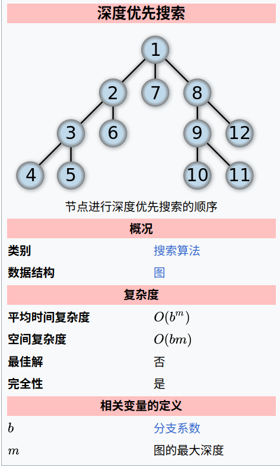

深度优先搜索算法（Depth-First-Search，缩写为DFS）是一种用于遍历或搜索树或图的算法。
这个算法会尽可能深地搜索树的分支。当节点v的所在边都己被探寻过，搜索将回溯到发现节点v的那条边的起始节点。
这一过程一直进行到已发现从源节点可达的所有节点为止。如果还存在未被发现的节点，
则选择其中一个作为源节点并重复以上过程，整个进程反复进行直到所有节点都被访问为止。
这种算法不会根据图的结构等信息调整执行策略。 

深度优先遍历分为：

* 前序遍历(pre_order_traversal)
* 中序遍历(in_order_traversal)
* 后序遍历(post_order_traversal)

**先序遍历**

先序遍历先抛出自己，再进行下一步搜索

.. code:: python
    :number-lines:

    # 深度优先搜索:by self
    # 先序遍历
    def iter_pre_order(root): 
        yield root
        if root.left is not None:
            yield from dfs(root.left)
        if root.right is not None:
            yield from dfs(root.right)
    # 中序遍历
    def iter_in_order(root): 
        if root.left is not None:
            yield from dfs(root.left)
        yield root
        if root.right is not None:
            yield from dfs(root.right)
    # 后序遍历
    def iter_post_order(root): 
        if root.left is not None:
            yield from dfs(root.left)
        if root.right is not None:
            yield from dfs(root.right)
        yield root

.. list-table:: 
    :widths: 10 10 10
    :header-rows: 0

    * - .. image:: ./images/pre_order_traversal.png 
      - .. image:: ./images/in_order_traversal.png 
      - .. image:: ./images/post_order_traversal.png 

**广度优先遍历**

.. image:: ./images/bfs.png
    :align: right
    :width: 15em

广度优先搜索算法（英语：Breadth-first search，缩写：BFS），
又译作宽度优先搜索，或横向优先搜索，是一种图形搜索算法。
简单的说，BFS是从根节点开始，沿着树的宽度遍历树的节点。
如果所有节点均被访问，则算法中止。广度优先搜索的实现一般采用open-closed表。 

**广度优先遍历的实现**

利用“先进先出”的队列和循环可以实现广度优先遍历。

.. code:: python
    :number-lines:

    from collections import deque

    def iter_bfs(root): 
        d = deque(root) # 根加入队列
        while d :       # 队列为空则表明遍历结束
            d_new = deque()
            while d:
                r = d.pop() 
                yield r 
                if r.left is not None:
                    d_new.appendleft(r.left)
                if r.right is not None:
                    d_new.appendleft(r.right)
            d = d_new
    
**用广度优先遍历判断一棵树是否为完全二叉树** 

flag=0，

第1次遇到leftChild或rightChild为空，置flag=1，

继续，若后续结点有孩子非空，且flag为1，则不是完全二叉树；

**非递归深度优先遍历的实现**

非递归深度优先遍历可以利用先进后出的栈和循环实现。

增加路径视为入栈，返回值视为出栈

* 先序遍历是入栈后立即出栈，通过将右子结点先入栈来实现 先出栈左结点的功能
* 中序遍历是出栈在左结点之后右结点之前，所以先沿着左结点入栈，然后出栈，如果有右结点再沿着左结点入栈，然后出栈，直至栈空。
* 后序遍历是出栈在左右结点都入栈之后，所以先入栈右左结点，然后出栈，如果还有左右结点则继续入栈右左结点，直至栈空。

.. code:: python
    :number-lines:

    def iter_pre_order(root): 
        stack = [root] #将根置入栈
        while stack :  # 栈空时结束
            r = stack.pop() # 出栈
            yield r 
            if r.right:
                stack.append(r.right) # 入栈
            if r.left:
                stack.append(r.left) # 入栈

    def iter_in_order(root): 
        stack = [] # 分为两个循环，入栈循环和出栈循环，出栈循环在外。
        p = root
        # 第一次入栈循环
        while p:
            stack.append(p)
            p = p.left
        # 出栈循环
        while stack:
            p = stack.pop()
            yield p 
            if p.right:
                p = p.right
                # 入栈循环
                while p:
                    stack.append(p)
                    p = p.left
    
    def iter_post_order(root): 
        stack = []
        p = root
        # 入栈循环
        while p : 
            if p.right:
                stack.append(p)
            if p.left:
                stack.append(p)
            p = p.left
        # 出栈循环
        while stack:
            p = stack.pop()
            if p.right:
                stack.append(p)
                p = p.right
                # 入栈循环
                while p : 
                    if p.right:
                        stack.append(p)
                    if p.left:
                        stack.append(p)
                    p = p.left
            yield p 

完全二叉树的顺序表示
--------------------

完全二叉树可以按‘广度优先遍历’的顺序，进行顺序存储：

如果用 :math:`T_{层数，一层从左至右的个数} = T_{i,j}` 来表示一个元素。则第n个元素为。

.. math:: T_{i,j}: \qquad n = 2^{i-1} - 1 + j

二叉树的应用
=================

哈夫曼树与哈夫曼编码(Huffman)
---------------------------------

**概念**

* 权值(w) ： 给二叉树的每个结点赋予一个权值（正数），就成了带权二叉树
* 树的路径长度(WPL) ：根结点到每个结点的路径长度只和，根到任意一个结点的路径长度为，层数乘结点权数。

**哈夫曼树**: 在一个权值序列下，使路径长度最小的二叉树称为哈夫曼树，又叫最优二叉树

哈夫曼树的构造
^^^^^^^^^^^^^^^

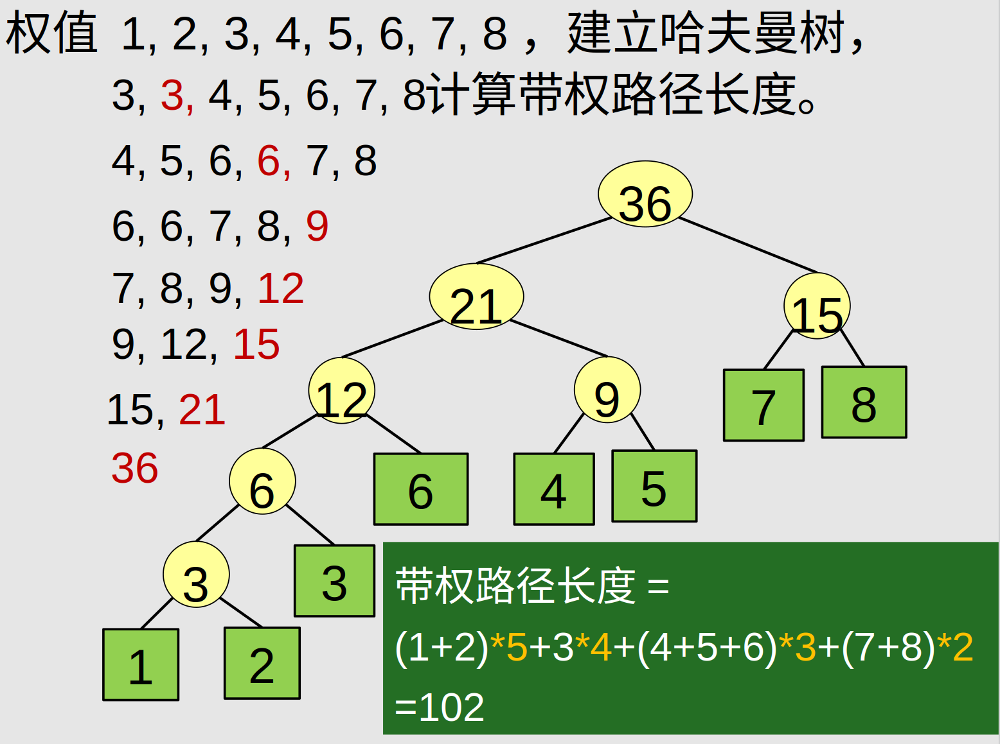

哈夫曼树的储存
^^^^^^^^^^^^^^^^

m个叶结点的哈夫曼树共2m-1个结点，使用顺序结构储存，前m个为叶结点。

结点储存信息：自身信息，父索引，右子索引，左子索引

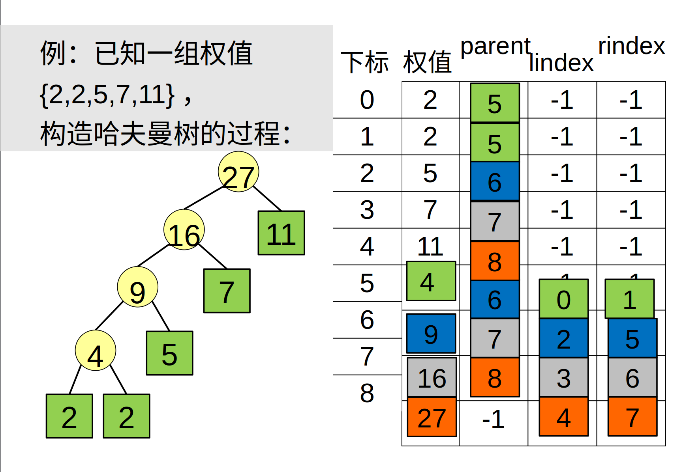

树的遍历
=====================
* 树的度：树中结点度的最大值；
* 兄弟：有共同的父结点；
* 无序树：兄弟间无左右次序；
* 有序树：兄弟分左右；
* 长子：最左子结点；
* 次子：长子的右邻；
* 左、右兄弟

**树的遍历**

参考二叉树的遍历，想想树的遍历如何实现，注：树没有中序遍历。

**树的顺序储存**

思考树如何借助遍历的顺序，实现顺序储存，结点需要哪些保存哪些信息。

树如何转换为二叉树

字典的存储之散列表示
=======================

希望得到一个函数满足 :math:`h(key) = addr`，从而可以根据字典的值得到存储的地址。这样的函数叫散列函数或hash函数。

**散列函数设计的基本问题**

* 如何求散列函数
* 由于key的数目一般远大于地址的数目，发生 :math:`h(key1) = h(key2)` 即碰撞时如何解决。

**负载因子** : :math:`\alpha = \frac{key的数目}{地址空间基本容量}`

除余法
---------

.. math:: h(key) = key \% p 

碰撞处理方式1-线性探查法再散列
^^^^^^^^^^^^^^^^^^^^^^^^^^^^^^^^^

.. image:: ./images/line_search.png

由于线性探查法使非同义词可能占据同一空间，从而会发生堆积问题(非同义词发生冲突)。

碰撞处理方式2-拉链法
^^^^^^^^^^^^^^^^^^^^^^^

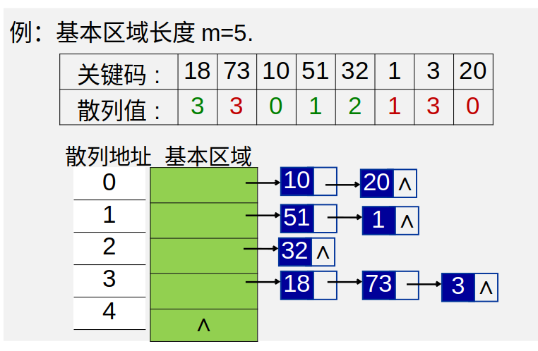

散列文件
-----------------

将散列表(拉链法解决碰撞)用于文件的存储。

.. image:: ./images/antongsanlie.png

**成倍扩充桶的好处** ： 减少访问次数。

二叉查找树
=================

二叉查找树（英语：Binary Search Tree），也称为二叉搜索树、有序二叉树（ordered binary tree）或
排序二叉树（sorted binary tree），是指一棵空树或者具有下列性质的二叉树：

* 若任意节点的左子树不空，则左子树上所有节点的值均小于它的根节点的值；
* 若任意节点的右子树不空，则右子树上所有节点的值均大于它的根节点的值；
* 任意节点的左、右子树也分别为二叉查找树；

**二叉查找树的重要性质** ： 通过中序查找可以返回一个顺序序列

二叉查找树的查找算法和插入，删除
-----------------------------------

通过二叉查找树的大小分布的性质来查找。

平衡二叉排序树(AVL)
=======================

为了尽可能使平均检索长度(ASL)比较短，从而提出平衡二叉排序树。

**平衡二叉排序树** : 每个结点的左、右子树高度之差的绝对值不超过1的二叉排序树。

待续

插入排序
=================

插入排序的原理是通过构建有序序列，对未排序的数据，在已排序序列中从后向前扫描，找到相应的位置插入。
插入排序在实现上，通常采用in-palce排序（占用空间O(1)），即从后向前扫描。

**in-palce排序**

1. 从第一个元素开始，该元素可以认为已经被排序
2. 取出下一个元素，在已经排序的元素序列中从后向前扫描
3. 如果该元素（已排序）大于新元素，将该元素移到下一位置
4. 重复步骤3，直到找到已排序的元素小于或者等于新元素的位置
5. 将新元素插入到该位置后
6. 重复步骤2~5

**二分插入排序**

将上面的2-5步改为使用二分法查找位置

**希尔排序**
希尔排序（Shellsort），也称递减增量排序算法，是插入排序的一种更高效的改进版本。
*希尔排序是非稳定排序算法*。

希尔排序建立在这样的思想下：

* 插入排序每次只移动一部，效率低下，可以改变其步长
* 使用步长减小的序列，只要步长最后为1，排序就一定成功
* 选择合适的步长序列影响着算法的收敛速度

因而希尔排序只是使用减小为1的步长序列来改善直接插入算法的方法。

已知的最好步长序列是由Sedgewick提出的(1, 5, 19, 41, 109,...)，该序列的项，从第0项开始，
偶数来自 :math:`9 \times 4^i - 9 \times 2^i + 1` 和
奇数来自 :math:`2^{i + 2} \times ( 2^{i + 2} - 3 ) + 1` 这两个算式。
这项研究也表明“比较在希尔排序中是最主要的操作，而不是交换。"
用这样步长序列的希尔排序比插入排序要快，甚至在小数组中比快速排序和堆排序还快，
但是在涉及大量数据时希尔排序还是比快速排序慢。 

选择排序
================

选择排序与插入排序不同，是在未排序的序列中寻找最大或最小值，然后加到已排序序列中的算法。

简单选择排序
---------------------

简单的选择排序就是将未排序序列中的最小值（最大值）依次加到已排序序列中，但未排序序列为空时停止。

堆排序
--------------

**堆**：满足堆序性的完全二叉树，堆序性是指，结点的值满足子结点恒大于或等于母结点（或恒小于等于）。

基于堆的性质，可以依次去除堆根结点完成排序，所指定的排序为堆排序。

堆的存储方式和完全二叉树相同，可以采用顺序储存。

**堆支持的基本操作**

.. image:: ./images/duicaozuo.png

**build**

建立堆有两种方法，一是不断插入新的元素，二是将待排序记录建成一个完全二叉树（存入序列），然后从后向前依次调整。

方法1的时间复杂度 :math:`\Sigma_1^n log(i) =O(log(n!))`,方法2的从后向前指的是序列顺序，时间复杂度为 :math:`O(n)`。

在其他算法中，充分利用大小的性质，可以得到较快速简洁的算法。

交换排序和基数排序
=====================

交换排序是以比较然后交换操作为基础的排序。

冒泡排序
-------------

冒泡排序是对未排序序列 [0:n] 相邻的元素两两比较（共 n-1次），将大的置后，从而使最后一个元素完成排序，重复直至未排序序列只有一个元素，完成排序的算法。

冒泡排序开销较大，效率较低。

快速排序
------------

快速排序是冒泡排序的改进版本。由于冒泡排序每次只进行相邻元素的比较交换，效率低下。
快速排序则一次性确定一个排序好的元素。

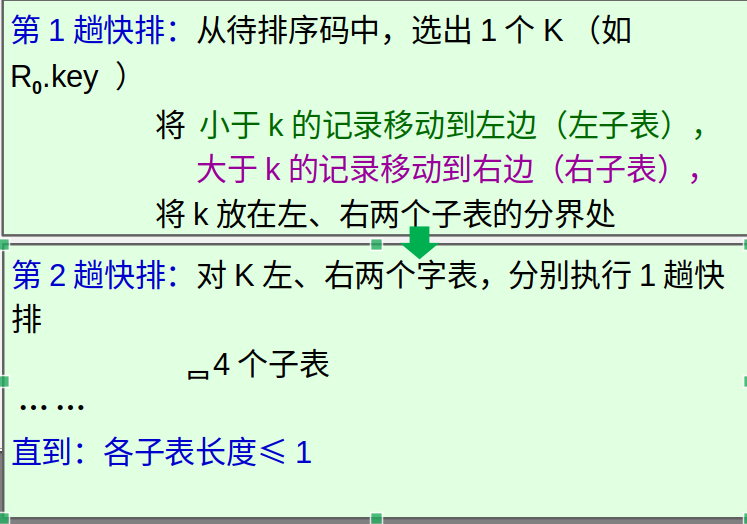

基数排序
-------------

将排序分解为若干个部分分别排序的方法，叫分配排序方法。

常见的分配排序为基数排序，用于排序整数。

基数排序是指按个位、十位、百位... 依次排序的方法。

图
==========

**相关概念**

* 完全图：任意两个顶点之间，都有1条边
* 稀疏图：N个顶点，很少条边(弧)
* 稠密图：N个顶点，很多条边(弧)
* (顶点间)邻接、(顶点与边)关联
* 顶点的度D(V):
  * 有向图中，入度为以V为终点的边数，出度 = 以V为起点的边数，度 = 入度 + 出度
  * 无相图中，以顶点V相关联的边数。
* 路径，以顶点序列来表示一个路径
* 路径长度，该路径的边数
* 回路：起点与终点相同
* 简单路径：只有起点和终点可以相同，即内部无回路 l
* 简单回路：回路 + 简单路径
* 有根图：在一个有向图中存在一个可以到达所有结点的顶点V，则称该图为有根图，该顶点为有根图的一个根。
* 子图：图的子集
* 连通：顶点之间至少存在一条路径则称顶点连通。
* 连通图：图中任意两个顶点都连通
* 连通分量：分量量（英语：Component）又称为连通分量、元件、或分支，
  是一个无向子图，在分量中的任何两个顶点都连通，且没有任何一边可以连到其他子图的顶点。
* 强连通图：双向连通图
* 带权图：给边赋予权值
* 带权路径长度：路径上权值之和
* 网络：带权的连通图

图的储存结构
----------------

* 顶点表+邻接矩阵
* 顶点表+（出或入）边表（n个单链表）

邻接矩阵表示法
^^^^^^^^^^^^^^^^^

.. image:: ./images/linjiejuzhen.png
    :width: 35em
    :align: center

邻接表
^^^^^^^

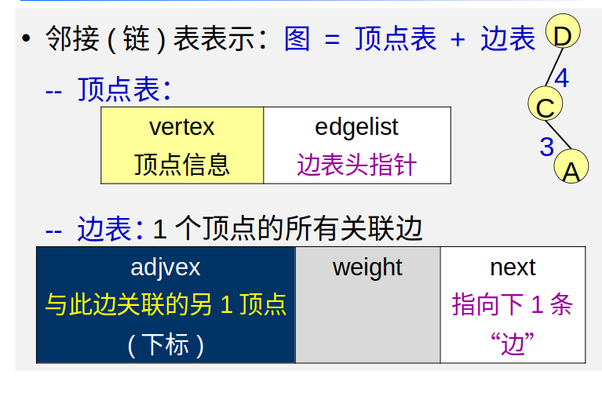

图的遍历
------------

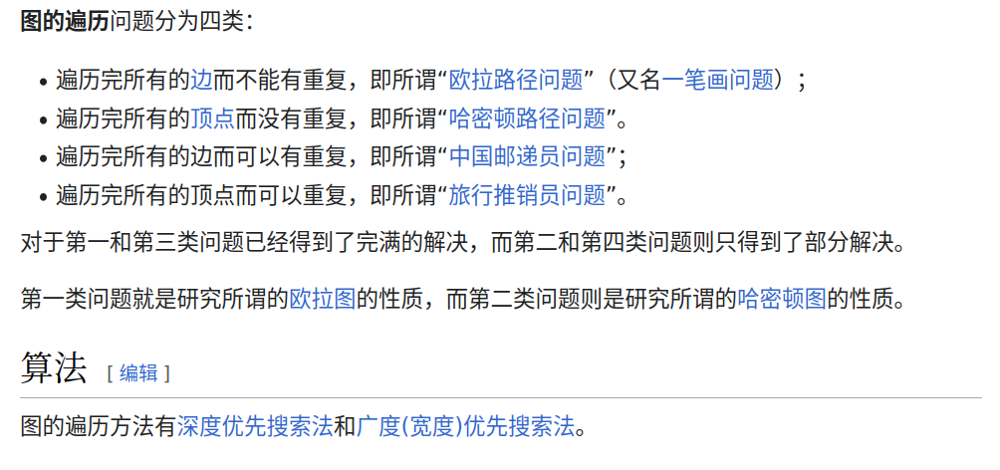

深度优先遍历
^^^^^^^^^^^^^

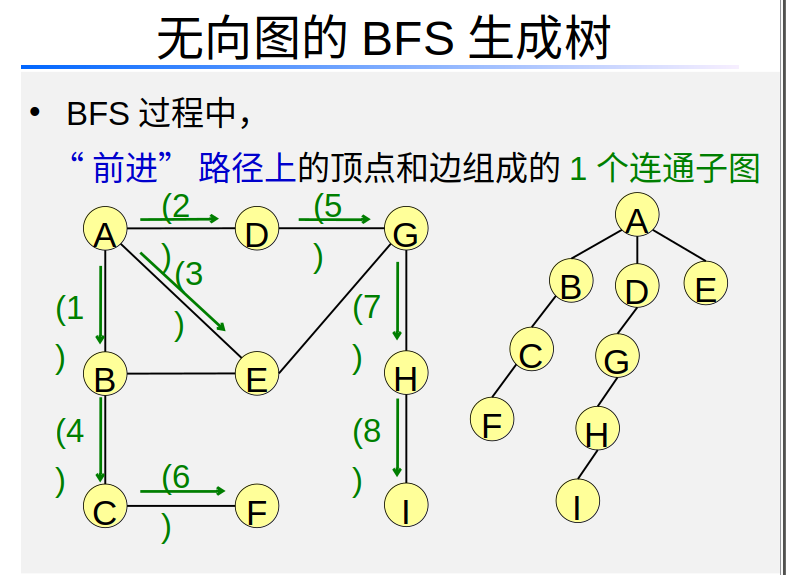

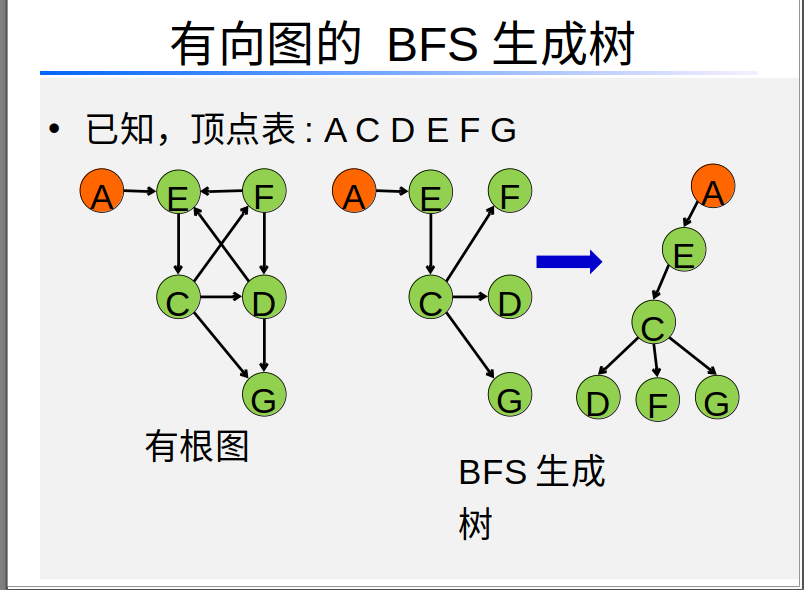

广度优先遍历
^^^^^^^^^^^^

**如何寻找一个无权图中某个顶点v到其它顶点的最短路径？**:
从顶点v开始BFS记录其余节点到v的最短路径长度

图的最短路径算法
------------------

* 单源点最短路径
  * Dijkstra 算法(要求权重非负)
  * Bellman-Ford 算法(权重可以负，但负权重无回路)
* 任意两点间的最短路径
  * Floyd 算法

**Dijkstra算法**

.. image:: ./images/Dijkstra_way.png

最小生成树
-------------

* **耗费** : 生成树中，各边的权值之和
* **网络** ：带权的连通图
* **最小生成数** : 所有生成树中，耗费最低

**Prim算法**

普里姆算法（英语：Prim's algorithm）是图论中的一种贪心算法，
可在一个加权连通图中找到其最小生成树。
意即由此算法搜索到的边子集所构成的树中，不但包括了连通图里的所有顶点，
且其所有边的权值之和亦为最小。

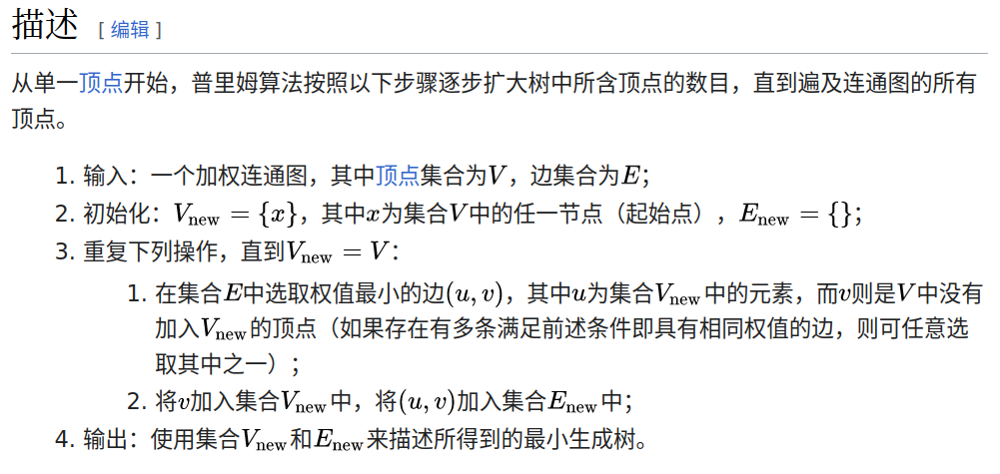

**Kruskal算法**

克鲁斯克尔算法（英语：Kruskal's algorithm）是一种用来查找最小生成树的算法
[1]，由美国数学家约瑟夫·克鲁斯克尔在1956年发表[2]。
用来解决同样问题的还有普林算法（Prim算法）和布卢瓦卡算法等。
三种算法都是贪心算法的应用。
和布卢瓦卡算法不同的地方是，克鲁斯克尔算法在图中存在相同权值的边时也有效。

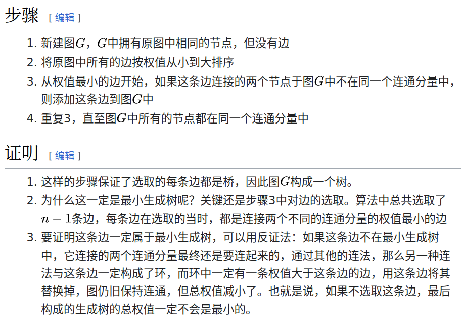

**基于并查集的Kruskal算法**

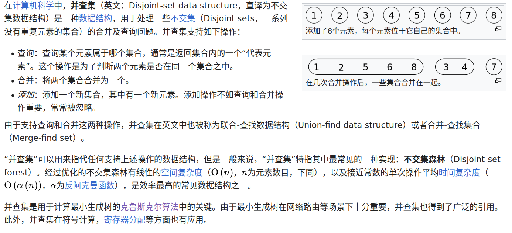

略

拓扑排序和关键路径
=====================

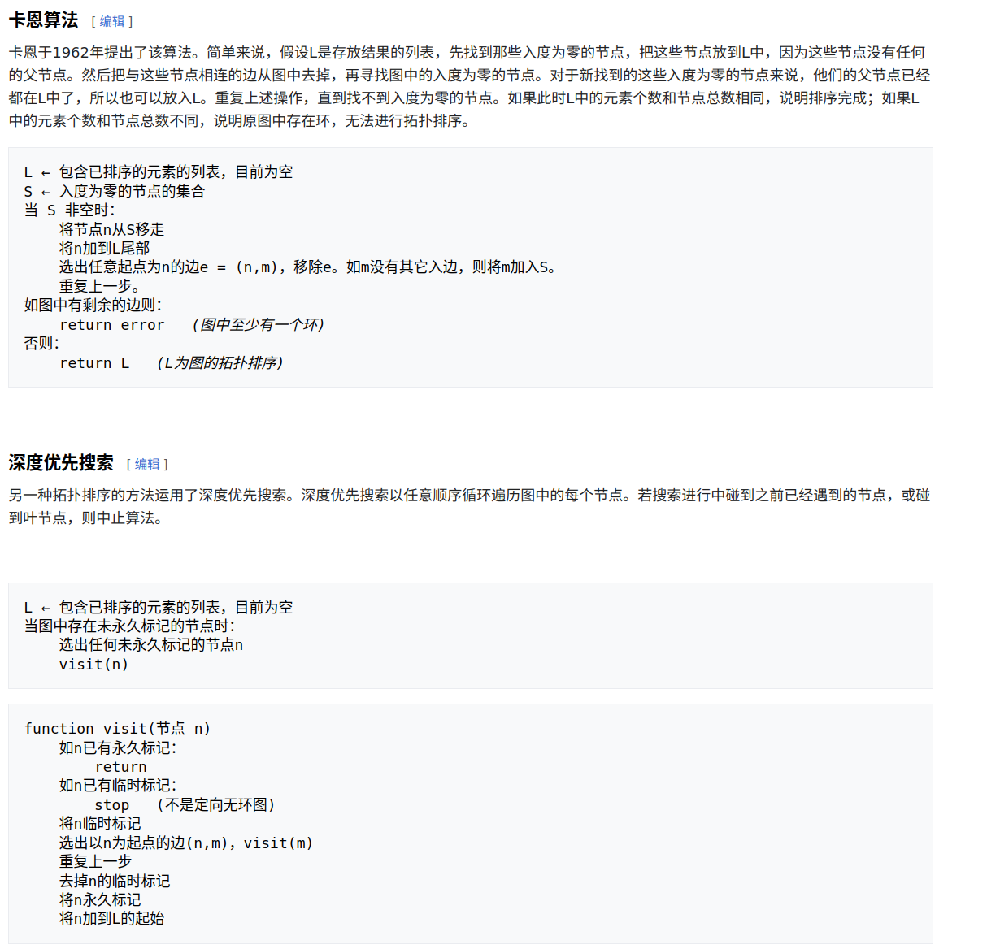

