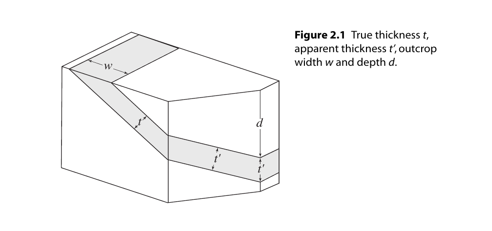

厚度(Thickness and depth)
=================================

.. contents:: 

定义
------------------

* **Thickness** : 厚度
* **Apparent thickness** : 视厚度
* **Outcrop width** : 露头宽度，水平面上的宽度距离
* **Depth** : 深度

其他
----------------------

参见原文