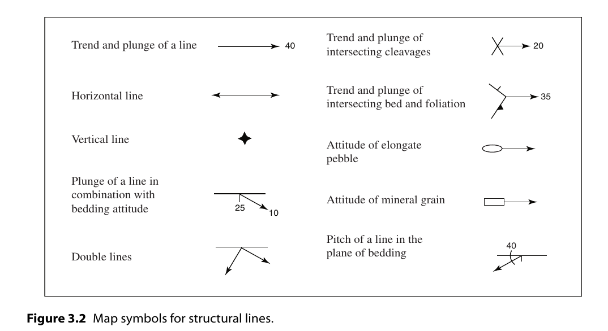

线状构造(Lines and intersecting planes)
==============================================

.. contents:: 

定义
----------------

* **Line** : 直线，同几何上的概念
* **Plunge** : 倾伏角，同dip，不过是将对象换为了直线
* **Pitch** : 侧伏角，平面走向线和直线的夹角
* **Trend** : 走向，包含该直线的铅垂面水平方向，使用Azimuth 或者 bearing表示。

线状构造 
---------------------

线状构造的走向和倾伏角完全确定了线状构造的空间方位。

下面是线状构造的地图符号，线状构造的符号包含了其长度、方向和倾角。

其他
-------------

见原文
