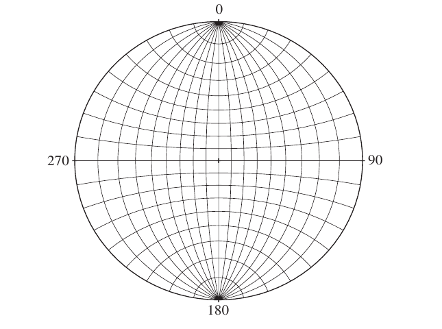

赤平投影(Stereographic projection)
===========================================

.. contents:: 

概念
-------------------

* **Stereographic projection** ： 赤平投影
* **Stereogram** : 赤平投影图
* **Stereonet** : 赤平投影网,他和下面三个概念是同一概念
* **equatorial stereographic net** 赤道赤平投影网
* **Wulff net** : 吴氏网
* **equal-angle net** : 等角网
* **polar net** ： 极点图，与上面的网不同。**
* **line** ： 直线
* **pole** ： 平面的法线（极线）
* **plane** ： 平面

这章介绍赤平投影

赤平投影基本原理和线面的绘制方法
---------------------------------------

略

赤平投影网(Stereonet)
-----------------------------

通过构建一系列大和小的圆我们可以得到赤平投影网。也叫赤道赤平投影网， 等角网或吴氏网。

赤平投影网由两种圆构成，分别是走向为NS的过原点平面，所得线可以称为经线（过原点），
二是走向为EW的铅垂面，可以称为纬线（平行），每个同类型的圆相隔10度。度数的含义见下：

1. 经线的度数（dip）

经线的度数可以用dip表示,从 0 E 到 90 到 0 W 。

经线可以视为倾角为 度数 的平面，也可以视为倾伏角为 度数 的直线构成。

2. 纬线

纬线的度数通过其上每一点到 NS 轴的 到角 表示，纬线主要用于绕过在赤平面上的轴旋转。

极坐标网(Polar net)
---------------------------

极坐标网由一系列平行于赤平面的纬线（用于确定倾伏角）和一系列过原点的铅垂面（用于表示方位）构成。
极坐标网在绘制平面上有难度，但在展示直线上很直观，也不需要旋转。

