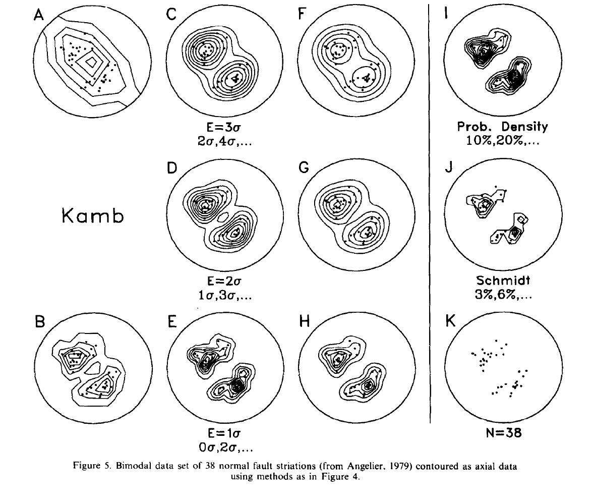

Kamb赤平极射投影等密度图的C程序
************************************

.. contents:: 

**Abstract** :

Kamb等密度图法是一种对方向数据分布进行初步分析和比较的方法。该方法基于与均匀分布对比的偏差进行密度统计，
比传统的Schmidt方法对数据大小的依赖小。

可以提出一些改进的方法，特别是关于自动等高线绘制的实现。为了减少平滑，均匀分布的随机样本抽取
的期望计数可以减少。这样提供了更局部的密度估计，可以特征的分辨率。为了精确性，密度估计直接在球体上进行。
也同样允许在赤平极射投影和其他非定面积投影，同时容纳矢量数据。权重函数提供了更好的密度估计也增加了等值线的平滑性。
这些概念已经在程序中实现。选项包括数据旋转角的选择，线性或平面数据，等面积或赤平投影，上下半球，散点图。
图像输出可以是屏幕或者dxf图像。程序容易移植到其他电脑系统和图形设备上。

关键词: Axes，C language, Computuer-aided drafting, Density diagrams, Graphics, Spherical projection, Vectors.

介绍
======================

球体方向数据，包括方向线（单位向量），无方向线（单位轴），和平面的极轴，在构造地质学和其他领域得到了大量应用。他们通常
作为散点图画在等面积投影上然后来绘制密度图。在Schmidt和相关方法中，用一个包含总面积百分之一的技术员
在常规网格节点上做密度估计，这个网格是每1%的区域的等值线图。[7]_ [12]_

广泛使用的Schmidt方法和其他的1%区域的方法由于密度图对样本大小有着很强的依赖性，所以并不是和数据集之间的比较。
在样本大小剧烈变化的地质学科而言，这个缺点是极其显著的。Kamb(1959)提出的替代方法中，等值线表示距离均匀分布下
随机样本均值的偏差。Kamb的方法减少了样本大小的影响，允许不同体量的数据集进行比较分析。

这篇文章首先回顾了Kamb的方法和一些适合自动化绘制密度图的修正方法。包括改变均匀分布的期望数，在球体估计点密度，方向数据的修正
和使用加权方法平滑图像。示例数据集被用于验证这些修正并比较Kamb方法和Schmidt方法和Diggle和Fisher(1985) 提出的方法的图像质量。
这些用于C程序的思想在 IBM PC 微机中实现，并且可以导出图像到 AutoCAD。 使用易于迁移到其他系统的 ANSI C标准写成。

KAMB方法
======================

见《构造地质学的几何方法》第18章。

计算元素大小和样本大小
========================

Kamb方法的一个最显著的好处就是通过计算元素大小（这里指的是Kamb方法r的计算，元素大小指的是r），
来减少样本大小的影响。Kamb选择 :math:`E = 3\sigma` 的二项分布模型来确定这个关系。但是其他的公式也是
可行的。建议使用区域为1/n倍计数器。可以通过选项确定这个选择。Kamb方法没有指定特定的最佳密度估计方法。
特别的，如本例所示，它可能由于强烈的优势方位导致过度平滑而使部分数据失真。改变二项分布模型可以切换平滑度
因此建议通过主观修正密度图的绘制。

可以通过减小 :math:`E = k\sigma` 的k值得到一个更小的计数半径，和更局部的密度估计，和更小的平滑度。

在球面计算密度
======================

见《构造地质学的几何方法》第18章。

.. math:: 

    &\ a = 2\pi (1 - cos\theta) \\
    &\ 对于向量数据分布在面积为4\pi 的区域：\\
    &\  p = a/A = (1 - cos\theta)/2 \\
    &\ cos\theta = (n - k^2)/(n + k^2) \\ 

    &\ 对于轴数据分布在面积为2\pi 的区域： \\
    &\ 半个球面 p = a/A = 1 - cos\theta \\
    &\ cos\theta = n/(n + k^2) \\

计算点积

权重函数
==========================

通过减小节点之间的距离可以增加图像的分辨率，但是容易导致出现的锯齿现象。
问题在于一个点的密度估计必须在一个有限的区域进行估计。在标准的节点计数方法中每一个在计数圆的
元素都有一个权重 w 1，而在计数器之外的权重为0。

.. math::  w = 1 (x \ge a)

令球冠的面积为,a, 样本距球冠中心的距离 x，可以得到一个单调递增的权重函数：

.. math:: w = 2(1-x/a) (x \ge a).

为了得到更高的平滑度，可以令：

.. math:: w = 3(1 - x/a)^2 (x \ge a).

这个权重函数提供了一个二次增加的权重分布。[4]_ 。
每一个权重函数都满足，对加权面积积分等于 a 的性质，
所以期望密度并没有改变。

一个基于高斯或费尔希分布的增加的加权函数被用于Kamb方法。他是一个理想的单峰分布，
并可以使加权面积增加到整个球面。通常而言，它会有更好的平滑度。

网格化和绘制等值线图
============================

网格化和控制在这里使用的网格算法中一个规则的正方形网格被背投影到球体上。
这提供了大于一个完整半球的覆盖范围，允许轮廓延伸到投影的边缘，
在那里它们被剪裁。在每个节点进行加权计数后，对网格进行预处理以进行轮廓绘制。
由于点数是一个不连续的变量，并且轮廓的最佳估计值位于连续值之间的中间，
因此从每个总数中减去0.5。例如，密度为0的等高线将通过计数值为0和1的两个节点的一半，
而不是通过第一个节点。然后，网格值将标准化为1 SD。
高线是通过网格的线性插值绘制的。任何由插值引起的轮廓定位误差都被限制在节点之间；
合理的细网格间距将使这些误差最小化。许多其他网格和等高线插值方法，
包括使用多项式拟合和交替网格几何，已被使用（例如：卡尔卡尼和冯弗雷斯，1979年；
托切尔，1979年；柴奥，1985年；狄格尔和费舍尔，1985年；耶茨，1987年；
查尔斯沃思等人，1989年）。

.. image:: ./images/Kamb不同选项的影响.png
    :align: center
    :alt: Kamb不同选项的影响

示例
===========

待续

参考文献
================

[1]_, [2]_, [3]_, [4]_, [5]_, [6]_, [7]_, [8]_, [9]_, [10]_, [11]_

.. [1] Davis,J.C. 1986 地质上的统计和数据分析
.. [2] Dudley, R. M., Perkins, P. C., and Gine, M. E., 1975, 优势方向的统计实验
.. [3] Fisher, N. I., Lewis, T.. and Embleton,B. J. J., 1987. 球面数据的统计分析
.. [4] Kalkani, E. C., and Von Frese, R. R. B., 1982, 用fabric数据的卷积确定可能的分布
.. [5] Kamb. W. B., 1959. 蓝色冰岩结构观测
.. [6] Marshak, S.. and Mitra, G., 1988. 结构地质的基本方法
.. [7] Ragan, D. M., 1918. 结构地质，一份几何方法的介绍
.. [8] Ramsden, J., and Cruden, D. M., 1979. 在等值线方向图中估计密度
.. [9] Robin, P. F., and Jowett, E. C., 1986, 用计数圈和连续加权函数对定向数据的等值线和统计评价
.. [10] Schaeben, H., 1982,通过近似理论方法计算与样本大小相关的计数元素大小
.. [11] Schaeben,H., 1986, Comment on sphere： 一个方向数据等值线图的作图程序
.. [12] Turner, F. J., and Weiss, L. E., 1963, 构造变质岩的构造分析

