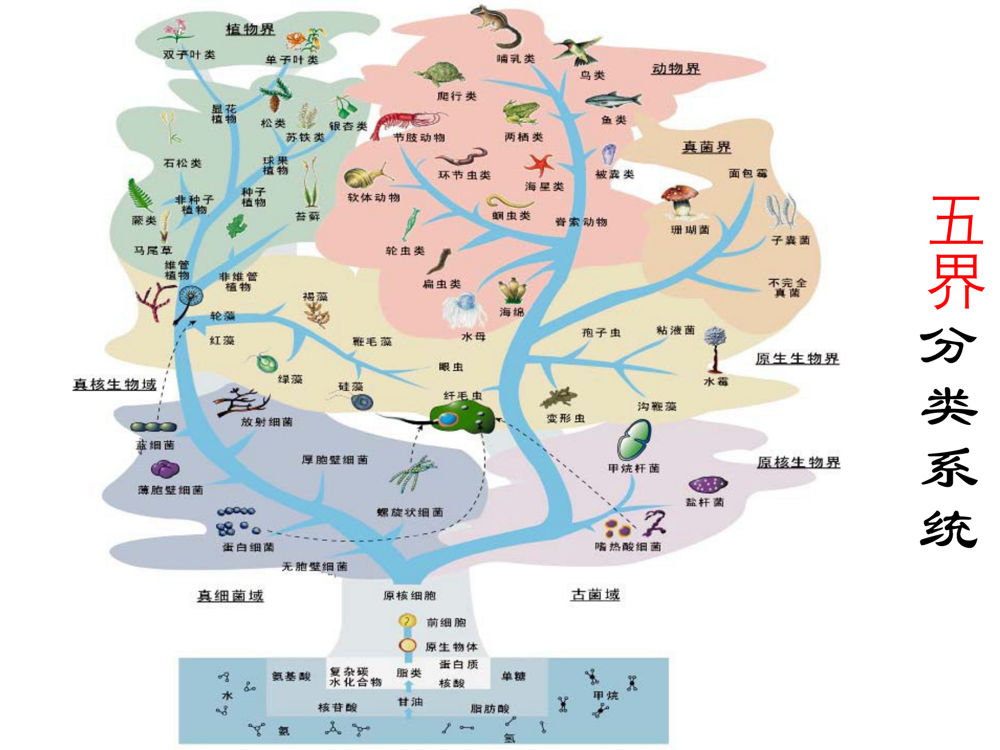
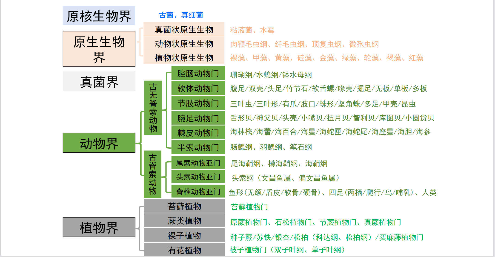
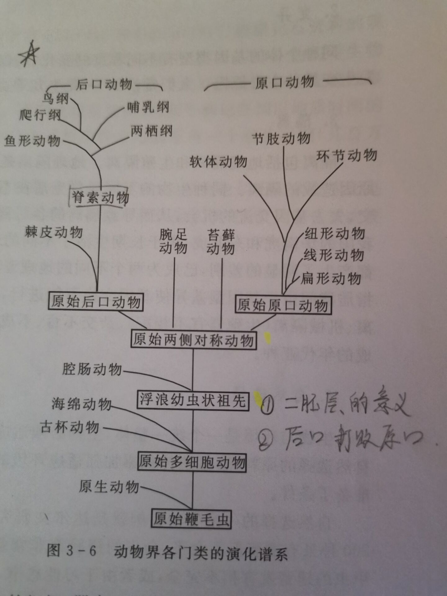

古生物和地史学概论
####################

.. contents:: 

第一章——化石与古生物学
***************************

化石（fossil）是指保存在岩层中的地质历史时期 *生物的遗体* 、 *生命活动的遗迹* 和 *生物成因的残留物指*

假化石（pseudofossil）是指类似化石但与生命活动无关的一类物体

疑化石（dubiofossil）是指无法辨别的化石类似物

古生物学以化石为研究对象。

古今生物之间的时间界线被定在更新世与全新世之交（约11700年）。

化石的形成
=====================

化石的石化作用：生活于地质历史时期的古生物，其死亡后的生物遗体以及生活时产生的遗迹，
被沉积物埋藏，并在漫长的地质年代过程中，随着沉积物的成岩作用，与沉积物
一起经受各种物理化学改造，最终称为沉积物的一部分的这个过程。

化石的形成条件
------------------

1. 生物本身条件

一般说来硬体比软体更易形成化石。

方解石、硅质化合物和磷酸钙等矿物组成的生物硬体比霰石和含镁方解石等不稳定矿物更易保存

有机质硬体如角质层、木质、几丁质薄膜等可碳化保存为化石。

2. 生物死后的环境条件

高能水动力条件下生物尸体容易被破坏;PH小于7.8时，碳酸钙组成的硬体容易被溶解；烟花环境下有机质容易腐烂。在还原条件下容易保存。

3. 埋藏条件

不同的埋藏条件对化石的形成有不同的影响，例如冻土中保存的猛犸象化石十分完整

4. 时间条件

化石经过上时期的石化作用才可形成化石

5. 成岩条件

沉积物在固结成岩过程中压实和结晶作用会影响化石形成。只有在压实作用较小且为经过严重重结晶作用的情况下，才能保存为完好的化石。

石化作用的形式
^^^^^^^^^^^^^^^^^^

* 矿质填充作用 矿物质沉淀填充硬体组织的空隙
* 置换作用 外来物质填充生物体内被溶解的组成物质，两者速度相当则保存效果较好。
* 碳化作用 不稳定成分被分解和因升镏作用挥发，径流下稳定的碳质薄膜

化石埋藏学
=================

研究古生物从死亡后到化石形成之前所经历的 *埋藏环境* 、 *埋藏条件* 和 *埋藏过程* 的学科称为化石埋藏学

化石的埋藏类型
----------------

化石的埋藏类型：
* 原地埋藏
* 异地埋藏

化石群的埋藏类型：
* 原地化石群： 化石成员几乎没有搬运
* 残留化石群： 大部分化石没有搬运，少部分搬运而走
* 混合化石群： 大部分化石没有搬运，少部分为搬运而来
* 搬运化石群 ： 大部分为搬运而来的化石群

辨别化石埋藏类型的主要标志：

1. 化石保存的完整程度
2. 个体大小的分选性，一般未经搬运的化石大小各异
3. 两壳保存的分散性，原地埋藏的 *双瓣壳化石* 一般两壳闭合，即使分离数量也大致1:1。
4. 观察判断生物的生长位置。 
5. 化石的生态类型与其埋藏环境是否一致。
6. 不同时代的化石保存在伊耆氏，老的化石应该属于异地埋藏
7. 生命活动留下的痕迹一般为原地埋藏
   
超常保存化石库
-------------------------

超常保存是指软体组织或结构被全部或部分保存下来。

在某些特殊的沉积环境下有利于软体组织的保存，在此特殊环境保存的化石聚落被称为 *超常化石库* 或 *化石贮集库*

生物软体组织的矿化保存形式：

1. 完全矿化，通常是磷酸盐化
2. 矿膜化，最常见，矿化膜一般为磷酸盐化、碳酸盐化、黄铁矿化。
3. 矿化核，软体组织被交代填充后形成的铸型。

生物软体矿化的保存类型：

1. 奥斯坦型或陡山沱型保存。 磷酸盐化；瑞典寒武纪奥斯坦化石库和中国埃迪卡拉纪陡山沱组化石库
2. 古泉型保存。二氧化硅迅速包裹生物体。只见于二氧化硅饱和和浅水环境下能够生存的微生物席和细菌化石中。
3. 布尔吉斯页岩型保存。加拿大寒武纪贝尔吉斯页岩化石库。软体结构以碳质压膜的形式保存。
4. 比彻三叶虫型保存。 黄铁矿化
5. 埃迪卡拉型保存。生物软体由于被微生物席所包覆而以印痕或铸型的形式保存

中国还有著名的澄江化石库和热河化石库

化石的分类
=================

1. 按照可视程度

肉眼可见的化石为 *大化石（macro-fossils）*。

通过显微镜观察才可见的化石为 *微化石（micro-fossils）*。

通过电子显微镜才可见的化石为 *超微化石（ultramicrofossils）*

分子化石或化学化石是指仅保留了原始生物的有机组分的一些基本碳骨架的化石。

2. 按照化石的保存类型

* 实体化石：生物遗体
* 膜铸化石：

  * 印痕化石：生物软体结构以印痕形式保存
  * 印膜化石：生物硬体在围岩上的印膜，分为外膜、内膜和复合膜
  * 核化石：空腔（生物体结构空腔或生物硬体溶解后空腔）被沉积物填充固结后形成的化石
  * 铸型化石： *贝壳* 已经形成外膜和内膜加上生物硬体溶解后空腔被沉积物填充形成的化石

* 遗迹化石
* 化学化石

化石研究方法和意义
=============================

研究步骤一般包括：

1. 标本或样品的xlji
2. 标本的揭露与分离
3. 化石的鉴定和记述
4. 化石标本的照相、制图和复原
5. 化石资料的分析和应用

古生物的分类和命名
=========================

分类等级
-------------

主要分类单元：
界（kingdom）、门（phylum）、纲（class）、目（order）、科（family）、属（genus）和种（species）。

辅助单位：亚

由于对化石不能判断是否存在生殖隔离，因此化石种着重以下特征判断：
1. 共同的形态特征
2. 构成一定的居群
3. 居群具有一定的生态特征
4. 分布于一定地理范围

有些种可分亚种：由地理隔离产生的性状差异分地理亚种，由年代不同产生的性状差异分年代亚种。

命名
-----------

n名法第一个字母大写

属及以上名称用单名法，
属及一下用斜体
种名称用斜体+双名法（双名包括属名+种名）
亚种还需加上亚种名构成三名法
可在学名后加上正体的作者+，+年代

sp. 表示未定种
sp. indet. 表示不定种
cf. 表示相似种
aff. 表示亲近种
种属名第一次提出需要加上 gen. nov.（属）或sp. nov.（种）

古生物的分类系统
======================

  

`常见化石门类.pdf`_

生命起源与生物进化
***********************

早期生物的发生和演化
========================

已发现的前寒武纪化石表明早期生物的演化存在4次飞跃。

1. 最早生物的出现

澳大利亚皮尔巴（Pilbara）地区大约35亿年的Warrawoona群碳质燧石叠层石种发现到而丝状细菌是目前最早的可靠化石记录

南美Onverwacht Seriers（约34亿年前）也发现了可能为蓝藻和细菌的球星或椭圆形有机体。

2. 早期生物分异

加拿大Ontario 西部苏必利尔湖沿岸的前寒武纪 Gunflint 组（约20亿年前）中发现的生物8属12种的微化石证实经过10亿年的演化，原核生物已发展到相当繁盛的程度，这可能与后期富氧大气圈的出现有关。

3. 从原核生物演化出真核生物

澳大利亚北方 Amadens 盆地的 Bitter Springs 组的燧石（约10亿年前）发现了4个属，其中出现了原生动物蓝藻。

在中国北方中元古代串岭沟组（年龄约17~18亿年）中发现的大型球状疑源类化石是早期真核生物的可靠证据。

4. 后生动物的出现

后生动物出现的时间一般认为在距今5.6亿~5.8亿年间，澳大利亚的埃迪卡拉动物群为其典型代表（主要为腔肠、环节、节肢）

显生宙生物的演化
=========================

1. 寒武纪生物大爆发

埃迪卡拉纪末期出现的小壳动物群，是继埃迪卡拉动物群之后首次出现带壳生物，动物界从无壳到有壳的演化是生物进化史上的有一次飞跃，并被认为是寒武纪生物大爆发的序幕。

寒武纪生物大爆发的主幕以5.2亿年前产于中国云南澄江地区寒武系第二统第三纪的澄江动物群为代表。澄江动物群精确记录了寒武纪早期生物大爆发的史实。99%的动物门类在此次生物大爆发出现。

2. 动植物从水生到陆生的发展

志留纪末期至早、中泥盆世，地壳上陆地面积增大，植物界由水域扩展到陆地。植物逐渐有了茎叶的分化，出现了原始的输导系统（维管束）等。

总鳍鱼类项两栖类过渡性质的化石中发现于晚泥盆世地层中。

动物完全摆脱水生到陆生，是两栖类演化到爬行类，得益于羊膜的产生。

3. 动物界各门类的演化谱系

References
***********

.. _常见化石门类.pdf: https://github.com/sicheng1806/essentials/blob/main/docs/source/cjhsml.pdf

