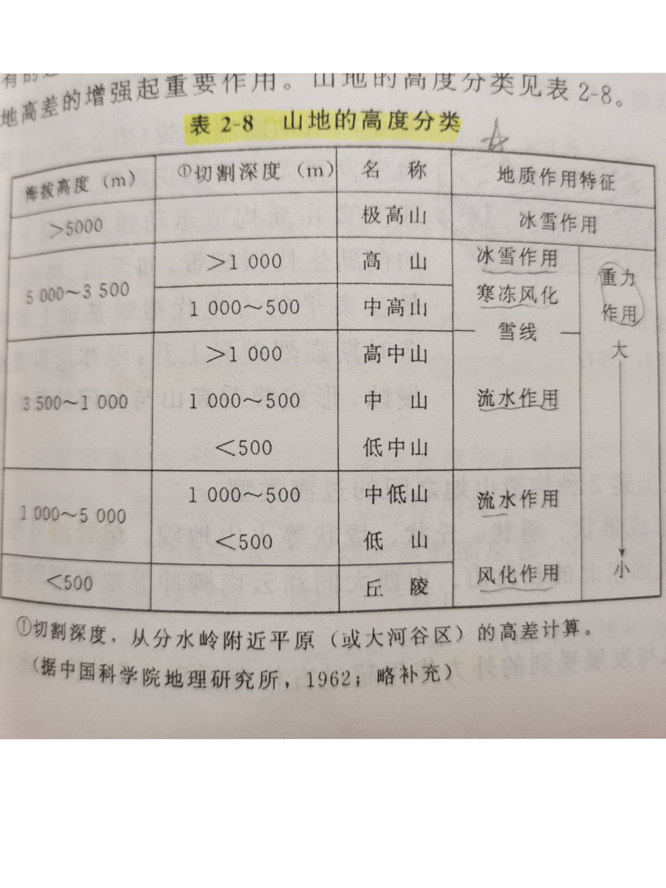

地貌学及第四纪地质学
#####################

地貌学是研究地表 `地貌形态特征`、 `成因`、 `分布` 和 `形成规律` 的学科。
第四纪地质学是研究距今二三百万年内
第四纪的 `沉积物`、 `生物`、 `气候`、 `地层`、 `构造运动` 和 `地壳发展规律` 的学科。[曹1995]_

主要问题包括两个方面：各种地质对象的演变史（即发展规律），地貌的命名、分类、特征描述

.. contents:: 

地貌
***************

地貌的概述和分级
==================

* 地貌的正负性::

    高于周围的地貌形态称为正形态，反之为负形态
    也可称为正地形和负地形

* 地貌的分级::

    地貌分为四级：
    - 巨型地貌：大陆和洋盆
    - 大型地貌：山地和平原（海洋不介绍）
    - 中型地貌：中型地貌属大型地貌的一部分，山地有山岭和谷底，平原有平原次级地貌。
    - 小型地貌：通常由外动力作用塑造形成，也不缺乏内力作用形成
      如：小型剥蚀地貌和堆积地貌;活动断层崖和地震裂隙和火山。

地貌具体介绍
==============

大型地貌山地
---------------

山地是由 *山岭* 和 *山谷* 组成的形态组合，可以按 *高度*， *成因* 进行分类

1. 按高度分类

2. 按成因分类::

    1. 构造山地
        1. 褶皱山地: 褶皱系统控制了本类山地的地貌，顺地质构造地貌与逆地质构造地貌
        2. 断块山地：断层系统控制了本类山地的地貌，多次夷平，保留古代夷平面
        3. 火山山地
    2. 剥蚀山地

中型地貌山岭
^^^^^^^^^^^^^^
    山岭由山顶、山坡、山麓组成

中型地貌谷地
^^^^^^^^^^^^^^^
山岭之间的形态组合，包括河谷，冰蚀谷，溶蚀谷

河谷
^^^^^^^^^^^^^^

1. 河谷横剖面形态
   
谷横剖面由谷底、谷坡和谷缘构成，谷底包括河床和河漫滩，谷坡包括可能发育有阶地，谷缘是谷坡上的转折点。

2. 河谷纵剖面形态

将足够数量的垂直主流线过水断面上的最低高程连接起来可得河谷的纵剖面图。纵剖面形态划分为多个阶域，阶域划分为多个阶梯，阶梯下划分为次级阶梯，依此类推。

河床
""""""""""
常年承担河流流动容器的区域。

河漫滩
""""""""
河流在洪水情况下可能漫过的地区

谷坡
""""""""
受流水侵蚀和重力作用下形成的岸坡

河流阶地
""""""""
河流多次下蚀形成在谷坡上的阶地

冰斗
^^^^^^^^

冰槽谷
^^^^^^^^
悬谷
^^^^^^

风蚀谷
^^^^^^^

风蚀洼地
^^^^^^^^^

    

外力作用
***************

风化和重力地貌与堆积物
==========================

流水、湖泊和沼泽地貌与沉积物
=====================================

岩溶地貌及岩溶堆积物
====================================

冰川和冻土地貌与堆积物
=====================================

风力地貌和堆积物与黄土
=====================================

海洋和海陆交替带地貌和沉积物
=====================================
地貌成因检索
**********************

重点研究对象和机制
**********************

第四纪地质学
****************

第四纪气候变化和海平面变化
===========================

第四纪生物、古人类与生物地理区
==============================

第四纪地层
===========================

新构造运动
===========================

参考文献
-----------

.. [曹1995] 地貌学及第四纪地质学/曹伯勋主编.——武汉:中国地质大学出版社 1995.10

