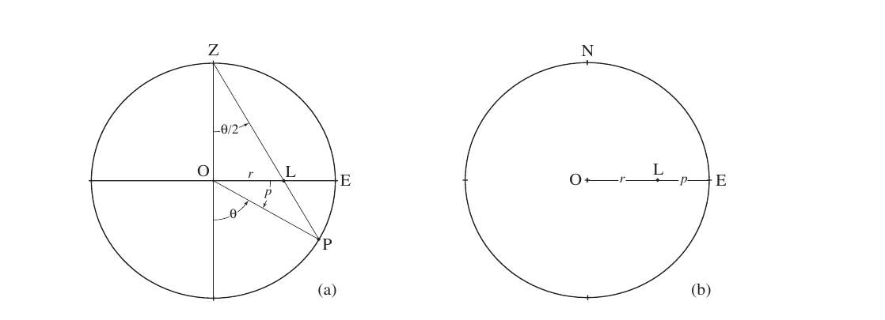
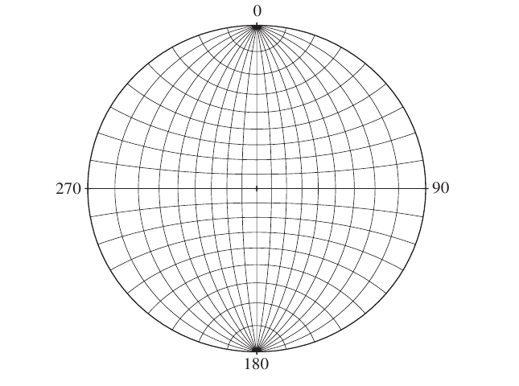
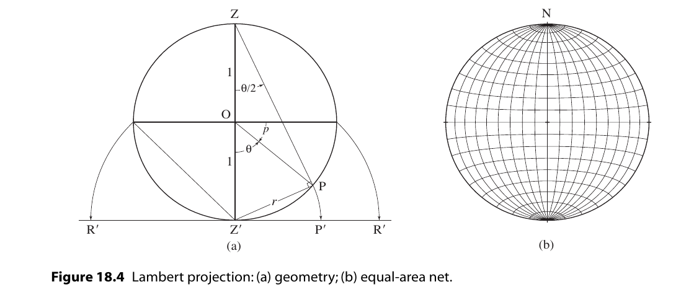
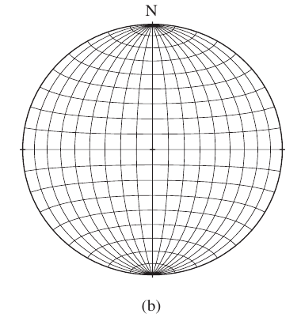
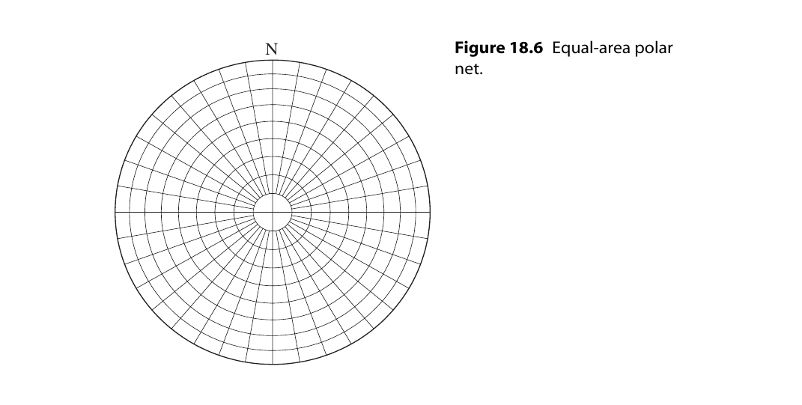
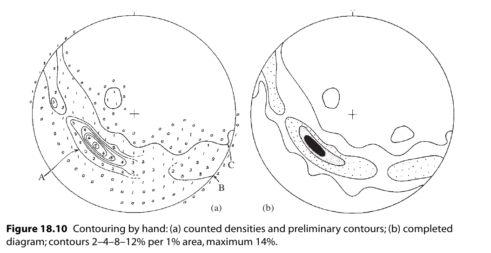
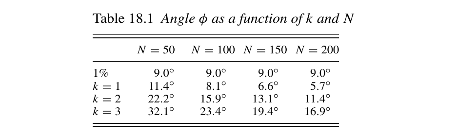

*************************
赤平极射投影与统计分析
*************************

**摘要**

赤平极射投影，这里包括等面积投影和等角度投影，是用于处理方向数据的工具，可以使三维方向数据以二维的形式呈现在投影圆中，
并且通过等面积投影可以进行数据的统计分析。文章先简略介绍等角度投影和等面积投影的基础概念，然后介绍赤平投影在统计分析中的
应用，主要为密度图的作法和程序实现，最后应用在一些地质问题中，包括求椭圆形褶皱的轴向，断层的阶层产状统计等。

**关键词** : 赤平极射投影，统计分析，构造，密度图，python

介绍
==========

全文内容如摘要所示。文中图片除使用mplstereonet绘制的之外，均取自参考文献。
赤平投影还可用于块体理论做力学和几何分析的基本工具，在此不涉及。
为了有更好的应用性，在基础理论之后会有应用部分。
赤平投影图由mplstereonet，python库绘制。

赤平投影的基本原理及应用
==============================

赤平投影可以用于两类数据的刻画，一是轴(没有定向的直线),二是单位向量(定向的直线)，将方向数据置于单位球的球心，
经赤平投影或等面积投影可以将数据与球面的交点或交线投影到投影面上，从而使三维数据二维化。

**赤平投影方法**

考虑单位球面上的一点P，选择球面的南极或北极与P点连线，连线交于赤平面上的点L就为P的赤平投影，也叫等角度投影。
具体作图法参见 [Ragan1959]_ 。

**赤平投影网**

通过构建一系列大和小的圆我们可以得到赤平投影网。也叫赤道赤平投影网， 等角网或吴氏网。

赤平投影网由两种圆构成，分别是走向为NS的过原点平面，所得线可以称为经线（过原点），
二是走向为EW的铅垂面，可以称为纬线（平行），每个同类型的圆相隔10度。度数的含义见下：

1. 经线的度数（dip）

经线的度数可以用dip表示,从 0 E 到 90 到 0 W 。

经线可以视为倾角为 度数 的平面，也可以视为倾伏角为 度数 的直线构成。

2. 纬线

纬线的度数通过其上每一点到 NS 轴的 到角 表示，纬线主要用于绕过在赤平面上的轴旋转。

(Stauffer, 1966; Denness, 1970, 1972; see also
Turner & Weiss, 1963, p. 58f).

**极点网**

极点网由一系列平行于赤平面的纬线（用于确定倾伏角）和一系列过原点的铅垂面（用于表示方位）构成。
极点网在绘制平面上有难度，但在展示直线上很直观，也不需要旋转。

.. image:: ./images/极坐标网.png
    :align: center
    :alt: 极坐标网

赤平投影方法

**等面积投影方法**

如果在赤平投影上绘制在下半球的均匀分布，会发现点的分布并不均匀，点会向网格中心汇聚，这样造成了与面积
相关方法的使用困难，为了解决这个问题，通常使用 *Lambert equal-area projection* 。

考虑一个单位参考球体的过直径的铅垂面，在这个面上倾伏角为 p 的直线 P。作角 :math:`\theta = 90 - p`。
。投影面是由过极轴最低点Z'的水平面，这个点的投影P’，是由旋转Z'P得到的。如上图。

**Schmidt网**

同赤平投影网同样的做法，利用等面积投影法可以得到等面积投影网，又叫 Schmidt net。

**等面积极点网**

同赤平投影网同样的做法

密度图(Contoured diagrams)
=======================================

借助等面积投影的性质，可以确保点在施密特网上的分布等于点在球面上的分布。

但是散点图并不好作比较和分析。
解决这个问题的方法通常是作在施密特网上作密度图。
一旦散点图出来，密度也可以计算出来，由一系列的方法可以完成这个任务。

密度图制作方法
----------------------------------------------

**Schmidt method**

.. image:: ./images/施密特方法.png
    :align: center
    :alt: Schmidt方法。

最初的和仍然广泛使用的计数方法是施密特方法 [Turner1963]_ 。
点图叠加在间距为R/10的网格上。
计数是用一种叫做施密德格计数器的特殊工具完成的(Knopf & Ingerson, 1938, p. 245)。
在图表主体中，计数器一端的圆圈以每个网格节点为中心，记录在圆内数据的个数。
如果计数圆与投影圆边界重叠，则使用工具的两端，记录在两端圆内数据的个数。
该工具还可以用作自由计数器,以确定更详细的密度变化。

**Kalsbeek method**

.. image:: ./images/Kalsbeek方法.png
    :align: center
    :alt: Kalsbeek Method

接下来介绍另一个更简单通用的方法。

为了使用这种方法，我们需要一个特殊的计数网格 [Kalsbeek1963]_ 。
投影区域被小三角形完全分割，六个三角形等于1%区域。

*计数*

1. 将点图和第二张描图叠加在计数网上。在每个六边形的中心，写上该六边形内的点的总数(参见图18.9b, A点)。
   对于图的内部，每个重叠六边形的中心都会有数字。 
   对于图中没有点的部分，六边形可以留空，而不是为每个六边形标注零。

2. 在投影网的边界，将网一侧各半六边形中的点与另一侧的互补半相结合，并将此数字沿原图写在网的两侧(见B点)。

3. 辐条两端的点使用互补的半圆(点C)进行计数。在最中心，使用1%的小圆(点D)。

这个或任何这样的人工计数技术都有一个问题。
正如我们所看到的，施密特网的性质是这样的:球体上的一个小圆的形状投射成一个椭圆形的区域，它的形状随倾角而不恒定。
在过去，人们通过使用可变形状的计数器来解决这个问题。
这需要更多的工作，而且对于大多数目的来说，这是不必要的。
而计算机生成的图表完全消除了这个问题。

*绘制等密度线*

1. 在图的内部，A点的等密度线见上。这个等密度线可以很容易通过观察画出。
   找出密度最大的区域是非常简单的。

2. 对于接近边缘的等密度线，会用到半六三角形的计数。
   见B点

3. 当应该严格画一条与边界相交的等高线，但很明显它会立即再回圈时，允许避免与边界实际接触(点C)。
4. 当初步轮廓完成后，可以进行一些修改以改善图的外观(图18.10b):
   
   * 在计数过程中发现的最大值可能不是图的真正最大值。
     通过将点图返回到计数网，可以找到最大的浓度。
     使用中间1%的圆圈作为自由计数器，移动图表，直到最大数量的点位于其中。
   * 所有的等高线可能不是显示图案所必需的;最多六个通常可以在不产生杂乱的情况下显示出图案。例如，如果间距非常接近，则可以消除中间轮廓。
     最终图中剩余等高线的值在图例中以2-4-8-12% / 1%面积的形式表示，最大为14%。
   * 浓度最大的区域往往变黑。虽然通常是不必要的，图案可以用在较少集中的区域。
     特别有效的是使用渐变的点状图案，使浓度较高的区域具有更密集的外观。
     线条图案会影响视觉效果，应该避免使用。
    
散点图的统计分析
------------------------------------------------

散点不可避免地涉及到统计性质的问题，可以使用各种技术来提取有关其最佳拟合和置信度的信息 [Mardia1972]_ ; [Watson1983]_ ; [Fisher1987]_ ，
但仍存在许多问题。下面使用一个更直观的几何方法区介绍这个主题 [Vollmer1995]_ 。

首先，散点图的分布是否有意义。面对散点图时，我们如何确定散点图之间的差异及其差异的重要性。

想象我们从特定的数据集中取了一个点画在散点图上。在等区域网上，我们将计数器放置在网上的任意一个位置。在这样一个实验中可能会有两种情况——
点在计数器中（成功），或者不在计数器中（失败）。对一个半径为R的区域A，实验成功的概率p为

.. math:: p = a/A = r^2/R^2

对于1%计数器，p = 0.01。

现在考虑随机放置总量为N的情况。实验的期望数可以用二项分布描述 [Walpole1993]_ 。二项分布的期望为

.. math:: 

    &\ p_k = C_N^kp^k(1-p)^{(n-k)} \\
    &\ E = \mu = \Sigma kp_k = np \\
    &\ \sigma^2 = \Sigma (k - \mu)^2p_k = np(1-p) \\

Kamb 认为 随机分布的情况下偏差大于 :math:`3\sigma` 的概率是极其小的，
可以用数据偏离 :math:`3\sigma` 的数据量来作为判断数据是否具有有意义的
概率分布的判据。其作图方法如下。

.. math:: 
    &\ 令 E = 3\sigma \\
    &\ (Np)^2 = Np(1-p) \\
    &\ p = 9/(N + 9) \\

现在我们需要确定完成这个的计数器大小。

.. math::

    &\ p = r^2/R^2 \\
    &\ r = 3R/\sqrt{N + 9}

有了这个，我们现在有一种方法来区分那些有意义的偏离一致性的散点图。
如果用这种大小的计数器绘制的图表显示出更大的波动，那么它可能不是随机的。

因为它们是在考虑特定的结构问题时产生的，所以大多数图表都有清晰可辨的模式，
即使它们也有局部的、微不足道的波动。明显非随机的分布不再用二项分布来描述。
在这种情况下，Kamb标准的主要好处是它减少了样本量的影响，因此可以比较具有不同点数的图表。

然而，Vollmer(1995)也发现 :math:`E = 3\mu` 倾向于过度平滑浓度较强的数据集。对于这些，需要一个较小的计数器。
对于离群点较少的数据集，可以通过将 :math:`3\mu 用 k\mu` 代替

.. math:: p = \frac{k^2}{N + k^2} and r = \frac{kR}{\sqrt{N + kappa^2}}

通过kamb统计密度完成密度图的方法，叫Kamb方法。

电脑成图
----------------------------------

大量数据点的散点图绘制和密度图绘制是一种理想的计算机应用。
这不仅节省了大量的时间和精力，而且可以以各种方式快速检查数据，这个任务通过人力基本无法完成。

Schmidt网上圆形计数器形状变化的问题是通过在半球表面而不是投影平面上计数来解决的(Warner, 1969)。
虽然手工操作很困难，但实际上通过编程让计算机这样做更容易。单位球球冠的半径为

.. math:: 
    &\ 球冠面积 a = 2\pi(1-cos\phi) \\
    &\ 概率 p = a/A = 1 - cos\phi \\
    &\ 点积 cos\phi = 1 - \frac{k^2}{N + k^2} = \frac{N}{N+k^2} \\

密度是通过使用点积确定网格节点的位置向量和每个数据向量之间的夹角来找到的(参见§7.3)。
如果这个角度小于或等于φ，则计数增加。根据最终的节点数据，可以自动绘制轮廓。

许多计算机程序已经被描述(参见Vollmer, 1995，一个很好的讨论和早期的参考资料)，其中一些是现成的:Allmendinger (2001)， 
Holcombe (2001)， Jacobson (1996)， RockWare (2001)， Wallbrecher(2005)。最近，Haneberg (2004, p. 43-47)
给出了使用Mathematica的基本方法的一个很好的一般描述。

1. 我们使用Kalsbeek网络而不是常规的方形图，对于每个结点：
   * 坐标轴原点位于投影网中心，+x = east , +y = north。
   * 每个结点的单位向量的方向余弦 :math:`l_N,m_N,n_N` 由结点的倾伏角和走向算出。
2. 计算每个样本的方向余弦 :math:`l_D,m_D,n_D` 。

3. 按顺序访问每个节点，并计算所有数据点和节点的点积。如果数据到结点的角距小于计数圈的角距则该节点的计数加1。
   最终将密度z由计数个数除以总数得出。
4. 为了正确计算与原始或附近的节点相关的密度，具有小倾角的数据点的相反向量被复制到上半球。
5. 最后将 :math:`z(x,y)` 画出。

改良的Kamb方法的程序设计
=====================================

对Kamb方法可以提出一些改进措施，以应对不同数据集之间的差异和不同的成图要求。

为了减少平滑度，可以将k值减小，从而使图像的分辨率增加，提供更加局部的密度估计。所以程序可以设置k值。

为了更精确密度估计，密度估计直接在球面上进行。

在密度估计中使用权重函数改善密度估计的效果。

同时允许赤平投影图的密度图。

下面介绍程序中基本步骤的原理

计算计数半径
------------------------

通过k值计算球冠半径 :math:`\phi` ,或者其他公式，例如使用 :math:`1/n` 倍计数球冠。n 为样本大小。
不同的k值和计算公式的使用会影响到球冠半径的大小，从而改变密度估计的精度。

密度估计
---------------

如前所述，程序的密度估计通过计算节点和数据点的点积 x 完成。然后使用点积与计数球冠的 :math:`a = cos\phi` 进行比较，
如果前者小则计数加一。这实际上为定义了一个权重函数 w : 

.. math:: 

    &\ w_i = 1 & (x_i \ge a) \\
    &\ d = \Sigma w_i && i 为数据点编号 \\

改变权重函数的形式可以*得到更精确的密度估计

**权重函数的不同形式**

.. math::

     &\ w = 2(1-x/a) \qquad (x \ge a). \qquad 线性权重函数\\
     &\ w = 3(1 - x/a)^2 \qquad (x \ge a). \qquad 二次权重函数 \\

Robin 和 Jowett在1986年还提出了一个指数形式的权重函数，可以将计数面积扩展到整个球面

.. math:: w = e^{k(x-1)}

不同的权重函数对成图的影响如下

.. image:: ./images/不同权重函数的影响.png
    :align: center
    :alt: 不同的权重函数的影响

网格化和绘制等值线图
----------------------

网格化和控制在这里使用的网格算法中一个规则的正方形网格被背投影到球体上。
这提供了大于一个完整半球的覆盖范围，允许轮廓延伸到投影的边缘，
在那里它们被剪裁。在每个节点进行加权计数后，对网格进行预处理以进行轮廓绘制。
由于点数是一个不连续的变量，并且轮廓的最佳估计值位于连续值之间的中间，
因此从每个总数中减去0.5。例如，密度为0的等高线将通过计数值为0和1的两个节点的一半，
而不是通过第一个节点。然后，网格值将标准化为1 SD。
高线是通过网格的线性插值绘制的。任何由插值引起的轮廓定位误差都被限制在节点之间；
合理的细网格间距将使这些误差最小化。许多其他网格和等高线插值方法，
包括使用多项式拟合和交替网格几何，已被使用（例如：卡尔卡尼和冯弗雷斯，1979年；
托切尔，1979年；柴奥，1985年；狄格尔和费舍尔，1985年；耶茨，1987年；
查尔斯沃思等人，1989年）。

应用示例
=========================

使用python库mplstereonet需要注意一个问题，即将原码中的 ``np.float`` 改为 ``np.float_ `` 或者 ``np.float64``。可能是因为numpy库更新的缘故，无伤大雅。

k-均值算法(kmeans method)
------------------------------

k-均值聚类的目的是：把 n个点（可以是样本的一次观察或一个实例）划分到k个聚类中，
使得每个点都属于离他最近的均值（此即聚类中心）对应的聚类，以之作为聚类的标准。
这个问题将归结为一个把数据空间划分为Voronoi cells的问题。 

mplstereonet 提供了kmeans 函数。

节理统计分析和结构面统计分析
--------------------------------

使用密度图的方式

参考文献
======================

[1]_, [2]_ , [3]_ , [6]_ , [7]_ , 

.. [1] Kington,Joe."mplstereonet Documentation“.“mplstereonet".https://mplstereonet.readthedocs.io/en/latest/mplstereonet.html
.. [2] Vollmer, 1995. C Program for Automatic Contouring of Spherical Orientation Data Using a Modified Kamb Method. Computers & Geosciences, Vol. 21, No. 1, pp. 31–49.
.. [3] Kamb, 1959. Ice Petrofabric Observations from Blue Glacier, Washington, in Relation to Theory and Experiment. Journal of Geophysical Research, Vol. 64, No. 11, pp. 1891–1909.
.. [Ragan1959] Ragan, D. M., 1918. Structural geology, an introduction to geometrical techniques(4rd ed.)
.. [Stauffer1966] Stauffer, M.R., 1966, An empirical-statistical study of three dimensional fabric diagrams as used in structural analysis: Canadian Journal of Earth Science, v. 3
.. [6] Denness, B., 1970, A method of contouring polar diagrams using curvilinear counting cells: Geological Magazine, v. 107,
.. [7] Turner, F.J., & L.E. Weiss, 1963, Structural Analysis of Metamorphic Tectonites: McGraw-Hill, New York.
